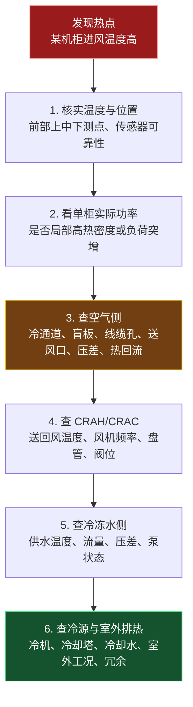

# 数据中心冷却运行监测与诊断速查卡

> 配套正文：`数据中心冷却面试速记_v0.1.md` 四-J（机柜功率密度与"总量匹配 vs 局部匹配"）第四节、四-D（运行监测与热点诊断）。
> 本卡为单页速查，细节与推导见主文档。

---

## 1. 监测点沿热量路径布（不是只放一个机房温度计）

```text
服务器进风
→ 服务器排风
→ 热通道 / CRAH 回风
→ CRAH 送风
→ CRAH 冷冻水盘管
→ 冷冻水系统
→ 冷机与室外排热
```

实际系统将温度、湿度、压差、流量、功率、阀位、设备状态接入 BMS / DCIM / EMS，做趋势、阈值告警、故障追踪。目的：在电子设备承受热应力前发现局部冷却不均。机柜前/后两面上中下各布点，顶部更易受热回流影响。

---

## 2. 关键参数速查表

| 参数 | 主要测点 | 反映什么 | 异常先想 |
|------|---------|---------|---------|
| 服务器进风温度 | 机柜前部上中下 | IT 实际热环境、热点 | 热回流、局部送风不足、高负荷柜 |
| 服务器排风温度 | 机柜后部上中下 | 服务器排热状态 | 高负荷、有效风量不足 |
| CRAH 送风温度 | 出风口/送风静压箱 | 末端送出空气状态 | 盘管冷量、控制设定、风机运行 |
| CRAH 回风温度 | 回风口 | 回收热空气状态 | 热通道收集、旁通、机柜负荷 |
| 送回风温差 | CRAH 或机柜进排风两端 | 空气带热与流量 | 高负荷、风量不足、旁通、回流 |
| 单柜功率 | PDU/智能电表 | 局部 IT 热负荷 | 高功率密度、负荷突增 |
| 冷热通道压差 | 冷/热通道或地板下静压箱 | 气流驱动力、漏风 | 封闭漏风、风机不足、地板开孔 |
| 湿度/露点 | 冷通道、CRAH 送风侧 | 静电与结露风险 | 加湿/除湿控制、冷表面结露 |
| CRAH 风机频率 | 控制器/VFD | 风量能力与风机能耗 | 风机受限、过送风、控制策略 |
| 冷冻水阀位 | CRAH 盘管二通阀 | 末端请求冷量程度 | 阀位长期大开但不冷→查水温/流量/压差 |
| 冷冻水供回水温度 | CRAH 进/出水管 | 水侧换热与冷源能力 | 供水升温、温差异常、流量不足 |
| 冷冻水流量、压差 | 支路/主管、泵组 | 水是否足够流经盘管 | 阀门、水泵、过滤器、压差设定 |

**补传感器优先级**（若只能先补一类）：机柜前部进风温度 → 单柜功率 → CRAH 送回风与水侧参数。

---

## 3. 进风温度优先

服务器感受的是**机柜前部进风口空气**，不是机房平均温度、也不是 CRAH 送风设定值。

```text
机房平均温度：24°C
CRAH 送风温度：20°C
某普通机柜进风温度：22°C
某高负荷柜进风温度：29°C   ← 局部热点已出现，均值却"正常"
```

热点本质是**服务器进风区域过热或过干**，不是简单的"房间温度高"。

---

## 4. 温差不能单独判断

空气侧热平衡：$$Q=\rho\,\dot V\,c_p\,\Delta T$$，温差 $\Delta T$ 同时受热负荷 $Q$ 与实际风量 $\dot V$ 影响。

| 观察到的温差 | 可能正常 | 也可能异常 |
|-------------|---------|-----------|
| 进排风温差大 | 高功率机柜正常排更多热 | 有效风量不足、热空气回流 |
| 进排风温差小 | 机柜负荷较低 | 送风过量、冷风旁通 |
| CRAH 送回风温差大 | 回风较热、盘管有效吸热 | 局部热回流、风量分布不均 |
| CRAH 送回风温差小 | 低负荷运行 | 旁通严重、CRAH 风量过大 |

> 温差是重要信号，但不是独立故障结论；须结合功率、进风温度、风机频率、通道压差、CRAH 送回风、水侧参数一起判断。

---

## 5. 三类故障区分

**冷量不足**（系统总热量移不走，多区域整体升温）
- 多个冷通道/进风温度持续升高；多台 CRAH/CRAC 近满负荷，风机/压缩机/阀位近上限
- CRAH 送风温度无法维持设定或持续升高；冷冻水阀位长期近全开
- 冷机/冷却塔/泵近上限，或室外高温致冷源能力下降
- 注意：**阀位全开 ≠ 冷量不足**，仍要看供水温度、实际水流量、盘管空气侧效果

**风量或气流组织不足**（总冷量够，但没送到该送的位置；局部热点常属此类）
- 仅一排/一个区域/少数高负荷柜进风偏高；CRAH 总冷量、冷冻水、冷机仍有余量
- 高热柜附近冷通道风量不足，或机柜顶部明显更热
- 未装盲板、线缆孔未封堵、地板开孔/送风口位置不合理；热通道封闭不完整致热排风绕回
- CRAH 风机很高但回风偏低 → 可能过送风+冷风旁通
- 封闭/盲板/密封能减旁通回流，但不能替代对局部负荷与送风路径的核查

**冷源或水系统受限**（CRAH 想要冷量，水系统/冷源交付不了）
- 冷冻水阀开度大但 CRAH 送风仍高；供水温度偏高或在多末端同步升高
- 支路流量不足、供回水压差不足，泵频率已高或过滤器/阀门阻力大
- 冷冻水回水温差、流量与末端负荷不匹配
- 冷机/冷却塔/冷却水泵近上限，或冷却塔受室外湿球限制
- CRAH 本体含冷冻水盘管与控制阀，阀调进入盘管水量，故水温/压差/流量直接影响实际可用冷量

---

## 6. 热点排查顺序（面试可直接用）

> 出现热点时，不能直接判断为冷机容量不足；应从服务器进风、局部热负荷、空气流量与气流组织、CRAH 末端状态、冷冻水流量和压差、冷源能力逐级排查。



- 先查距故障点最近、最可能造成局部异常的因素，再上溯系统级冷源。
- 多区域同步升温 → 更早看 CRAH 群控、冷冻水与冷机侧。
- 仅一两个机柜异常 → 先查负荷、气流、封闭，勿立刻降全机房送风温度。

---

## 7. 一句话收口

数据中心监控以**服务器进风温度**为核心而非机房平均温度；出现局部热点不能直接归为冷机容量不足——先排查送风分配、冷热通道封闭、冷风旁通与热回流；仅当多区域同步升温且 CRAH 阀门/风机/冷机近上限，才进一步判断末端冷量、水系统或集中冷源受限。

