# 数据中心冷却面试速记（v0.1）

> 来源=用户学习笔记（秋招空调制冷/数据中心方向，数据中心冷却学习日），非本仓库代码。
> 定位：从四-A~四-J 的数据中心冷却完整渐进路径（通用底盘→数据中心基础→负荷容量→冷源控制→AI/HPC→机柜密度→液冷），本文件承接 `空气侧处理与焓湿图面试速记_v0.1.md` 的 HVAC/焓湿图基础，专讲数据中心空气冷却与冷源。
> 互链：HVAC/焓湿图基础见 `空气侧处理与焓湿图面试速记_v0.1.md`；冷水机组与水系统见 `水冷冷水机组系统图_v0.1.md` / `水系统管路阀门水泵面试速记_v0.1.md`；VRF/DOAS/CRAC/CRAH 四概念对比见 `VRF_DOAS_CRAC_CRAH四概念对比面试速记_v0.1.md`。
> 纪律：液冷留最后（四-A~四-J 均不进液冷细节，仅做空气冷却视角的前置铺垫）。

---

## 六、数据中心连接（空气侧）

### CRAC 与 CRAH
| 设备 | 全称 | 主要冷却方式 | 与普通空调关系 |
|------|------|--------------|----------------|
| CRAC | Computer Room Air Conditioner | 通常为 DX 直膨式，制冷剂在机组内直接蒸发吸热 | 更像数据中心专用直膨式精密空调 |
| CRAH | Computer Room Air Handler | 冷冻水盘管，由外部冷水机组提供冷量 | 更像数据中心专用 AHU |

> CRAH 用冷冻水盘管，CRAC 多为直膨式；具体产品/架构随项目变化，面试说"通常"最稳妥。

### 冷热通道
```
冷通道 → 服务器前侧吸入冷空气 → 内部吸收显热 → 后侧排出热空气 → 热通道
       → CRAC/CRAH 回风口 → 处理后冷空气重新送回冷通道
```
隔离目的：减少冷风热风过早混合，避免热风回流到进风口，提升送风有效利用率、减少局部热点。

### 与舒适性空调区别
| 维度 | 普通舒适性空调 | 数据中心空气冷却 |
|------|----------------|------------------|
| 主要负荷 | 人员、照明、日射、围护，显热+潜热 | IT 设备显热为主 |
| 湿度影响 | 常是舒适性和除湿重要因素 | 潜热相对小，但仍需维持设备允许范围 |
| 运行特征 | 随人员与气候，可能有停机时段 | 高负荷、全年连续运行 |
| 核心目标 | 人员舒适与 IAQ | 设备进风温度、可靠性、连续性和热点控制 |
| 气流组织 | 满足舒适送回风与新风需求 | 高度关注送风到机柜、热回风路径、旁通风与短路风 |
| 可靠性 | 按建筑服务要求设计 | 更强调冗余、监控、故障切换和维护连续性 |

> 数据中心往往以再循环空气承担主要显热冷却，仅为人员提供必要新风；核心不是把房间"吹得舒服"，而是让服务器进风条件稳定、避免热点并保持持续可靠运行。

### 四-D、数据中心空气冷却（学习日专题）

> 先建立总体画面：**数据中心不是以"人舒不舒服"为第一目标，而是持续、可靠地把服务器产生的大量显热送走，并让每台服务器进风都处于安全范围。** CRAC、CRAH 是冷却设备；冷热通道是让冷量真正送到服务器的气流组织方法。

#### 总体气流循环（先记这张图）
```
CRAC / CRAH
   ↓ 送出冷空气
冷通道
   ↓
服务器前侧进风口
   ↓ 服务器内部吸收设备热量（CPU/GPU/电源等使空气升温）
服务器后侧排风口
   ↓
热通道
   ↓
CRAC / CRAH 回风口
   ↓
冷却后重新送至冷通道
```
服务器通常是"**前进后出**"：前侧吸入冷空气，内部部件使空气升温，再从后侧排出热空气。数据中心的空气系统就是不断把热通道的热空气送回冷却设备，冷却后再供应到冷通道。

#### CRAC 是什么
CRAC = Computer Room Air Conditioner（计算机房空调器）。通常采用**直接膨胀（DX）制冷**，设备内具有压缩机和制冷剂循环；热空气经过制冷剂盘管后被冷却，再送回机房。可理解成服务机房、强调连续稳定运行的专用精密空调。

```
机房热空气
   ↓
CRAC：风机 + 制冷剂盘管 + 压缩机
   ↓
冷空气送到冷通道
```
- 适用：小型数据中心、边缘机房或不具备集中冷冻水条件的场景；
- 特点：安装和独立部署方便，但压缩机在设备端运行，整体能效通常不如大型集中冷冻水方案。

#### CRAH 是什么
CRAH = Computer Room Air Handler（计算机房空气处理机组）。本身通常**没有压缩机**，依靠外部冷水机组提供的冷冻水；机房热空气经过 CRAH 的冷冻水盘管，热量传给冷冻水，之后冷冻水回到冷水机组排热。

```
冷水机组
   ↓ 冷冻水
CRAH：风机 + 冷冻水盘管
   ↓
冷空气送到冷通道
```
- 可近似理解为"**数据中心专用 AHU**"：以空气为末端送风介质，但盘管冷量来自冷冻水系统；
- 适用：中大型、集中式数据中心，便于与冷水机组、冷却塔、水侧自然冷却等系统协同。

#### 两者怎么区分（一句话记忆）
**CRAC 自己"制冷"；CRAH 自己不制冷，而是"用冷冻水处理空气"。**

| 对比项 | CRAC | CRAH |
|--------|------|------|
| 中文理解 | 计算机房精密空调 | 计算机房空气处理机组 |
| 冷却盘管介质 | 制冷剂 | 冷冻水 |
| 压缩机 | 通常设备内置 | 通常不在 CRAH 内，由外部冷站供冷 |
| 系统性质 | 相对独立的 DX 冷却系统 | 集中冷冻水系统的空气侧末端 |
| 类比 | 专用直膨式精密空调 | 数据中心专用 AHU |
| 常见场景 | 小型机房、边缘节点、局部冷却 | 中大型、集中式数据中心 |

#### 冷热通道为何重要
冷热通道隔离不是为了"排得整齐"，而是为了避免冷空气和热空气过早混合。若服务器后侧排出的热空气绕回前侧，服务器会吸入偏热空气，出现局部热点；系统为压住热点，只能把 CRAC/CRAH 送风温度调更低、风机开更大，能耗上升。

```
不隔离：
冷风 →→→ 与热风混合 →→→ 服务器吸入混合热风
                   ↑
             热风回流 / 短路

隔离后：
冷风 → 冷通道 → 服务器 → 热通道 → 回风
```

冷热通道隔离的直接作用：
1. 减少冷热空气混合和旁通风；
2. 减少服务器进风口的热空气回流；
3. 提高每单位送风的有效利用率；
4. 减少热点，提升温度均匀性；
5. 允许在满足服务器进风要求前提下提高送风温度，从而降低冷却能耗。

#### 与舒适空调不同（复习表，六节已列，这里补完整九维）
| 维度 | 普通舒适性空调 | 数据中心空气冷却 |
|------|----------------|------------------|
| 核心对象 | 人员与室内环境 | 服务器及 IT 设备 |
| 首要目标 | 人员热舒适、通风与 IAQ | 设备进风边界、稳定运行与可靠性 |
| 主要负荷 | 人员、照明、日射、围护结构和新风负荷 | 服务器、存储、网络设备等持续设备显热 |
| 显热与潜热 | 潜热常不可忽略，尤其夏季新风 | 以显热为主，潜热相对较小 |
| 运行时间 | 多随人员使用时间变化 | 通常全年 24/7 连续运行 |
| 热密度 | 相对较低且较分散 | 高且集中，机柜可能形成热点 |
| 气流组织 | 关注舒适风速、送回风均匀性 | 极重视冷热通道、封闭、旁通和热回流 |
| 可靠性 | 短时故障通常影响舒适度 | 故障可能导致 IT 降频、宕机或设备风险 |
| 冗余要求 | 常规项目视需求配置 | 常要求 N+1、2N 等冗余与故障切换 |

普通舒适性空调需同时处理人员舒适、新风、CO₂、湿度等；数据中心主要面对高密度、连续的 IT 显热，并对温度稳定性、冗余及热点控制提出更严格要求。

#### 90 秒面试回答（学习日验收稿）
数据中心空气冷却与普通舒适性空调在基本原理上都包括送风、回风和盘管换热，但控制目标不同。舒适性空调主要服务人员，需要兼顾温度、湿度、新风和空气品质；数据中心主要处理服务器等 IT 设备持续产生的高密度显热，潜热负荷相对较小。

数据中心通常采用 CRAC 或 CRAH。CRAC 是采用制冷剂直接膨胀的专用精密空调，设备通常带有压缩机；CRAH 则使用外部冷水机组提供的冷冻水，通过水盘管冷却机房空气，可以理解为数据中心专用 AHU。

数据中心全年连续运行，对供冷可靠性、冗余、温度稳定性和故障切换要求更高。气流组织上，服务器前侧从冷通道吸入冷空气，后侧向热通道排出热空气；通过冷热通道隔离减少冷热空气混合和热风回流，可以减少热点并提高冷却效率。

#### 四-D-2、数据中心冷却系统观：热量从 IT 设备到室外的完整链路

> 本子节把四-D 的"设备与气流基础"进一步拉成**完整系统观**：核心不是"机房平均温度多低"，而是建立"热量从 IT 设备出发，跨越空气侧、水侧或制冷剂侧，最终排至室外"的全链路认知。数据中心的冷却对象不是人的舒适感，而是服务器等 IT 设备的进风温度、持续运行能力与热点风险。

##### 先看系统边界（五层面，今天只连冷却与 IT 热量）

| 层面 | 典型内容 | 与冷却的关系 |
|------|----------|--------------|
| IT 设备 | 服务器、存储、交换机、路由器 | 电能大部分最终转化为热量，是冷却负荷来源 |
| 供配电 | 变压器、UPS、配电柜、柴油发电机 | 自身也有损耗发热，且保障冷却设备不断电 |
| 冷却系统 | CRAC、CRAH、冷机、泵、冷却塔、液冷设备 | 将 IT 热量逐级搬运并排向室外 |
| 监控与控制 | 温湿度、机柜进风温度、流量、压差、功率、告警 | 发现热点、控制设备、判断能效与故障 |
| 消防与安全 | 火灾探测、灭火、门禁等 | 保障机房运行安全，但不是本节重点 |

**重要认识**：服务器消耗的电能几乎都会以热的形式出现在机房中。GPU、CPU、内存、硬盘、电源模块和网络设备都在持续放热，因此数据中心冷却本质上是一个**持续排热问题**。

##### 空气冷却主路径（传统空气冷却数据中心）

服务器通常"前进风、后排风"：机柜前侧形成冷通道、后侧形成热通道；冷空气进入服务器前部，吸收元件热量后以热空气从后部排出。最关键的不是"机房平均温度"，而是：每台服务器进风口是否得到足够冷空气、排出的热空气能否被顺利收集、冷空气是否真正穿过服务器吸热、是否存在局部热点/热回流/冷风旁通。


##### CRAH 如何接水系统

若用 CRAH，通常采冷冻水盘管：机房热空气经 CRAH 盘管把热量传给盘管内冷冻水，CRAH 再把处理后的冷空气送往冷通道。一句话概括：**服务器先把热量交给机房空气，CRAH 再把空气中的热量交给冷冻水，冷冻水最后把热量带回冷水机组**。CRAH 是空气侧末端，不直接"制造冷量"，而是使用集中冷水系统提供的冷冻水与机房回风换热。

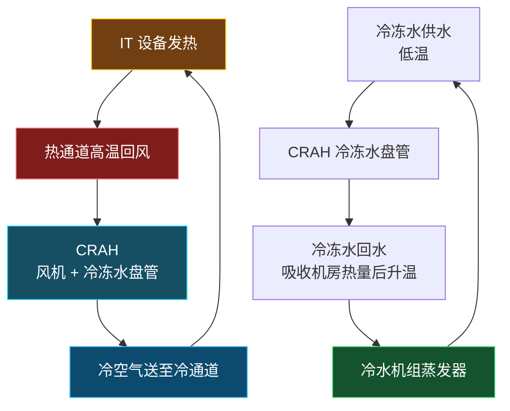

##### 冷机如何排热（完整热量链）

冷水机组蒸发器从冷冻水吸热，制冷剂经压缩机升压升温后在冷凝器向冷却水放热；高温冷却水再被送往冷却塔，借助空气和水蒸发把热量排到室外。

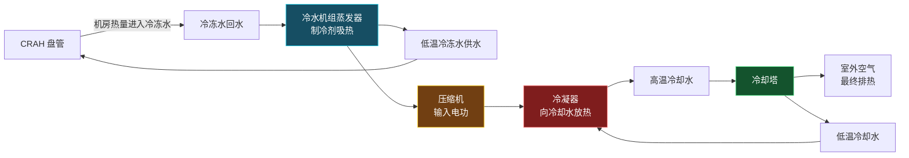

大型水冷数据中心一条完整热量链：

```
IT 芯片 → 服务器内部空气 → 服务器排风/热通道 → CRAH 回风 → CRAH 冷冻水盘管
       → 冷冻水回水 → 冷水机组蒸发器 → 制冷剂 → 冷凝器冷却水 → 冷却塔 → 室外空气
```

> 注意：冷却塔排出的热量不仅包括服务器产生的热量，也包括冷水机组压缩机等设备消耗电能后转化的热量（呼应冷冻水文件六、冷却塔基础的热量链 `Q_tower ≈ Q_cond = Q_evap + W_comp`）。

##### CRAC 的路径不同（DX 直膨）

若末端是 CRAC，常见架构为直接膨胀式 DX：制冷剂直接在 CRAC 内蒸发器盘管吸收机房空气热量，通常不需要 CRAH 冷冻水盘管这一环节。

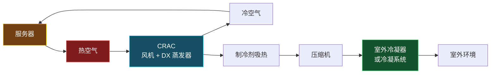

三类机房末端吸热与下一步去向对照：

| 设备 | 机房内如何吸热 | 热量下一步去哪里 |
|------|----------------|------------------|
| CRAC | 制冷剂在 DX 盘管中直接吸热 | 制冷剂回路、压缩机、室外冷凝器或冷凝系统 |
| CRAH | 冷冻水在水盘管中吸热 | 冷冻水回到集中冷水机组 |
| 液冷换热设备 | 冷却液直接或间接从芯片附近吸热 | CDU、设施水或其他外部排热回路 |

CRAC 与 CRAH 都负责机房空气侧循环和换热，但前者更接近"机房专用直膨空调"，后者更接近"接入集中冷冻水系统的机房空气处理设备"（即"数据中心专用 AHU"）。

##### 为什么不只是降室温（冷风旁通 vs 热空气回流）

普通建筑空调主要感受房间平均温度/湿度/风速/空气品质；数据中心首先关心服务器进风温度和局部热环境。即使机房平均温度正常，若热空气绕流到机柜前部，局部服务器进风温度仍可能过高。

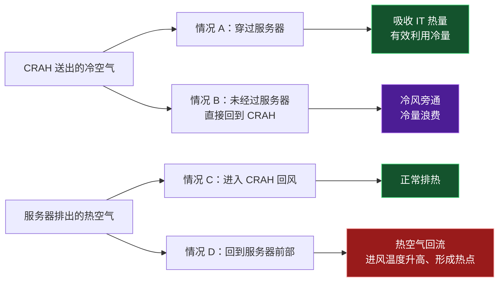

冷热通道和通道封闭的目的，就是尽量减少冷风旁通和热空气回流。ASHRAE 数据中心能效建议也强调，冷热通道布局及封闭可防止送风与回风短路，并帮助稳定服务器进风温度。

##### 面试表达（40—60 秒可直接用）

数据中心冷却的核心不是简单降低机房平均温度，而是持续、可靠地把高密度 IT 热负荷排至室外，并保证服务器进风温度不超限。以 CRAH 加冷冻水系统为例，服务器从前部冷通道吸入冷空气，空气流经 CPU、GPU 等部件后吸热，从后部排入热通道；CRAH 回收热空气，通过冷冻水盘管将热量传给冷冻水。冷冻水回到冷水机组蒸发器，热量再经制冷剂、冷却水和冷却塔排至室外。系统还要通过冷热通道封闭、风量和温度控制，减少冷风旁通与热空气回流，并通过冗余设计保障故障或检修期间的连续冷却能力。

> 衔接：本子节完整链路与 `冷冻水冷却水系统与水泵控制面试速记_v0.1.md` 六、六-C（冷却塔排热、冷冻水末端）自洽；与 `VRF_DOAS_CRAC_CRAH四概念对比面试速记_v0.1.md` 6.6（数据中心 CRAH 高可靠版本）、6.7（风冷 vs 水冷先问哪一侧）呼应；CRAC/CRAH 设备级区分见四-D 主节，选型方法论见四-E。

### 四-E、数据中心冷却方案选型（方法论专题）

> 四-D 讲"设备与气流基础"；本节讲"如何根据条件选方案"。**先记住最稳的结论：数据中心没有一种"任何项目都最节能"的固定冷却方案。正确做法是先保证服务器进风条件、可靠性和可维护性，再根据 IT 负荷密度、当地气候、水资源、电价、规模、冗余等级和改造条件，选择空气冷却、自然冷却、蒸发冷却、冷冻水或液冷的组合。**

#### 先纠正一个误区：不能只看单机 COP
"最节能"不能只看某台 CRAC、CRAH 或冷水机组的 COP，也不能只看是否采用液冷。数据中心总能耗应从整条链路看：

```
IT 设备
  + CRAC / CRAH 风机
  + 压缩机或冷水机组
  + 冷却塔、冷却水泵、冷冻水泵
  + 加湿、除湿、控制与照明等
  ↓
数据中心总能耗
```

常用总体指标是 PUE：

PUE = 数据中心总能耗 / IT设备能耗

PUE 越接近 1，说明非 IT 基础设施的附加能耗越低；但高能效不能以牺牲设备可靠性、结露控制和冗余能力为代价。ASHRAE 数据中心热指南也将设备环境条件、温湿度测量、气流组织、设备布局及高密度设备作为设计和运行的核心问题。

#### 第一步：先减"无效冷却"（最便宜、最稳的节能）
在选择冷源前，往往最便宜、最稳的节能措施是改善空气组织。如果冷风没有真正进入服务器进风口，而是和热风提前混合，再高效的冷机也会被浪费掉。

```
不良组织：
冷风 →→ 与热风混合 →→ 服务器吸入偏热空气
                  ↑
              热风回流

优化后：
CRAC / CRAH → 冷通道 → 服务器前侧 → 服务器后侧 → 热通道 → 回风
```

优先措施：
- 采用冷热通道布置，服务器前侧面对冷通道、后侧面对热通道；
- 使用冷/热通道封闭，减少旁通风和热风回流；
- 封堵机柜空位、地板开孔和电缆孔，避免冷风短路；
- 依据机柜负荷布置送风口或回风口，而不是平均送风；
- 用机柜进风温度、回风温度和热点情况控制风机，而不是长期满速运行。

设备布局和气流模式本身就是 ASHRAE 数据中心热环境指南重点覆盖的内容，它通常也是空气冷却系统最先该优化的部分。

#### 第二步：按热密度选路线
| IT 热负荷密度 | 更合适的冷却主线 | 原因 |
|---------------|------------------|------|
| 低至中等密度、传统通用服务器 | CRAH/CRAC 空气冷却 + 冷热通道隔离 | 技术成熟、维护简单，空气仍可有效承担主要显热 |
| 中等密度、规模较大 | 冷冻水 CRAH + 水侧自然冷却 | 适合集中冷站；可利用低室外湿球温度减少冷机运行 |
| 气候干燥或凉爽 | 间接蒸发冷却、直接/间接自然冷却 | 可显著减少压缩机制冷时间，但要评估气候、水耗和空气品质 |
| 高密度 AI/HPC 机柜 | 风液混合、冷板直接液冷 + 少量空气冷却 | 空气难以经济地带走全部高热流密度，液体可在热源附近高效取热 |
| 极高热密度、专用部署 | 浸没式液冷或其他高比例液冷 | 热容量和传热能力高，但改造、运维与设备兼容要求更高 |

这不是绝对的容量分界表：实际选择需以机柜功率密度、芯片热流密度、服务器厂商要求、供回水温度和冗余等级为准。ASHRAE 已专门增加高密度空气冷却设备类别和液冷设备环境指南，说明高密度负荷不能简单沿用传统机房空调思路。

#### 第三步：让冷源"少开压缩机"
压缩机制冷通常是空气冷却中较高能耗的环节。最有效的策略之一是根据当地全年气象条件，让系统尽可能多地运行在"少用或不用压缩机"的模式。

自然冷却并非一定把室外风直接吹进机房。常见方式：

| 方式 | 工作逻辑 | 优点 | 主要限制 |
|------|----------|------|----------|
| 空气侧自然冷却 | 过滤后的室外空气直接或部分进入机房 | 节电潜力大，系统链路短 | 室外污染物、湿度、温度波动和过滤要求 |
| 水侧自然冷却 | 利用低温室外空气、冷却塔或干冷器冷却水，再经换热器供冷 | 不让室外空气直接进入机房，环境可控性较好 | 需要合适气候和水系统设计 |
| 间接空气自然冷却 | 室外空气通过换热器冷却室内循环空气，两股空气不混合 | 可兼顾节能与室内洁净控制 | 换热器压损、初投资和控制复杂度 |
| 直接蒸发冷却 | 水蒸发冷却送风 | 能耗较低 | 送风含湿量上升，对干燥气候更合适 |
| 间接蒸发冷却 | 通过蒸发冷却侧和换热器冷却送风 | 送风可降温而不明显增湿 | 仍需考虑水耗、水质和气候 |

ASHRAE 将空气侧自然冷却描述为：把过滤后的室外空气直接引入数据中心、无需传统空调或湿度处理来实现冷却；但是否能采用取决于当地室外条件、污染物和设备环境边界。

#### 第四步：提高供风温度
如果 IT 设备允许，不要习惯性把机房送风温度设得过低。在满足服务器进风温度、露点、湿度及热点控制要求的前提下，提高供风/回风温度设定，通常可以提高冷机效率、扩大自然冷却可用时段，并减少过度除湿或再热。

但必须注意：控制目标应是服务器进风口温度，而不是只看 CRAC/CRAH 出风温度。若气流组织差，即使设备出风很冷，远端机柜仍可能出现热点；反之，在隔离良好的冷热通道中，系统可以在更高、更节能的送风温度下稳定运行。

#### 第五步：空气与液冷协同
液冷并不意味着机房不再需要空气系统。即使采用冷板液冷，服务器的内存、硬盘、网卡、电源和机柜环境等部件仍可能需要一定空气冷却；液冷系统也需要 CDU、泵、换热器、管路、泄漏检测和控制逻辑。

更常见、也更稳妥的路线：

```
CPU / GPU 等高热流部件
        ↓
冷板直接液冷
        ↓
CDU / 二次侧液路
        ↓
设施水系统 / 冷却系统

其余部件和机柜环境
        ↓
CRAH / 风机墙 / 空气侧系统
```

面对 AI 负荷，关键不是简单问"要不要液冷"，而是问：多少热量必须由液体带走，剩余热量如何由空气侧可靠地带走，以及两侧如何协同控制。

#### 选择决策框架（工程筛选顺序）
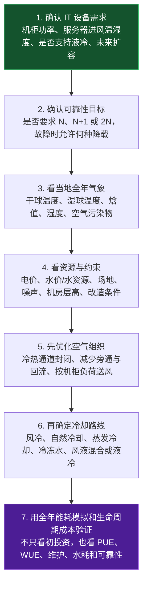

美国能源部的数据中心节能设计指南将设计、运行和能源效率作为系统性问题处理；因此实际项目应以全年运行策略和全生命周期成本验证方案，而不是以单一设备效率判断。

#### 面试回答（最稳版本）
数据中心最节能的冷却方案不能脱离机柜热密度、气候、水资源、可靠性和扩容需求单独判断。对于中低热密度机房，应先通过冷热通道隔离、封堵旁通风和按需风机控制，减少无效空气混合；在气候适宜地区，再优先采用空气侧或水侧自然冷却、间接蒸发冷却，尽量减少压缩机运行。对于高密度 AI 或 HPC 负荷，空气冷却可能难以经济地承担全部热量，更合理的路线通常是冷板液冷与 CRAH 空气系统协同：液冷带走 CPU/GPU 等高热流部件的热量，空气侧处理其余部件和机房环境。最终应以服务器进风环境、全年 PUE/WUE、可靠性冗余和全生命周期成本共同评价，而不是只追求某一种设备或单项能效。

---

### 四-F、数据中心 IT 负荷与冷却容量匹配（通用基础专题，不进液冷）

> 本子节属于普通数据中心与 AI 数据中心的**共同基础**：根据 IT 功率理解机柜热负荷，解释冷却容量如何匹配，并判断"冷量不足"与"气流组织不足"是两个不同问题。
>
> **今日总目标（一句话）**：数据中心冷却要同时满足**总量热平衡**和**局部气流/容量匹配**；总冷量足够，不代表每个高负荷机柜都能获得足够冷空气。
>
> **渐进学习路径**（秋招优先、面试表达优先：先把 CRAH 空气冷却和水系统讲稳，液冷作为高密度 AI 场景的"进一步解决方案"而非孤立热门名词）：


今日不进入 CDU、冷板、浸没等液冷细节。

##### 一、电功率—热负荷基本概念

**核心判断（务必记牢）**：在稳态工程估算中，IT 设备消耗的 1 kW 电功率，几乎最终都会成为约 1 kW 的热负荷；但"IT 热负荷约为 1 kW"**不等于**"冷却系统只需按 1 kW 额定冷量配置"。IT 实际功率、辅助设备散热、峰值、冗余、实际工况和扩容需求必须分开看。

**为什么电功率会变成热**：服务器、存储、交换机等设备从电网获得电能后，CPU/GPU 计算、电源转换、硬盘运转、风扇运行和网络传输最终都会使能量以热的形式释放。少量能量可能通过信号、光或机械运动离开机房，但相对于 IT 总功率通常可忽略，因此工程上常近似：

$$Q_{IT} \approx P_{IT,actual}$$

其中 `Q_IT` 为 IT 设备释放到机房空气或液冷回路中的热负荷（kW），`P_IT,actual` 为 IT 设备实际输入电功率（kW）。例如服务器当前实际耗电 10 kW，则最终约向空气或冷却液释放 10 kW 热量；空气冷却时热量先进入服务器排风，液冷时较大部分直接进入冷却液。将 IT 总输入功率作为 IT 发热量，是数据中心负荷估算的基本做法。

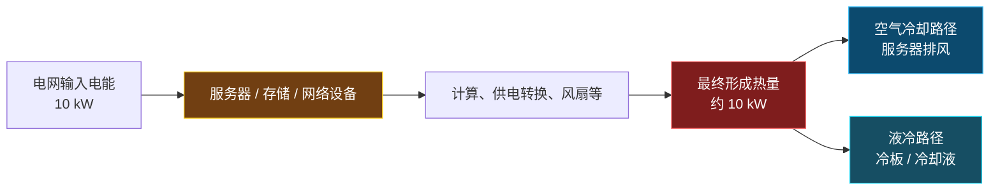

**四种功率要分开**（面试勿把铭牌功率当长期实际负荷）。可用"铭牌用于上限判断，实测用于运行判断，峰值用于风险判断，设计用于容量规划"记忆：

| 概念 | 含义 | 典型用途 | 不能误解为 |
|------|------|----------|------------|
| 设备铭牌功率 | 厂商标注的最大、额定或配置上限输入功率 | 设备选型、供电上限初判 | 长期实际耗电 |
| 实际运行功率 | 服务器当前真实消耗的功率 | 实时热负荷、能耗、热点与控制分析 | 永远稳定不变 |
| 峰值功率 | 特定任务、启动、满载训练或瞬态工况下可能达到的高功率 | 供配电和冷却风险校核 | 每时每刻的平均负荷 |
| 设计功率 | 规划阶段用于确定供电、冷却和扩容能力的负荷假设 | 系统容量、冗余与分期建设 | 仅等同于设备铭牌之和 |

尤其不要把服务器铭牌功率直接等同于长期热负荷——标称功率通常反映最大使用功率或电源配置上限，实际功率应由当前硬件配置、利用率和运行任务决定。

**一个简单例子**：某机柜装 10 台服务器，每台电源铭牌 1.2 kW（机柜铭牌合计 12 kW）；日常实际运行每台约 0.55 kW（机柜实际 IT 功率约 5.5 kW）；AI 训练短时满载每台约 1.0 kW（机柜峰值 IT 功率约 10 kW）。则：日常冷却负荷首先按约 5.5 kW 理解；高负荷任务期间可能需应对约 10 kW 局部热负荷；设计人员不会简单用 12 kW 乘机柜数作"永远运行的冷负荷"，也不能只按 5.5 kW 配置而忽略峰值、业务增长和冗余；按 10 kW、12 kW 或其他设计值校核，取决于负载预测、同时使用率、扩容策略、供电架构、可靠性等级和规范要求。

**冷却容量为何更大**：数据中心总冷却负荷可先理解为：

$$Q_{total} \approx Q_{IT} + Q_{UPS/PDU} + Q_{lighting} + Q_{people} + Q_{envelope} + Q_{other}$$

UPS、变压器、PDU 等供配电设备自身存在转换损耗，也会变成机房或相邻电气房内的热量；照明、人员、围护结构传热和加湿等也可能需要纳入热负荷计算。总热负荷估算应汇总 IT、电源设备、建筑传导、加湿、冗余和未来增长等因素。

但有一个重要的工程细节：**冗余设备本身不必然在正常状态下持续产生等同于"满容量"的热负荷；冗余首先意味着故障或检修工况下，剩余系统仍有能力承担设计负荷**。所以要区分两个问题：① 热负荷计算——当前和预测未来到底有多少热需要排走；② 容量与冗余设计——即使一台冷机、CRAH 或泵失效，剩余设备还有多少冷却能力。

**"空气输送损失"怎么理解（措辞微调）**：气流组织不良会降低有效冷量利用率，并使所需送风量、风机能耗或送风温度要求上升。热量并不会凭空消失，服务器仍向机房释放相同热量；问题是冷风旁通、热空气回流、漏风和送风分配不均，会让冷空气没有有效穿过高负荷服务器，导致局部进风温度超限。为保护最热机柜，系统可能被迫增加 CRAH/CRAC 风机风量、降低送风温度、开启更多末端设备、甚至提前启用更多冷源设备。因此气流组织问题首先是局部冷却能力和能效问题，不应被理解成总热负荷中的一项"固定损失热量"。

> **面试版回答**：数据中心中 IT 设备消耗的电能绝大部分最终转化为热量，稳态估算中 1 kW IT 实际用电通常可近似对应 1 kW IT 热负荷。但冷却系统设计容量不能只等于 IT 功率，还应考虑 UPS 和配电损耗、照明和围护结构等附加热源、业务峰值、实际工况、未来扩容与系统冗余。还要区分设备铭牌功率、实际运行功率、峰值功率和设计功率：铭牌表示上限，实际反映当前热负荷，峰值用于风险校核，设计用于供电与冷却容量规划。因此不能直接把服务器铭牌功率当作长期冷却负荷。

##### 二、机柜功率密度（kW/柜）与三层汇总

机柜功率密度用 `kW/柜` 表示机柜内 IT 设备的功率与发热水平。三层汇总关系：

```
服务器功率 → 机柜功率 → 机房/数据中心 IT 负荷
```

**关键结论：总量匹配不代表局部匹配**。机房平均功率密度不能完全代表局部状态——部分机柜低负荷、部分高负荷时，全机房均值可能正常，但高负荷机柜附近仍可能进风温度偏高或风量不足。除总 IT 负荷和总制冷量外，还必须看：每个机柜功率、机柜位置、服务器进风温度、送风量分配、回风路径、冷风旁通、热空气回流。

##### 三、空气冷却热平衡 `Q = ṁ c_p ΔT`

空气带走热量的基本关系：

$$Q = \dot m\, c_p\, \Delta T = \rho\, \dot V\, c_p\, \Delta T$$

- `Q`：空气带走的热量；`ṁ`：空气质量流量；`ρ`：空气密度；`V̇`：体积流量；`c_p`：空气比热容；`ΔT`：空气经过服务器前后温升。

理解要点：机柜热负荷增加时，要维持相同温升通常需增加风量；风量不足时，排进风温差增大或进风温度升高。**风量并非越大越好**——过大会增 CRAH/CRAC 风机能耗、造成冷风旁通、机房压差异常、气流组织恶化、部分区域过剩而部分仍不足。正确目标是冷却能力与每个机柜实际热负荷匹配。

**今日计算练习**：10 kW 机柜、温升 12 K、ρ≈1.2 kg/m³、c_p≈1.0 kJ/(kg·K)。注意单位统一：以 kW、kg/s、kJ/(kg·K) 和 K 表示时，由 `Q = ρ V̇ c_p ΔT` 反算得到的 `V̇` 单位就是 m³/s，数值即 kW：

$$\dot V = \frac{Q}{\rho\, c_p\, \Delta T} = \frac{10}{1.2\times1.0\times12} = 0.694\ \text{m}^3/\text{s}$$

换算：

$$0.694 \times 3{,}600 \approx 2{,}500\ \text{m}^3/\text{h} \quad (\text{约 } 1{,}470\ \text{CFM})$$

即理想条件下，10 kW 机柜、进排风温升 12 K 时约需 **0.69 m³/s 或 2,500 m³/h**（典型温升常取 10–12°C）。

下面把这段计算从"会算数"深化到"能解释工程含义"——你真正要掌握的不是背数值，而是：**固定热负荷下，风量与允许温升互相制约；但实际机房需要的是"有效穿过服务器的风量"，而不是 CRAH/CRAC 盲目开到最大风量。** 空气流量管理会显著影响数据中心冷却性能。

###### "风量不足"为什么有两种表现

"排风与进风温差增大，或者进风温度升高"都对，但两种表现对应不同的气流边界。

**情况一：进风温度基本正常。** 若冷通道仍能稳定供冷（如进风 22°C），但风量减少、IT 热负荷仍为 10 kW，则 $\Delta T = Q/(\rho\,\dot V\,c_p)$ 被迫增大。例如原 0.69 m³/s、ΔT=12 K；若有效风量降为约 0.35 m³/s，理想计算下 ΔT 升到约 24 K，排风可能从 34°C 升至约 46°C。

**情况二：冷通道供风本身不足。** 若高负荷机柜附近送风不够，或发生热空气回流，服务器会吸入更热的空气；此时即使服务器风扇高速运转，进风温度仍会上升——这是局部热点最危险的表现。

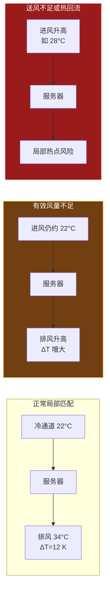

因此，看到"排风很热"不能立即说是冷却故障；还要看机柜功率、进风温度和实际风量。若进风合格、功率很高，较高排风温度可能只是正常吸热；若进风也很高，才应优先排查局部气流组织、回流或冷量不足。

###### 为什么不是风量越大越好

要分清：更多"有效穿过服务器"的风量可以提高散热能力；但更多"系统送出的总风量"不必然有用。

风量过大而气流没被约束时，常见后果：

- **风机能耗增加**：CRAH/CRAC 和服务器风机需要更多电功率（风机功率通常随风量显著上升，呼应四-E 的 PUE 视角）；
- **冷风旁通**：冷空气从空 U 位、机柜缝隙、线缆孔、未封闭通道或多余送风口绕过服务器，直接回到回风侧；
- **冷热混合**：过量送风可能扰乱原本的热通道回风路径；
- **局部失衡**：低负荷区域获得太多冷风，高负荷机柜仍因送风口位置、阻力和回流而缺风。

数据中心气流管理资料将线缆开孔、孔洞和缝隙导致的冷风绕过服务器并直接回到冷却设备，视为典型冷风旁通；盲板、通道端部封闭和线缆孔密封可减少冷热混合。即便增加风量降低了局部温升，也要比较由此带来的风机耗电、旁通损失和冷源能耗，而不是只看温度下降。

###### "理想估算"漏掉什么

2,500 m³/h 是真正流过服务器、并且全部有效吸热所需的理论风量，不等于应直接把 CRAH 总送风量设成 2,500 m³/h。工程落地还必须考虑：

| 因素 | 它会带来的影响 |
|------|----------------|
| 冷风旁通、漏风 | CRAH 送出的部分冷风没有穿过服务器，实际所需总送风量可能更高 |
| 热空气回流 | 提高服务器进风温度，可能要改善封闭和回风路径，而不是一味加风 |
| 服务器和机柜阻力 | 决定服务器风扇、CRAH 风机需要提供的静压 |
| 风口/穿孔地板位置 | 决定冷风能否送到高功率机柜前部 |
| CRAH 送风温度 | 影响服务器可接受的温升和冷通道温度 |
| 高度温度分层 | 机柜顶部可能比底部更容易缺冷 |
| 冗余与峰值负荷 | 需校核故障、切换和业务突增时的可用风量与冷量 |

本题真正的工程结论是：**对 10 kW、12 K 温升的机柜，理论上需要约 0.69 m³/s 的有效穿柜风量；如果服务器进风温度过高，不能只通过增加 CRAH 风量解决，应先判断是总冷量不足、局部送风不足、冷风旁通，还是热空气回流。**

##### 四、冷却容量如何匹配（四类容量概念）

容量链：**IT 总负荷 → 机柜负荷分布 → 所需空气流量和冷量 → CRAC/CRAH 末端能力 → 冷冻水或制冷剂系统 → 冷水机组和室外排热设备**。

四个容量概念：

1. **额定冷量**：规定工况下标称的冷却能力；
2. **实际可用冷量**：受冷冻水供水温度、进风温度、水流量、风量、盘管状态、部分负荷性能影响，额定 ≠ 现场实际可用；
3. **显冷量**：数据中心主要负荷是服务器显热，需重点关注高显热比运行（区别于舒适性空调还需处理人员/新风潜热与湿度负荷）；
4. **冗余后的可用容量**：如负荷需 3 台 CRAH、配 4 台（N+1），不能把 4 台全视为长期可扩容容量，其中一台承担冗余。

**判断**：安装容量、运行容量、冗余容量、可扩展容量必须分开。

##### 五、关键监测参数（为什么进风温度 > 平均温度）

| 参数 | 工程意义 |
|------|----------|
| 服务器进风温度 | 判断服务器获得的冷空气是否合格 |
| 服务器排风温度 | 反映服务器排热状态 |
| CRAH/CRAC 送风温度 | 冷却设备输出空气状态 |
| CRAH/CRAC 回风温度 | 反映回收热空气状态 |
| 送回风温差 | 反映空气带走热量的情况 |
| 机柜功率 | 直接反映局部热负荷 |
| 机房压差 | 判断气流方向和送风组织 |
| 湿度/露点 | 判断静电、结露和环境风险 |
| 风机转速 | 反映空气输送能力及能耗 |
| 阀门开度 | 反映冷冻水或制冷剂调节状态 |

**为什么进风温度比机房平均温度更重要**：服务器真正"感受到"的是其进风口空气状态；平均温度正常时，某高负荷机柜仍可能因热空气回流出现过高进风温度。

**送回风温差不能单独诊断**：较大的服务器进排风温差可能表示该机柜有效吸收了较多热量，也可能表示局部风量不足或进风受热回流影响；必须与机柜功率、进风温度、风量、CRAH 运行状态一起判断。温差是非常有价值的诊断信号，不是单独的故障结论。

**为什么温差不唯一定义故障——双向含义对照**：根据热平衡 `Q = ρ V̇ c_p ΔT`，温差 `ΔT` 同时受热负荷 `Q` 与风量 `V̇` 影响，且服务器负载、风机状态本身随时间变化。因此"同样的温差"可由完全不同的运行状态造成，温差只报告"这段空气的状态变化"，不直接说明造成变化的唯一原因。

**大温差（如进风 22°C、排风 34°C、ΔT=12 K）的四种可能含义**：

| 观察现象 | 可能含义 | 是否一定故障 |
|----------|----------|--------------|
| 温差大、进风温度正常、机柜功率高 | 服务器确实吸收并排出较多热量，气流路径可能正常 | 不一定 |
| 温差大、进风温度高、机柜功率高 | 高负荷机柜冷空气可能不足，存在热点风险 | 需要排查 |
| 温差大、机柜功率并不高 | 实际穿过服务器的风量偏小，或热空气回流抬高进风温度 | 可能异常 |
| 温差突然变大 | IT 负荷突增、服务器风扇异常、送风减少、地板下静压变化等 | 需结合趋势判断 |

**小温差（如进风 22°C、排风 26°C、ΔT=4 K）的四种可能含义**：

| 观察现象 | 可能含义 |
|----------|----------|
| 机柜 IT 负荷较低，本来发热就少 | 正常低负荷 |
| 送风量远大于实际所需，空气快速穿过服务器 | 过送风、能效浪费 |
| 大量冷风旁通，冷空气未真正穿过设备即回风 | 冷风旁通、气流短路 |
| 进风温度已高而温差仍小 | 服务器风扇主动加速保护，提高通过设备的风量 |

所以"温差大"既可能是高效带热，也可能是风量不足；"温差小"不自动代表冷却好或能效高，也可能是过送风、冷量浪费或旁通。正确诊断须把温差放在"负荷—风量—温度"三者关系中，结合机柜功率、进风温度、排风温度、风机转速、CRAH/CRAC 送回风、冷/热通道状态综合判断；若温差突然变化但 IT 功率未变，更应优先排查风机、送风口、挡板、阀门、CRAH 运行或传感器漂移。数据中心常用回风温度指数等综合指标识别再循环与气流短路，也说明单纯温差读数不足以完成诊断。

**直观类比（面试可一句话带出）**：把机柜想成"人用吸管喝饮料"——饮料带走的热量取决于每秒喝多少（流量）和出入口温差；出口液体温度高，不一定说明人"有病"，可能只是喝得慢或杯中热量更多。要判断问题，必须同时知道喝的速度、杯中热量和入口温度。数据中心同理：温差只告诉你这段空气的状态变化，不直接告诉你造成变化的唯一原因。

> 边界：18–27°C 常被作为典型 IT 设备推荐进风温度范围，但实际可接受范围必须以所用 IT 设备的 ASHRAE 热等级与厂商规范为准；不能把单一范围当成所有服务器的强制限值。ASHRAE 的 AI 数据中心能效建议也明确强调：应避免过量送风、根据实际 IT 负荷调节 CRAH/CRAC 风机，并在机柜进风侧部署细粒度传感器，而不能只用房间级温度判断。

**监测参数优先级**（面试官问"最重要的监测量"时按优先级而非背表回答）：

| 优先级 | 关键参数 | 为什么看它 |
|--------|----------|------------|
| 1 | 机柜/服务器进风温度 | 直接反映 IT 设备真实热环境，是热点预警核心 |
| 2 | 单柜 IT 功率、机柜功率密度 | 决定局部热负荷和所需冷却能力 |
| 3 | CRAH/CRAC 送回风温度、风机转速 | 判断末端换热和空气输送状态 |
| 4 | 冷冻水供回水温度、流量、压差、阀位 | 判断 CRAH 冷水盘管是否得到足够冷量 |
| 5 | 冷机负荷、冷却水温度、泵/塔状态 | 判断集中冷源与室外排热能力 |
| 6 | 湿度/露点、机房压差、漏水与告警 | 防止结露、静电、气流反向和水系统风险 |

##### 五-B、监测点布置、监控平台与 ML 预测的边界

**监测点不是"机房里挂几个温湿度计"，而是按热量路径分层布点**：IT 热源 → 空气侧末端 → 冷冻水侧 → 冷源与室外环境。传感器、智能电表、设备控制器与服务器自身接口采集数据后上传 BMS/DCIM/EMS，平台完成趋势显示、告警、报表与控制联动。

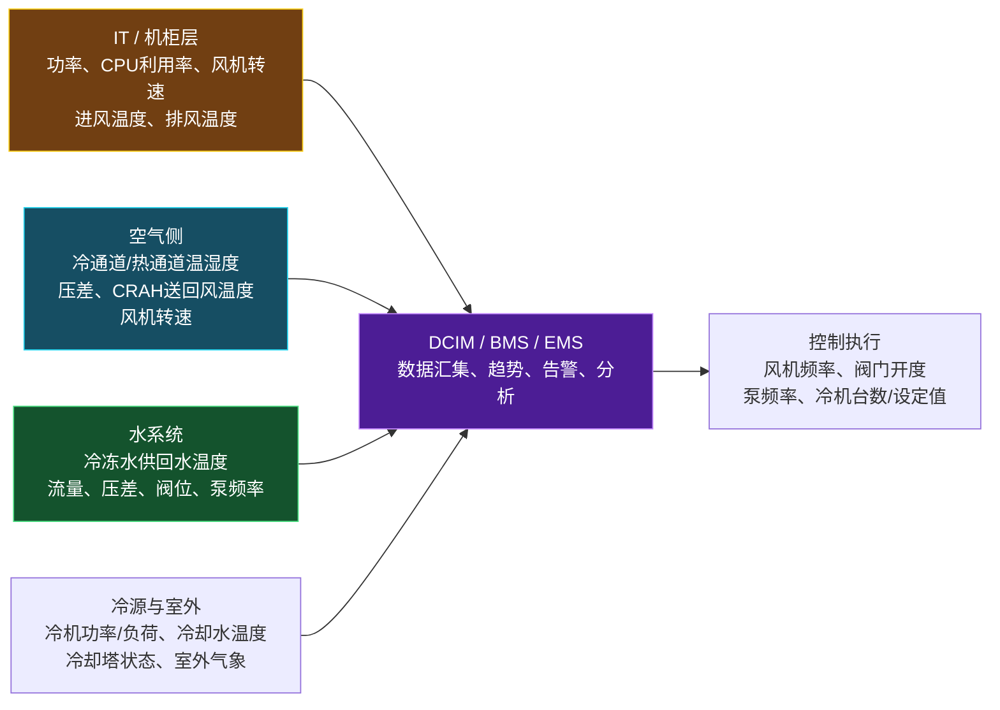

**分层布点要点**：

- **IT 与机柜层（回答"哪一个机柜发热、哪一个机柜真正缺冷"）**：机柜 PDU/智能电表测单柜功率与能耗；服务器 BMC/IPMI/Redfish 接口取 CPU/GPU 利用率、设备功率、风扇转速与部分进排风温度；机柜前部低/中/高不同高度温度传感器（高处更易热空气回流）；机柜后部温度传感器测排风与进排风温差。
- **空气侧（判断冷空气是否有效抵达、热空气是否有效回收）**：冷通道温湿度重点布置在机柜进风面而非墙上或机房中央；热通道回风温度；CRAH/CRAC 送回风温湿度；风机转速/频率、风阀状态；冷—热通道压差、地板下静压（判断送风驱动力、漏风与旁通）。
- **冷冻水与冷源层（水侧是否真的把冷量送到末端）**：冷冻水供回水温度（得水侧温差）；流量、供回水压差；CRAH 二通阀开度（长期接近 100% 而送风仍不足 → 水温/流量/上游冷源能力问题）；冷冻水泵频率、功率、台数；冷机负荷、蒸发器/冷凝器温度、功率与 COP；冷却水供回水温度、冷却塔风机频率、室外干湿球温度（判断排热条件与自然冷却机会）。

**能用机器学习预测冷负荷吗**：可以，且与 Python、XGBoost、传感器缺失鲁棒性背景很契合。但必须区分三个层次——**先算清、再预测、最后优化**：

| 层次 | 目标 | 适合的方法 |
|------|------|------------|
| 机理计算 | 根据 IT 功率、流量与温差核算热负荷 `Q = ṁ c_p ΔT` | 热平衡公式 |
| ML 预测 | 预测未来 15 分钟至数小时 IT/冷却负荷、热点风险、PUE | XGBoost、随机森林、时序模型 |
| 优化控制 | 基于预测调整 CRAH 风机、阀门、泵频率、冷机台数或设定值 | 规则控制 + 优化；后期再考虑 MPC/强化学习 |

ML 应建立在可靠传感、热平衡和传统控制逻辑之上，而不是替代它。短期预测常见输入：IT 负荷（机柜功率、CPU/GPU 利用率、任务类型）、空气侧（进排风温度、冷通道温度、CRAH 送回风、风机频率）、水侧（冷冻水供回水温度、流量、压差、阀位、泵频率）、冷源侧（冷机功率、冷却塔状态、室外干湿球）、时间信息（小时、工作日/周末、历史滞后值）。预测值可提前启用备用 CRAH、预调泵频率、优化冷机台数；工程闭环须含全维度数据采集 → 模型预测 → 策略决策 → PLC/控制器执行，而非模型只输出一个数值。冷水机组负荷预测已有服务冷水系统负荷优化与节能的研究。

**对你最适合的第一个小项目（不要一上来预测机房总冷负荷，总量预测会掩盖局部热点问题）**：

> **基于 IT 功率与环境传感器的机柜进风温度/热点风险短期预测**
> - 输入：单柜功率、邻柜功率、冷通道温度、CRAH 送风温度、风机频率、冷冻水供水温度、时间滞后特征；
> - 输出：未来 15 或 30 分钟机柜进风温度，或"是否超过预警阈值"的热点风险分类；
> - 模型：先以 XGBoost 为主；
> - 工程意义：提前发现局部高热负荷或气流组织风险，而非等服务器过温才响应；
> - 边界：公开数据不足时可用模拟数据与机理模型演示，但不能宣称真实工程准确率。

这条项目比"纯预测冷负荷"更能体现你理解了总冷量与局部冷却并非同一问题。

##### 五-C、18–27°C 边界与风冷/液冷/水系统辨析

**18–27°C 到底指什么**：指服务器进风口处的空气干球温度，主要适用于传统空气冷却或风液混合系统中仍由空气冷却的部件。它不是"整个机房任何位置都必须 18–27°C"，也不是液冷回路水温或冷冻水温度。

```
冷通道空气 → 进入服务器前部的空气温度 → 典型建议 18–27°C
不是：CRAH 送风温度
不是：热通道温度
不是：机房平均温度
不是：冷冻水供水温度
不是：液冷 TCS/FWS 供液温度
```

例如冷通道封闭时，冷通道内服务器进风空气可符合建议范围，而热通道或机房其他区域温度可明显更高；不能在房间中央测得 27°C 以下就认定每个服务器都安全。

**五-C-1、CRAH 温度 ≠ 服务器进风温度（最常被混淆的一对）**：服务器进风温度是服务器前面实际吸进去的空气温度；而"CRAH 温度"不是一个单一温度，可能指 CRAH 的送风温度、回风温度，或盘管冷冻水供回水温度。二者位置不同、用途也不同：前者判断 IT 是否安全，后者判断 CRAH 本身是否在正常提供和回收冷量。

先看气流位置（冷空气从 CRAH 到服务器、再回到 CRAH 的完整路径）：

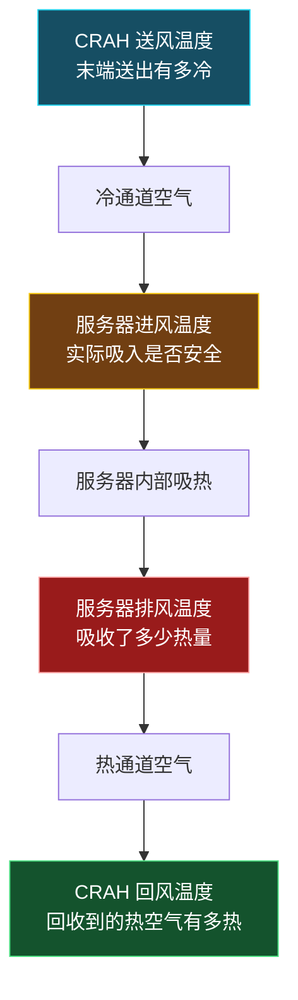

在气流组织理想、冷通道封闭良好的情况下，近似有 `T_CRAH送风 ≈ T_服务器进风`；但实际机房中，服务器进风温度往往略高于 CRAH 送风温度——冷空气从 CRAH 到机柜前部的途中，可能受到热空气回流、漏风和冷热空气混合影响。通道封闭的重要作用，就是让 CRAH 送风温度更接近服务器真实进风温度。

CRAH 涉及的温度及其测点位置：

| 温度名称 | 测点位置 | 它回答的问题 |
|----------|----------|--------------|
| CRAH 送风温度 | CRAH 出风口或送风静压箱 | CRAH 送出去的空气有多冷 |
| 服务器进风温度 | 服务器前面/机柜前部 | 服务器实际吸到的空气是否安全 |
| 服务器排风温度 | 服务器后面/机柜后部 | 空气穿过服务器后吸收了多少热量 |
| CRAH 回风温度 | CRAH 回风口 | CRAH 实际回收到的热空气有多热 |
| 冷冻水供回水温度 | CRAH 水盘管进、出口 | 水侧能否向 CRAH 提供足够冷量 |

所以别人问"CRAH 温度是多少"时，应追问或主动澄清：您指的是 CRAH 送风、回风，还是冷冻水供回水温度？

一个数值例子（假设）：

```
CRAH 送风温度：20°C
服务器进风温度：22°C
服务器排风温度：34°C
CRAH 回风温度：32°C
```

这表示：CRAH 先把空气冷却到 20°C；冷空气到达机柜前升到 22°C，说明送风路径存在约 2 K 温升（少量温升不一定异常，但需关注是否持续扩大）；空气通过服务器后升至 34°C，服务器进排风温差 12 K，说明空气吸收了 IT 热量；多个机柜热排风混合后，以约 32°C 进入 CRAH 回风侧，回风温度不必与单台服务器排风温度完全相同。

**为什么服务器进风更重要**：CRAH 送风温度正常，不等于每台服务器都安全。例如 CRAH 出风 20°C，但某高负荷机柜因热空气回流，实际进风可能达 29°C；机房平均温度也许仍正常，但该机柜已面临热点风险。因此数据中心真正应优先控制和监测的是**服务器/机柜进风温度，而不是仅控制 CRAH 送风温度或机房平均温度**（18–27°C 建议区间针对的正是服务器或机柜进风区域；冷热通道封闭后，机房其他区域或热通道可明显高于 27°C）。

**与控制的关系**：CRAH 常以送风温度、回风温度、冷通道温度、压差或其组合控制；更先进或更可靠的逻辑会把机柜进风温度纳入控制目标。例如：

- 某列机柜进风温度升高：提高附近 CRAH 风机频率，或调整送风量；
- CRAH 送风正常但局部机柜进风仍高：优先检查热回流、盲板、封闭、地板开孔和气流分配，而不是立即降低所有 CRAH 的送风温度；
- CRAH 回风过低且风机很高：可能存在冷风旁通或过送风；
- CRAH 回风高、阀门接近全开、送风仍升高：再检查冷冻水温度、流量、压差及冷源能力。

> **面试版回答**：服务器进风温度是服务器前部真正吸入空气的温度，是判断 IT 设备热安全的直接指标；CRAH 温度需区分送风温度、回风温度和冷冻水供回水温度。CRAH 送风反映末端送出了多冷的空气，但冷空气在到达机柜前可能因热空气回流、漏风或冷热混合而升温，因此 CRAH 送风正常不代表所有服务器进风都合格。数据中心应以机柜进风温度作为热点控制的关键指标，再结合 CRAH 送回风和水侧参数定位问题。

**风冷、液冷与水系统（最容易混淆的点）**："空气冷却"和"水系统冷却"不是完全对立的概念。

- 传统 CRAH 冷冻水系统：服务器芯片 → 服务器内部空气 → 冷/热通道空气 → CRAH 冷冻水盘管 → 冷冻水 → 冷水机组 → 冷却水/冷却塔 → 室外。服务器末端仍是风冷，只是 CRAH 用冷冻水作冷源，因此 18–27°C 同样适用（服务器仍在吸空气）。
- 冷板液冷：CPU/GPU → 冷板 → TCS 技术冷却液 → CDU 液-液换热器 → FWS 设施水 → 冷机/干冷器/冷却塔 → 室外。液冷时芯片主要冷却对象不再是进风空气，而是冷板内冷却液，关键参数变为 TCS/FWS 供回液温度、流量、压差、冷板压降与芯片温度，不能直接套用 18–27°C 作液体温度标准。

| 项目 | CRAH 冷冻水空气冷却 | 冷板液冷 |
|------|---------------------|----------|
| 服务器末端介质 | 空气 | 冷却液 |
| 芯片热量先交给谁 | 服务器内部空气 | 冷板内技术冷却液 |
| 关键安全温度 | 服务器进风空气温度 | 芯片温度、冷板入口温度、TCS 供液温度 |
| 18–27°C 是否直接适用 | 是，针对服务器进风空气 | 不直接适用液体；仅对仍由空气冷却的部件有意义 |
| 后端冷源 | 冷冻水、冷机、冷却塔等 | CDU 后接设施水，再接冷机/干冷器/冷却塔等 |
| 是否仍可能需要空气侧 | 是，完全依赖空气 | 是，很多系统仍处理内存、硬盘、网卡、电源等剩余热量 |

所以"传统水系统"和"液冷"最大区别不是后端都不用水（两者后端都可能用水系统），而是服务器最前端如何把芯片热量送入系统：CRAH 冷冻水是空气—水换热、水在 CRAH 盘管里离芯片较远；冷板液冷是芯片附近液体—水换热、冷却液经冷板近距离取热。两者可在同一数据中心共存，形成空气辅助液冷或混合冷却系统。

##### 六、容量不足的三种表现（系统诊断思维）

1. **冷量不足**：CRAH/CRAC 接近满负荷、送风温度无法降低、冷冻水阀门长期全开、多区域温度整体升高；
2. **风量或气流组织不足**：总制冷量仍有余量，但部分机柜温度偏高、热空气回流明显、局部冷风不足、高负荷机柜热点突出；
3. **冷源或水系统受限**：CRAH 阀门已开大但盘管供冷不足、冷冻水供水温度升高、水流量不足、压差不够、冷机或泵达能力上限。

**容量不足诊断树**（今天最值得练成口头表达的系统性框架——先从最靠近 IT 设备的局部负荷与气流开始，逐层向冷源回溯；它不是绝对固定的维修 SOP，但作为面试系统诊断框架非常好）：

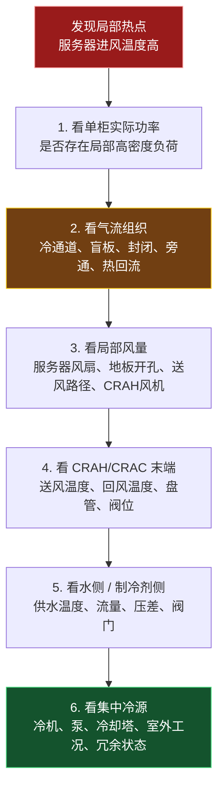

> 面试关键句：出现热点时不能直接判断是冷机容量不足，应沿"服务器进风 → 空气流量 → CRAH → 冷冻水流量 → 冷源能力"逐级排查。

##### 七、与 AI/HPC 的有限联系（边界克制，今日不深入液冷）

今天只需形成以下关系（**正确且克制**，无需讨论 CDU、冷板和浸没式）：

```
单柜功率越高
→ 需要的风量或允许的温升管理要求越高
→ 机柜级气流分配与热点风险更突出
→ 纯空气冷却的风机能耗、噪声、风阻和空间压力增加
→ 才引出后续的液冷、后门换热器或混合冷却
```

AI 机柜功率密度上升确实是推动冷却技术变化的核心因素，但不同数据中心和机柜设计条件差异很大，**不能用一个固定 kW/柜 阈值宣称"超过即必须液冷"**。

##### 八、连接项目 1（缺失鲁棒性迁移，定稿表达）

> 我的主课题研究了传感器数据缺失条件下的热舒适预测鲁棒性和关键变量筛选。数据中心容量管理与热点控制同样依赖机柜功率、服务器进风温度、排风温度、风量、压差、冷冻水供回水温度及设备状态等数据；若传感器出现缺失、漂移或异常，局部负荷识别和冷却控制可能失真。因此，我在缺失处理、特征重要性分析和轻量化输入方面的方法思路，未来可以迁移到数据中心运行数据的质量诊断、热点风险预测或软测量中。不过，我当前研究对象仍是热舒适数据，实际迁移必须基于数据中心真实运行数据重新建模和验证。

##### 今日输出与验收

- **"总量"与"局部"图**（比单纯"服务器—CRAH—冷机"更贴合本日主题，含五类瓶颈）：

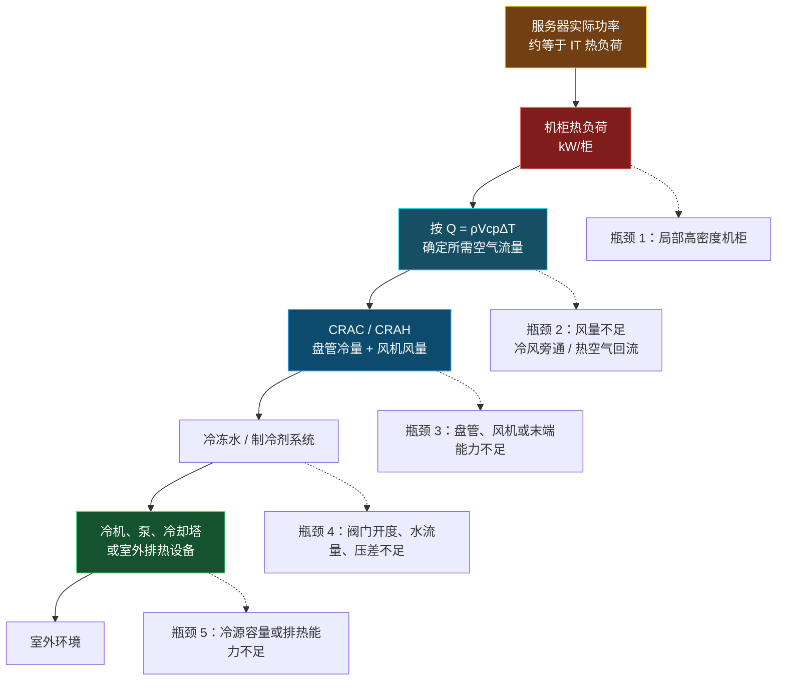

- **机柜风量估算题**：10 kW、ΔT=12 K，公式 `V̇≈Q/(ρ c_p ΔT)`、单位统一（数值即 kW、结果 m³/s）、0.694 m³/s≈2,500 m³/h≈1,470 CFM、为何需额外余量；
- **《数据中心负荷与容量面试 10 问》**（每题 80–150 字）：IT 功率与热负荷关系 / 机柜功率密度 / 平均负荷不代表局部风险 / 总冷量足够仍热点 / 风量-温差-热负荷关系 / 风量非越大越好 / 额定 vs 实际可用冷量 / 进风温度 > 平均温度 / 局部热点排查 / AI 更易面临空气冷却压力；
- **项目 1 迁移回答**一段（见第八节定稿）；
- **3 分钟录音**（题目：介绍 IT 负荷、机柜功率密度与冷却容量之间的关系；顺序见原文复述顺序）。

> 核心目标：能根据 IT 功率理解机柜热负荷、解释冷却容量如何匹配，并判断"冷量不足"与"气流组织不足"是两个不同问题。衔接：本专题与四-D-2（热量链路）、四-E（选型方法论）、六-C/冷冻水六（冷冻水末端与排热）自洽；液冷细节留待后续专题。

---

### 四-G、冷热通道与气流组织（通用基础专题，不进液冷）

**本质先说清**：冷热通道的本质不是"把机柜摆整齐"，而是强制建立一条**可控的空气热量路径**——冷空气只进入服务器前部，热空气只回到空调设备回风侧，尽量避免两股空气在机房内混合。

##### 一、先把气流看懂

服务器通常是**前进风、后出风**。因此两排机柜应以前面相对形成**冷通道**、背面相对形成**热通道**的方式布置：冷空气进入冷通道，穿过服务器吸热后进入热通道，再返回 CRAH/CRAC。

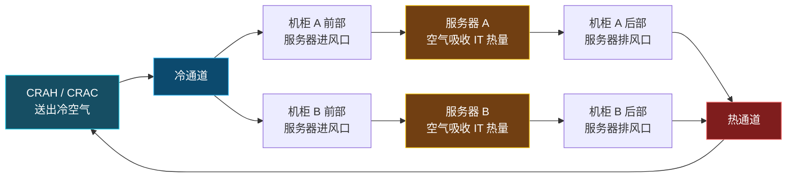

> 注意：冷通道和热通道本身**不是某台空调设备**，而是由机柜排列、送回风方式、架空地板或顶部送风、回风口和隔断共同形成的**机房空气组织方案**。

##### 二、为什么要分冷热通道

若没有冷热通道，服务器排出的热空气会在机房内扩散、与冷空气混合。为保证最不利机柜不超温，CRAH/CRAC 往往不得不降低送风温度或增加风量，结果制冷和风机能耗增加。

冷、热气流分离带来的核心收益：

1. 降低服务器进风温度的不均匀性，减少局部热点；
2. 让更多冷空气真正穿过服务器，而非直接返回空调；
3. 让更热、更集中的回风回到 CRAH/CRAC，提高末端换热的有效性；
4. 在满足最热点机柜进风温度的前提下，为提高送风温度、降低风机转速创造条件。

##### 三、两种典型问题

**1. 热空气回流**

热空气回流是服务器后部排出的高温空气，没有顺利被热通道和回风口收集，而是绕到机柜前部、又被服务器吸入。

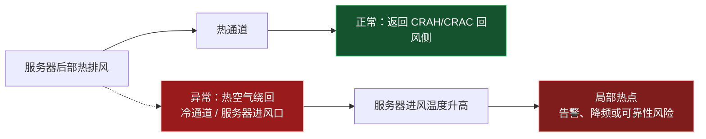

它的直接后果**不是"总冷量消失"**，而是高温空气掺入进风，局部服务器入口温度超限。即使房间平均温度和 CRAC/CRAH 总冷量看起来正常，高负荷机柜仍可能形成热点。

常见诱因：通道未封闭、机柜顶部或侧面漏风、空机位没有盲板、回风路径不畅、机柜摆放方向混乱、局部高密度负荷或局部送风量不足。

**2. 冷风旁通**

冷风旁通是 CRAH/CRAC 送出的冷空气没有穿过服务器吸热，便直接进入热通道或回到回风侧。

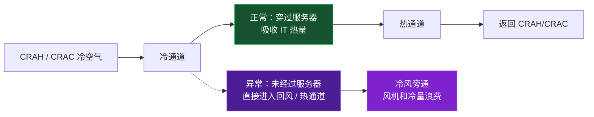

冷风旁通本质是"冷空气走捷径"。它使 CRAH/CRAC 回风温度偏低、盘管换热利用不足；为满足局部机柜，系统可能错误地继续加大风量或降低送风温度，增加能耗。

常见诱因：地板送风口开孔过多或位置不匹配、机柜空位或线缆孔未封堵、送风量明显超过服务器需求、冷通道端部未封闭、回风口位置不合理。

##### 四、风量不足与过量（口诀：不足看热点，过量看旁通）

| 问题 | 直接机理 | 主要表现 | 常见后果 |
|------|----------|----------|----------|
| 风量不足 | 通过高热负荷机柜的空气质量流量不够 | 机柜进排风温差增大、进风温度升高、局部热点 | 设备降频、温度告警、可靠性风险 |
| 风量过大 | 送风量超过 IT 实际吸热所需 | 冷风绕过机柜、回风温度偏低、部分冷通道静压过高 | 风机能耗增大、冷风旁通、局部气流短路 |
| 热空气回流 | 热排风混入服务器进风 | 单柜进风温度高，热点位置可能稳定或随负荷变化 | 即使总冷量够也可能超温 |
| 冷风旁通 | 冷风未穿过服务器就回到回风侧 | 回风偏冷、有效温差小、冷量利用率差 | 空调"看似在工作"，实际冷量浪费 |

不要把"风量越大"理解成"散热一定更好"。对于固定热负荷，空气侧满足：

```
Q = ρ·V̇·c_p·ΔT
```

风量 `V̇` 增大确实会降低空气穿过服务器后的温升 `ΔT`，但如果气流路径未被约束，多余空气可能旁通；同时风机功率通常会快速增加。因此目标是**按机柜负荷定向供风**，而不是把整个机房风量开到最大。

##### 五、什么是通道封闭（containment）

通道封闭是在冷通道或热通道上方、两端及必要侧面增加门、顶板、隔断等，使供风和回风路径更明确。它**不是把机柜"密封起来"**，而是把通道空间进行隔离。

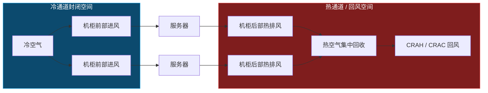

封闭可以是：

- **冷通道封闭 CAC**：把冷空气限制在机柜前方区域，适用于架空地板下送风等布置；
- **热通道封闭 HAC**：把热排风收集在机柜后方区域并导向回风侧，常有利于提高回风温度；
- **局部封堵措施**：空机位盲板、机柜侧板、线缆孔封堵、地板开孔管理；这些往往成本低，却能显著减少短路和漏风。

封闭不是万能方案，需同时考虑消防排烟、维护通道、照明、门禁、回风路径、局部压差和机柜扩容方式；工程上应结合机房布局、负荷密度和现有送回风形式进行设计。

##### 六、面试用 40 秒回答

数据中心采用冷热通道，是为了匹配服务器前进风、后出风的气流特征，使冷空气集中供应到机柜前部，服务器排出的热空气集中进入热通道并返回 CRAH 或 CRAC，从而减少冷热空气混合。热空气回流是热排风重新被服务器吸入，会造成局部进风温度升高和热点；冷风旁通则是冷空气没有经过服务器就直接回到回风侧，导致冷量和风机能耗浪费。通过冷通道或热通道封闭、盲板和线缆孔封堵、合理的送回风口布置以及风机变频控制，可以让冷量和风量更准确匹配机柜负荷。

---

### 四-H、冷冻水 / 冷却水输送与冷源控制（通用基础专题，不进液冷）

> 本专题闭环四-D-2 的"CRAH 接水系统"钩子：前面已经知道 CRAH 用冷冻水盘管把机房热量搬到水里，但水接到哪里、如何把热量最终排到室外，是冷源与输配系统的职责。它与四-F「冷源或水系统受限」诊断、五-C-1「冷冻水供回水温度」、冷冻水文件六/六-C（冷却塔排热、冷冻水末端）自洽。液冷细节（CDU/冷板）仍留待后续专题，本专题只讲传统空气冷却后端的水系统。

**本质先说清**：数据中心冷源系统有"两条水路"——一条把冷量从冷机送到 CRAH（冷冻水），一条把冷机吸收的热量排到室外（冷却水）。空调侧看的是冷冻水，排热侧看的是冷却水，两者在冷水机组处通过制冷循环耦合。

##### 一、从 CRAH 到室外的两条水路

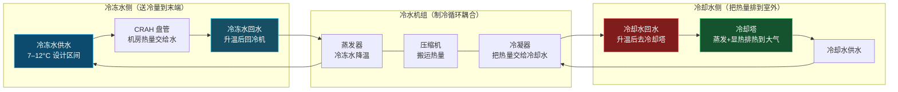

> 关键认识：CRAH 把机房热量交给冷冻水，冷冻水回到冷机蒸发器被降温；冷机靠压缩机把热量"泵"到冷凝器，再经冷却水送到冷却塔排到室外。所以说"传统水系统"后端仍用水，是指冷冻水与冷却水这两段，而不是服务器进风侧。

##### 二、冷冻水输送（把冷量送到末端）

冷冻水侧回答的问题是：**冷机产出的冷量，能否按需要的温度和流量真正到达每个 CRAH 盘管。**

| 参数 | 含义 | 它回答的问题 |
|------|------|--------------|
| 冷冻水供水温度 | 冷机送出、去 CRAH 的水温 | 末端有没有足够低温冷源 |
| 冷冻水回水温度 | CRAH 吸热后回到冷机的水温 | 水侧实际带走了多少热量 |
| 冷冻水流量 | 管网循环体积流量 | 是否满足 CRAH 盘管换热需求 |
| 供回水压差 | 管网两端压力差 | 流量是否受管网阻力限制 |
| CRAH 二通阀开度 | 盘管进水调节 | 末端是否"要冷量"已到极限 |
| 冷冻水泵频率/功率 | 变频循环泵运行 | 变流量控制与泵耗 |

冷冻水供回水温差 `ΔT_chw` 直接反映水侧带热状态：回水升得越高，单位流量搬运的热量越多。若阀门长期接近 100% 而送风仍无法满足，往往意味着水温、流量或上游冷源能力不足（这正是四-F「冷源或水系统受限」的表现之一）。

**变流量（VWV）思路**：负荷低时不一定靠降水温，而可降低泵频率、减少流量，用"大温差小流量"降低输配能耗；但流量过低会使 CRAH 盘管换热不足或压差不够，需在最低流量限制内运行。变水量与末端风量（VAV）是两套不同维度的调节，详见冷冻水文件六-B（VWV vs VAV 辨析）。

##### 三、冷却水与冷却塔排热（把热量送走）

冷冻水把热量交给冷机后，这些热量必须经由冷却水排到室外，否则冷机无法持续制冷。

- **冷却塔**：利用空气与水的接触，靠部分水蒸发带走热量（蒸发散热为主，辅以显热），使冷却水降温后回到冷机冷凝器。
- **Range（进出水温差）**：冷却塔进水温度 − 出水温度，反映塔实际搬运的排热量；
- **Approach（逼近度）**：冷却塔出水温度 − 室外湿球温度，反映塔接近理想下限的能力；湿球温度越低，越容易把水冷却到接近环境温度。
- **自然冷却（free cooling）机会**：当室外湿球温度足够低时，可通过板式换热器让冷冻水直接经冷却塔降温、减少或停止开压缩机，是数据中心节能的重要手段（四-E 选型第五步已提及）。

##### 四、冷水机组基础（冷量从哪里来）

冷水机组是制冷循环的核心设备，本质是一台"热量搬运机"：

```
IT 机房热量 → 冷冻水（蒸发器降温）→ 压缩机耗功把热量抬升到高温 → 冷凝器交给冷却水 → 冷却塔排到室外
```

- **蒸发器**：冷冻水在这里被降温，是"产冷"端；
- **冷凝器**：冷却水在这里带走压缩机搬运来的热量，是"排热"端；
- **COP（性能系数）**：`COP = 制冷量 / 压缩机输入功率`，越高越省电；随负荷率、冷冻水/冷却水温度、室外工况变化。
- 冷机负荷、蒸发器/冷凝器温度、功率与 COP，是判断冷源效率与余量的关键（五-B 监测点第四层已列出）。

##### 五、冷源控制逻辑（与末端联动）

冷源不是单台设备独立运行，而是与末端、泵、塔协同：

1. **台数控制**：按总冷负荷决定开启几台冷机/冷水泵，避免"大马拉小车"低效率运行；
2. **水温设定**：适当提高冷冻水供水温度可在安全范围内提升 COP、减少压缩机能耗，但必须与服务器进风温度（不是 CRAH 送风温度）约束协调；
3. **自然冷却切换**：根据室外湿球温度在"纯机械制冷 / 部分自然冷却 / 完全自然冷却"之间切换；
4. **与末端联动**：若多台 CRAH 回风高、阀门接近全开、送风仍升高（五-C-1 控制关系第四条），应回溯冷冻水温度、流量、压差及冷源能力，而不是只调末端。

> 工程闭环：末端风量/水温需求 → 冷冻水流量与温度 → 冷机台数与设定 → 冷却水与冷却塔排热 → 室外工况，是一个跨空气侧、水侧、制冷剂侧与室外的系统。

##### 六、面试用 40 秒回答

数据中心冷源有两条水路：冷冻水把冷量从冷机送到 CRAH 盘管，冷却水把冷机吸收的热量经冷却塔排到室外，两者在冷水机组通过蒸发器、压缩机、冷凝器耦合。冷冻水供回水温差反映水侧带热状态，阀门长期全开仍不足往往指向水温、流量或冷源能力；冷却水侧靠冷却塔蒸发排热，湿球温度越低越有利于自然冷却节能。冷水机组 COP 随负荷与水温变化，冷源控制应做台数控制、水温设定与自然冷却切换，并与末端风量、阀位联动，而不是只调 CRAH。后端用水不等于液冷——服务器末端仍是风冷，液冷细节留待后续专题。

---

### 四-I、AI / HPC 高密度特征与冷却挑战（通用基础专题，不进液冷）

> 本专题位于渐进路径"冷源与控制"之后、"液冷"之前，是通往液冷的前置站。它把四-F 第七节「AI 有限联系」、四-G 的风量压力、四-H 的冷源联动在"高密度场景"下收束，解释**为什么 AI/HPC 把空气冷却推到了边界**——但仍只讲空气冷却视角，不进 CDU、冷板、浸没等液冷细节（留待后续专题）。

**本质先说清**：AI/HPC 并没有改变"电能最终变热、热量要排到室外"的基本物理，它改变的是**负荷的量级、分布和变化速度**，从而把前面各专题里的局部问题放大成系统性约束。

##### 一、AI/HPC 为什么改变了冷却的题面

| 特征 | 传统企业/通用负载 | AI/HPC 负载 |
|------|-------------------|-------------|
| 单机柜功率密度 | 通常几 kW/柜 | 训练节点可达数十 kW/柜，部分 GPU 机柜更高 |
| 负载变化 | 相对平缓、日间周期 | 训练任务启停造成短时大幅波动，推理呈突发 |
| 热点位置 | 分散 | 高度集中在 GPU/加速器区域，局部热流密度极高 |
| 时间尺度 | 慢变 | 任务级分钟~小时级，需更快的监测与响应 |

这些特征叠加后，前面四-F（单柜功率↑→风量/温升要求↑→气流分配与热点风险↑）、四-G（风量不足看热点、过量看旁通）、四-H（冷源与末端联动）都会更频繁地被触发。

##### 一-B、共用的底层逻辑（普通数据中心与 AI/HPC 相同）

不管是普通服务器机柜还是 AI/HPC GPU 机柜，热量链条都一样：

```text
IT 实际功率
→ 最终转化为热负荷
→ 汇总为单柜热负荷与机房总热负荷
→ 空气或液体带走热量
→ 末端设备、冷冻水系统与冷源排至室外
```

因此两类数据中心都需要：

- 按机柜监测实际功率，而不是只看机房平均负荷；
- 监测服务器进风温度、排风温度、风量/压差、CRAH/CRAC 状态和冷源状态；
- 同时满足总冷量与局部冷却能力；
- 通过 PUE、设备温度、泵/风机能耗和冗余能力评价系统；
- 在热点、传感器异常或设备故障时保持安全运行。

数据中心热管理本身包含三个层面：房间级 CRAH/CRAC 布置、行/机柜级冷热通道和封闭、以及元件级冷却。液冷只是后一个层面可能采用的方案，而不是把前两层逻辑全部推翻。今天的边界是建立"为什么 AI/HPC 更容易把空气冷却推向极限"这条因果链，不进入冷板、CDU 或液冷回路细节。

##### 二、空气冷却在高密度下的三重约束

即使只靠空气冷却，高密度也会同时撞上三条边界：

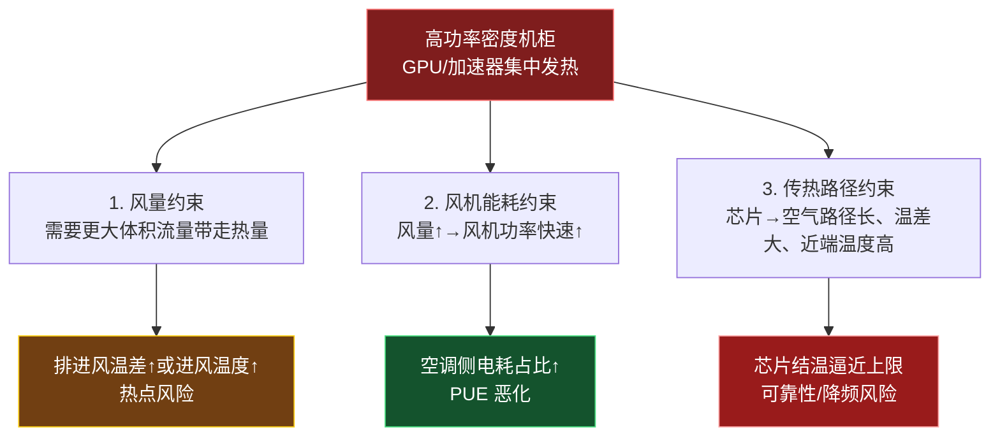

1. **风量约束**：由 `Q = ρ V̇ c_p ΔT`，固定热负荷下要降低温升就得加大风量；但机柜进风面积、地板开孔、风机能力都有限。
2. **风机能耗约束**：风机功率随风量近似立方增长，盲目加大风量会快速抬高空调侧电耗、恶化 PUE（四-E 已讲 PUE 是总能耗/IT 能耗）。
3. **传热路径约束**：空气比热低、芯片到空气需经"芯片→服务器内部空气→机柜进风→CRAH"多级路径，芯片近端温差大，空气冷却对"离芯片最近那一段"无能为力——这正是后续液冷要解决的近端取热问题（本专题不展开）。

**为什么空气侧更吃力（从热平衡推导）**：仍是 `Q = ρ Ṁ c_p ΔT`。当单柜热负荷 $Q$ 上升时，若允许温升 $\Delta T$ 不变，所需有效空气流量 $\dot V$ 必须上升：

```text
机柜功率密度提高
→ 所需穿柜风量提高
→ 服务器风扇、CRAH 风机、送风路径压力增大
→ 风机能耗、噪声、压降、旁通与热回流风险增加
→ 高负荷柜的局部冷却更难保证
→ 才开始评估液冷或风液混合
```

所以液冷不是因为空气"完全不能冷却"才出现，而是当高密度负荷下继续依靠大量空气输送热量，可能在能效、空间、噪声、可靠性或局部温度控制上变得不经济或不稳。高密度 AI 设施可能采用增强风冷、混合液冷或以液冷为主的方案，具体选择取决于机柜密度目标、硬件路线及设施排热能力（不以固定 kW/柜 阈值为判据，呼应第三节）。

##### 三、关键克制：不能用固定 kW/柜 阈值宣称"超过即必须液冷"

四-F 第七节已强调：不同数据中心和机柜设计条件差异很大，**不能用一个固定 kW/柜 阈值宣称"超过即必须液冷"**。空气冷却仍有改进空间（更好的封闭、盲板、定向送风、提高送风温度、热通道封闭提升回风温度、自然冷却），液冷是否采用取决于 TCO、可靠性目标、机房改造可行性与业务增长预测，而非单一密度数字。

##### 四、对监控与容量的新要求

高密度、快波动使前面五-B（监测分层）与五-C-1（进风温度优先）更加重要：

- **监测频率与粒度**：单柜功率、进风温度不能只靠机房平均，需在机柜/节点级高频采集（呼应五-B 第一层 IT 与机柜层）；
- **预测窗口缩短**：负荷短时跃升要求冷却系统更快响应，ML 短期预测（五-B 第一个小项目）价值更高；
- **容量冗余含义变化**：N+1 冗余不仅看稳态总冷量，还要看单点失效时能否兜住训练任务的局部峰值（呼应四-F 容量与冗余设计区分）。

##### 五、面试版回答

AI/HPC 并没有改变"电能最终变热、热量要排到室外"的基本物理，它改变的是负荷量级、分布和变化速度：单机柜功率密度可达数十 kW、GPU 区域热流高度集中、训练启停造成短时大幅波动。这使空气冷却同时撞上三条边界——需要的风量更大、风机能耗随风量近似立方增长、芯片到空气传热路径长导致近端温度高。但密度升高不意味着必须用固定 kW/柜 阈值判断"必须液冷"；空气冷却仍有封闭、定向送风、提高送风温度、自然冷却等改进空间，是否采用液冷取决于 TCO 与可靠性目标。高密度场景下，机柜级高频监测、进风温度优先控制和更快的冷却响应变得更加关键。

##### 六、项目一迁移定稿（边界守稳）

方法可迁移，不虚构已有液冷/数据中心实验经验。建议定稿回答：

> 我的主课题关注热舒适预测在传感器数据缺失条件下的鲁棒性，以及关键变量筛选。数据中心容量管理和热点控制同样依赖机柜功率、服务器进排风温度、冷通道/热通道温度、风量、压差、CRAH 状态和冷冻水参数等数据；如果这些传感器缺失、漂移或异常，可能使负荷识别、热点预警与控制决策失真。因此，我在缺失数据处理、特征重要性分析和轻量化输入方面的思路，未来可迁移到数据中心运行数据的质量诊断、软测量或热点风险预测。但我目前研究对象仍是热舒适数据，数据中心场景需要使用真实或可信的运行数据重新训练、校验和部署。

为让这段更工程化，末尾补一句：

> 在实际部署中，我会先以热平衡和运行规则建立基线，例如核对 IT 功率与进排风温差、风量之间的关系；机器学习模型应作为预测、异常检测和辅助决策工具，而不是替代冷却系统的基本物理约束。

这样可避免面试官认为"所有问题都想用机器学习解决"：传感器数据与模型确实可用于热异常检测，但热管理系统的温度、风量、压差和冷源边界仍应首先满足工程约束。

---

### 四-J、机柜功率密度与"总量匹配 vs 局部匹配"（空气冷却视角，不进液冷）

> 本专题位于四-I（AI/HPC 高密度）之后、"液冷"之前，是空气冷却视角下对"为什么高密度会出热点"的底层解释。关键不是背"多少 kW/柜算高密度"，而是理解：**机柜功率密度决定局部热负荷；总冷量满足全机房，并不自动保证高负荷机柜能得到足够冷空气。**

##### 零、冷却容量匹配是什么（定义与两层含义）

冷却容量匹配，就是让冷却系统在实际运行条件下，能够以合适的方式移走数据中心产生的热量，并且把冷量准确送到需要的位置。它既包括"总冷量够不够"，也包括"局部机柜是否真的得到足够风量和冷量"。

**两层含义**

- **总量匹配**：先看全机房的热量能否被移走：

  $$Q_{\text{冷却系统可用}}\geq Q_{\text{IT}}+Q_{\text{UPS/PDU}}+Q_{\text{其他负荷}}$$

  例如 IT 设备发热 500 kW，加上 UPS、配电和其他附加热负荷后，机房总热负荷为 550 kW；那么 CRAH、冷冻水系统、冷机和室外排热设备在当前工况下都必须能持续移走至少这部分热量，并保留设计所需冗余。

- **局部匹配**：总冷量够仍不够。还要看每个机柜，特别是高功率机柜，是否获得与自身热负荷相匹配的有效风量和冷量。

  ```text
  机房总冷量充足
          +
  某高功率机柜局部风量不足
          =
  该机柜仍可能热点
  ```

  例如机房总热负荷 300 kW、总可用冷量 400 kW，看起来有余量；但若一台 15 kW 机柜附近送风不足或热空气回流，它的服务器进风温度仍会升高。此时不是"总冷量不足"，而是局部气流组织和末端冷却能力不匹配。

**要匹配哪些环节**（冷却容量沿整条链路匹配）：

```text
IT 实际功率与机柜负荷
→ 单柜所需空气流量/冷量
→ CRAH / CRAC 的风机与盘管能力
→ 冷冻水或制冷剂的温度、流量、压差
→ 冷机能力
→ 冷却塔、干冷器等室外排热能力
```

任何一环能力不足，都会限制系统最终可提供的冷却能力。比如 CRAH 阀门已经全开，但冷冻水流量不足或供水温度过高，CRAH 的实际可用冷量就可能低于铭牌额定值。

**不等于铭牌相加**：容量匹配看的是实际可用冷量，不是简单相加设备铭牌冷量。实际能力会受到供水温度、回风温度、水流量、风量、盘管状态、设备部分负荷性能和室外环境等影响。还要区分：

| 概念 | 含义 |
|------|------|
| 安装容量 | 所有已安装设备的额定冷量之和 |
| 运行容量 | 当前开启设备在现场工况下实际可提供的冷量 |
| 冗余容量 | 为故障、检修保留的能力，如 N+1 中额外的一台 CRAH |
| 可扩展容量 | 保持冗余后，系统仍能安全承接的新增负荷 |

> **一句话记忆**：冷却容量匹配，就是"热量产生多少、在哪里产生、以多快速度变化"，与"系统能在实际工况下移走多少热量、并能否准确送到该位置"相匹配。

> 单页速查版见 `数据中心冷却容量匹配速查卡_v0.1.md`（两层含义、链路、四类容量定义与常见误区、CRAH 示例、可扩 25% 陷阱、当前余量 vs 设计可扩容、运行容量不看台数、一句话记忆）。

##### 一、三个负荷层级（从小到大）

把负荷从小到大看成三层：

```text
单台服务器实际功率
        ↓ 汇总
单个机柜功率 / 功率密度（kW/柜）
        ↓ 汇总
机房或数据中心总 IT 负荷（kW 或 MW）
```

例如，一台服务器实际功率为 0.8 kW，某机柜装了 10 台，则该机柜 IT 功率约为 8 kW，也近似对应 8 kW 的局部热负荷。若 50 个类似机柜同时运行，机房 IT 负荷约为 400 kW；但这是总量概念，不能说明各机柜位置的冷却是否均匀。

##### 二、什么是机柜功率密度

机柜功率密度常写成：

\[
P_{\text{rack}}=\sum_{i=1}^{n}P_{\text{server},i}
\]

若一个机柜内有多台服务器、存储和网络设备，其实际功率相加就是该机柜的实际功率密度。更准确说，kW/柜描述的是每个机柜的功率/热负荷水平；若要强调面积尺度，才会用 kW/m²。

机柜功率密度直接决定该柜所需的局部空气流量。对空气冷却而言：

\[
Q_{\text{rack}}=\rho\,\dot V_{\text{rack}}\,c_p\,\Delta T
\]

同样的允许温升下，机柜从 5 kW 增至 10 kW，所需通过该柜的有效空气流量大约也要翻倍。机柜密度上升趋势会提高数据中心对供电和冷却能力的要求。

##### 三、平均值为何会骗人

假设机房有 10 个机柜：

| 机柜类型 | 数量 | 单柜实际功率 | 合计 |
|---------|------|------------|------|
| 低负荷机柜 | 8 个 | 3 kW/柜 | 24 kW |
| 高负荷机柜 | 2 个 | 15 kW/柜 | 30 kW |
| 机房合计 | 10 个 | — | 54 kW |

机房平均值为：

\[
\frac{54}{10}=5.4\ \text{kW/柜}
\]

只看平均值，会得到"约 5.4 kW/柜"的印象；但真实情况是有两台 15 kW/柜的高热密度机柜。它们需要远高于普通机柜的风量和更可靠的送风路径，若仍按平均 5.4 kW/柜配置地板送风口或风量，就可能出现热点。

**这就是：平均负荷正常，不等于任何机柜都安全。**

热点可以在全机房温度看似合格时出现；高密度设备集中布置、送风路径受阻、穿孔地板位置或开孔率不匹配、空机位漏风和热排风不畅，都会使部分服务器进风超温。

##### 四、"总量匹配"与"局部匹配"

把这两句话严格区分：

| 概念 | 问的问题 | 例子 |
|------|---------|------|
| 总量匹配 | 全机房总制冷量能否移除总热量？ | IT 总热负荷 500 kW，冷源和末端总体可提供 600 kW 冷量 |
| 局部匹配 | 每台机柜是否得到与自身负荷相匹配的冷量和风量？ | 某 15 kW 高密度机柜能否获得足够冷空气，且热排风能否被及时回收？ |

总冷量为 600 kW 不代表每个位置都有"均匀的 600 kW 冷量"。冷量需要通过 CRAH/CRAC 的风机、送风路径、架空地板静压、穿孔地板或风口、冷通道、服务器风扇和热通道回风路径，准确地送到机柜前部。

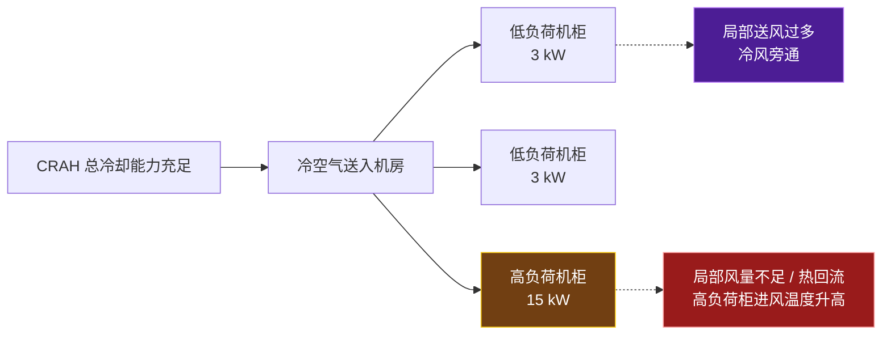

因此，一个机房可能同时发生两件事：

- 高负荷柜附近冷空气不足，形成热点；
- 低负荷区送风过量，形成冷风旁通。

这时如果只看 CRAC/CRAH 总容量或机房平均温度，会误认为"系统冷量充足、无需处理"；实际上问题是气流分配和局部容量匹配。

##### 四-B、容量链条：最弱环节决定能力

冷却容量匹配不是只把机房总热负荷和冷机铭牌冷量相比较，而是要让末端风量、盘管冷量、水系统输送能力、冷源能力以及冗余策略在实际工况下都能覆盖 IT 负荷。可以把容量看成一条"最弱环节决定能力"的链：

```text
IT 总负荷
→ 机柜功率分布与热点位置
→ 单柜所需有效风量、允许进排风温差
→ CRAH / CRAC 的风机与盘管实际能力
→ 冷冻水 / 制冷剂的流量与温度条件
→ 冷水机组、冷却塔 / 干冷器等排热能力
→ 室外环境
```

任何一环不足，都可能使服务器进风温度超限。例如冷机总容量足够，但某台 CRAH 风机风量不足、盘管阀门未全开或冷冻水压差不足，局部机柜仍可能过热。

##### 四-C、四种容量概念

**额定冷量**：设备在制造商规定的标准工况下所标称的能力，例如某 CRAH 标称冷量为 100 kW。用于设备初步选型和比较，但不能直接等同于现场能力。额定工况通常隐含了空气侧进风状态、送风量、水侧供水温度、流量等前提；离开这些前提，额定值就只是一个参考铭牌值。

**实际可用冷量**：设备在现场当前条件下真正能从空气中移走的热量。对 CRAH 而言可从空气侧和水侧分别理解：

$$Q_{\text{air}}=\dot m_{\text{air}}\,c_{p,\text{air}}\,(T_{\text{return}}-T_{\text{supply}})$$

$$Q_{\text{water}}=\dot m_{\text{water}}\,c_{p,\text{water}}\,(T_{\text{return}}-T_{\text{supply}})$$

稳定状态下两者应大致相等；出现显著不一致时，优先检查测量误差、传感器位置、旁通和系统蓄热等因素。实际可用冷量受以下因素共同影响：

| 变量 | 对实际能力的影响 |
|------|------------------|
| 冷冻水供水温度 | 水温升高，盘管与空气温差通常减小，可提供冷量下降 |
| 冷冻水流量/压差 | 流量不足或阀门开度受限，盘管水侧换热能力下降 |
| CRAH 风量 | 风量不足则热空气无法充分流过盘管；过大可能增加风机耗电或旁通 |
| 回风温度 | 回风更高时盘管空气侧温差改变；但高回风也可能来自热点或热回流 |
| 盘管清洁度 | 积尘、结垢、过滤器堵塞会提高阻力并削弱换热 |
| 部分负荷性能 | 风机、阀门、冷机和泵在不同负荷下的控制与效率不同 |

**显冷量为什么关键**：数据中心主热源是服务器、存储和网络设备的电功率，几乎全部最终表现为显热——空气或冷却液升温，但不一定产生大量水蒸气，因此常被理解为"高显热比"场景。与普通办公建筑相比：

| 项目 | 普通舒适性空调 | 数据中心空气冷却 |
|------|----------------|------------------|
| 主体负荷 | 人员、照明、设备、围护、新风 | IT 设备及供配电设备 |
| 显热 | 有，但并非全部 | 占主导 |
| 潜热 | 人员散湿、新风湿负荷常很重要 | 通常较低，但加湿、外气或渗透仍可能带来湿度问题 |
| 末端重点 | 温湿度舒适、除湿、新风 | 稳定服务器进风温度、足够风量、热点控制 |
| 气流组织 | 人员活动区舒适度 | 服务器前进风、后排风和冷热通道分离 |

"以显热为主"不等于"不需要管湿度"：数据中心仍可能需要控制湿度或露点，以避免静电、结露或设备环境风险；只是其主要冷负荷通常不是人员和新风造成的潜热。当前运行的数据中心仍以风冷为主，热管理重点是持续移除设备热量并提高能效。

**N+1 后可用多少**：假设单台 CRAH 额定冷量 100 kW、机房实际 IT+附加热负荷约 270 kW、配置 4 台 CRAH。若每台在当前工况下都能提供 100 kW：

```text
安装名义容量 = 4 × 100 = 400 kW
N 所需容量   = 3 × 100 = 300 kW
冗余容量     = 1 × 100 = 100 kW
```

即三台运行即可覆盖设计负荷，任意一台停机后剩余三台仍能提供约 300 kW，因此是 N+1。N 表示支撑满 IT 负载时所需容量；N+1 是在 N 基础上增加一个同类冗余单元。

但不能把那 100 kW 冗余当成可长期使用的扩容空间。一个典型误判：安装 4×100 = 400 kW、设计负荷 300 kW，看似还剩 100 kW（约 25%）可扩；可一旦长期跑满 400 kW，任一台故障后只剩 300 kW，反而无法覆盖，系统从 N+1 退化为 N。第四台是故障、检修和切换时的可靠性缓冲，不是闲置容量。

另一个误判是混淆"当前余量"与"可扩容"：当前负荷 270 kW、单台故障后仍剩 300 kW，看似还能增 30 kW；但这 30 kW 未必能接进某个机柜，仍受末端、水系统、冷源、配电和局部气流全链限制。

更严谨地，可扩展容量应这样判断：

$$\text{可扩展容量}\neq\text{安装名义容量}-\text{当前负荷}$$

$$\text{可扩展容量}=\min(\text{末端},\ \text{水系统},\ \text{冷源},\ \text{配电},\ \text{局部气流})_{\text{故障工况}}-\text{当前负荷}$$

这是工程理解式，不是规范公式。

**四类容量别混淆**：

| 名称 | 它表示什么 | 常见误区 | 例子 |
|------|-----------|----------|------|
| 安装名义容量 | 所有已安装设备在额定工况下的容量之和 | 直接当作可长期使用容量 | 4 台 × 100 kW = 400 kW |
| 当前运行容量 | 当前开启设备在当前工况下能提供的实际能力 | 只看开启台数，不看水温、流量和工况 | 3 台实际各 90 kW = 270 kW |
| 冗余容量 | 为故障、检修或切换保留的能力 | 当作可随意消耗的闲置资源 | N+1 中第 4 台 CRAH |
| 可扩展容量 | 保持设计冗余后，还可安全承接的新增负荷 | 用安装容量减当前负荷直接计算 | 由全链条余量校核，不能仅看一项 |

四者混淆，是数据中心容量判断和面试中最常见的错误之一。

**一个必要校正**："机房负荷需要 3 台 CRAH、实际配置 4 台"只有在每台实际可用冷量相同且三台足以覆盖设计负荷时才能称为 N+1。若机房设计负荷 300 kW，但现场因高冷冻水供水温度等原因每台实际只能提供 85 kW，则三台总能力只有 255 kW；即使安装四台标称 100 kW 的 CRAH，也不能在该实际工况下保证 N+1。这就是为什么冷却冗余校核要用**设计最不利工况下的实际可用能力，而不是设备铭牌容量**。

##### 五、必须看哪些量（判断单柜热风险的顺序）

当你判断某个机柜是否存在热风险时，按以下顺序看：

1. **机柜实际功率**：它到底产生了多少热，而非仅看铭牌。
2. **服务器进风温度**：设备真正吸到的空气是否超限（呼应五-C-1 进风温度优先）。
3. **机柜进排风温差**：结合功率判断有效风量是否可能不足。
4. **冷通道送风条件**：穿孔地板/风口位置、送风量、地板下静压或风道状态。
5. **热通道回风路径**：是否有热空气回流到机柜前部。
6. **机柜封堵状态**：空 U 位盲板、机柜侧面、底部和线缆孔是否漏风。
7. **CRAH 状态**：送风温度、风机频率、阀门开度和水侧冷量是否受限。

行业资料也将单柜送风量与 IT 设备需求不匹配、空 U 位和机柜缝隙漏风、局部热负荷与投入冷量不匹配等列为局部热点的常见原因。

##### 四-D、运行监测与热点诊断（沿热量路径逐级判断）

> 单页速查版见 `数据中心冷却运行监测与诊断速查卡_v0.1.md`（监测路径、12 参数表、进风优先、温差对照、三类故障、排查 flowchart）。

###### 监测的逻辑

监测点应围绕热量路径布置，而不是只放一个"机房温度计"：

```text
服务器进风
→ 服务器排风
→ 热通道 / CRAH 回风
→ CRAH 送风
→ CRAH 冷冻水盘管
→ 冷冻水系统
→ 冷机与室外排热
```

实际系统通常会将温度、湿度、压差、流量、功率、阀位和设备状态接入 BMS、DCIM 或 EMS 平台，实现趋势记录、阈值告警和故障追踪。机柜级热点监测的目的，是在电子设备承受热应力前发现局部冷却不均。

###### 关键参数怎么用

| 参数 | 主要测点 | 它反映什么 | 异常时先想到什么 |
|------|---------|-----------|------------------|
| 服务器进风温度 | 机柜前部，上中下位置 | IT 设备实际热环境、热点 | 热回流、局部送风不足、高负荷柜 |
| 服务器排风温度 | 机柜后部，上中下位置 | 服务器排热状态 | 高负荷、有效风量不足 |
| CRAH 送风温度 | CRAH 出风口/送风静压箱 | 末端送出的空气状态 | 盘管冷量、控制设定、风机运行 |
| CRAH 回风温度 | CRAH 回风口 | 回收热空气的状态 | 热通道收集、旁通、机柜负荷 |
| 送回风温差 | CRAH 或机柜进排风两端 | 空气带热与流量状态 | 高负荷、风量不足、旁通、回流 |
| 单柜功率 | 机柜 PDU/智能电表 | 局部 IT 热负荷 | 高功率密度、负荷突增 |
| 冷热通道压差 | 冷/热通道或地板下静压箱 | 气流驱动力、漏风、送风组织 | 封闭漏风、风机不足、地板开孔问题 |
| 湿度/露点 | 冷通道、CRAH 送风侧 | 静电与结露风险 | 加湿/除湿控制、冷表面结露风险 |
| CRAH 风机频率 | CRAH 控制器/VFD | 风量能力与风机能耗 | 风机受限、控制策略、过送风 |
| 冷冻水阀位 | CRAH 盘管二通阀 | 末端请求冷量的程度 | 阀位长期大开但不冷，检查水温、流量和压差 |
| 冷冻水供回水温度 | CRAH 进/出水管 | 水侧换热与冷源能力 | 供水升温、温差异常、流量不足 |
| 冷冻水流量、压差 | 支路/主管、泵组 | 水是否足够流经盘管 | 阀门、水泵、过滤器、压差设定 |

对机柜温度，较完整的做法是在前、后两面上中下各布置测点，因机柜顶部更容易受热空气回流影响；数据中心监控软件可据此做趋势分析和告警。

###### 为什么进风温度优先

服务器不会"感受"机房平均温度，也不会直接感受 CRAH 的送风设定值；它真正感受的是机柜前部、服务器进风口的空气状态。例如：

```text
机房平均温度：24°C
CRAH 送风温度：20°C
某普通机柜进风温度：22°C
某高负荷柜进风温度：29°C
```

房间平均温度和 CRAH 送风温度都可能看似正常，但高负荷柜已出现局部热点。热点本质是服务器进风区域过热或过干，而不是简单的"房间温度高"。因此，若只能优先补一类传感器，优先级通常是：机柜前部进风温度 → 单柜功率 → CRAH 送回风与水侧参数。

###### 温差为什么不能单独判断

空气侧热平衡为：

$$Q=\rho\,\dot V\,c_p\,\Delta T$$

温差 $\Delta T$ 同时受热负荷 $Q$ 与实际风量 $\dot V$ 影响：

| 观察到的温差 | 可能是正常情况 | 也可能是异常情况 |
|-------------|---------------|------------------|
| 进排风温差大 | 高功率机柜正常排出更多热量 | 有效风量不足、热空气回流 |
| 进排风温差小 | 机柜负荷较低 | 送风过量、冷风旁通 |
| CRAH 送回风温差大 | 回风较热、盘管有效吸热 | 局部热回流、风量分布不均 |
| CRAH 送回风温差小 | 低负荷运行 | 旁通严重、CRAH 风量过大 |

正确的诊断表达是：**温差是判断热量传递和风量匹配的重要信号，但不是独立的故障结论**；必须结合单柜功率、服务器进风温度、风机频率、通道压差、CRAH 送回风状态和水侧参数一起判断。

###### 三类故障怎么区分

**冷量不足**（系统能移走的总热量不够，通常多区域整体变热而非仅一两个机柜）：

- 多个冷通道或机柜进风温度持续升高；
- 多台 CRAH/CRAC 接近满负荷，风机和压缩机/阀位接近上限；
- CRAH 送风温度无法维持设定或持续升高；
- 冷冻水阀位长期接近全开；
- 冷机、冷却塔、泵等接近能力上限，或室外高温导致冷源能力下降。

注意：阀位全开本身不等于冷量不足，它只说明 CRAH 正在请求较多冷冻水；仍要看供水温度、实际水流量和盘管空气侧效果。

**风量或气流组织不足**（总冷量可能够，但未有效送到需要的位置；局部热点常属此类，热回流和旁通是关键线索）：

- 只有一排、一个区域或少数高负荷机柜进风温度偏高；
- CRAH 总冷量、冷冻水温度和冷机负荷仍有余量；
- 高热机柜附近冷通道风量不足，或机柜顶部明显更热；
- 未装盲板、线缆孔未封堵、地板开孔/送风口位置不合理；
- 热通道封闭不完整，热排风绕回冷通道；
- CRAH 风机很高但回风偏低，可能存在过送风和冷风旁通。

冷热通道封闭、盲板和线缆开孔密封能减少冷风旁通、热回流和热点，但不能替代对局部负荷与送风路径的核查。

**冷源或水系统受限**（CRAH 想要冷量，但水系统或冷源没有足够能力交付）：

- CRAH 冷冻水阀门开度大，但 CRAH 送风温度仍高；
- 冷冻水供水温度偏高，或在多个末端同步升高；
- 支路流量不足、供回水压差不足，泵频率已高或存在过滤器/阀门阻力；
- 冷冻水回水温差、流量与末端负荷不匹配；
- 冷机、冷却塔或冷却水泵已接近上限，或冷却塔受室外湿球条件限制。

CRAH 本体通常包含冷冻水盘管和冷冻水控制阀；阀门调节进入盘管的水量，因此水温、压差和流量直接影响其实际可用冷量。

###### 热点排查顺序

出现热点时，不能直接判断为冷机容量不足；应从服务器进风、局部热负荷、空气流量与气流组织、CRAH 末端状态、冷冻水流量和压差、冷源能力逐级排查。

```mermaid
flowchart TB
    H["发现热点<br/>某机柜进风温度高"] --> A["1. 核实温度与位置<br/>前部上中下测点、传感器可靠性"]
    A --> B["2. 看单柜实际功率<br/>是否为局部高热密度或负荷突增"]
    B --> C["3. 查空气侧<br/>冷通道、盲板、线缆孔、送风口、压差、热回流"]
    C --> D["4. 查 CRAH/CRAC<br/>送回风温度、风机频率、盘管、阀位"]
    D --> E["5. 查冷冻水侧<br/>供水温度、流量、压差、泵状态"]
    E --> F["6. 查冷源与室外排热<br/>冷机、冷却塔、冷却水、室外工况、冗余"]

    style H fill:#991b1b,stroke:#fca5a5,color:#fff
    style C fill:#713f12,stroke:#facc15,color:#fff
    style F fill:#14532d,stroke:#4ade80,color:#fff
```

这个顺序先检查距离故障点最近、最可能造成"局部异常"的因素，再逐级上溯到系统级冷源。若多个区域同步升温，可更早把注意力放到 CRAH 群控、冷冻水与冷机侧；若仅一两个机柜异常，则优先看负荷、气流和封闭，而不是立刻降低全机房送风温度。

##### 六、与 AI 的连接（过渡认识）

今天只需建立一个过渡认识：

```text
普通机柜功率增加
→ 同一温升下要求更大有效风量
→ 对冷通道、送风路径和热通道回收要求更高
→ 热点更容易出现
→ 当空气侧难以经济、稳定地满足时
→ 才进一步评估后门换热器、液冷或混合冷却
```

不应把"超过某个固定 kW/柜 就一定需要液冷"当成规则。是否采用液冷还取决于服务器形式、冷却覆盖率、可用空间、气流架构、供回液温度、当地气候、可靠性和 TCO 等条件（与四-I 第三节克制一致）。

##### 七、面试版回答

机柜功率密度通常以 kW/柜表示，反映单个机柜内 IT 设备的实际功率和局部热负荷。数据中心不能只看总 IT 负荷和总制冷量，因为机柜负荷往往不均匀：低负荷机柜可能出现送风过量和冷风旁通，而高负荷机柜即使在总冷量充足时，也可能因局部风量不足、热空气回流、送风口布置不合理或机柜漏风而出现进风温度超限。因此，容量设计与运行管理既要做总量热平衡，也要结合单柜功率、机柜位置、服务器进风温度、送回风路径和气流组织实现局部匹配。

> 结构化 10 题面试问答见 `数据中心负荷与容量面试10问_v0.1.md`（IT 功率/机柜密度/平均负荷局限/总冷量够仍有热点/风量温差关系/风量非越大越好/额定 vs 实际冷量/进风优先/热点排查/AI 冷却压力），每题可直接作答案。

---

### 四-K、冷却监控、控制闭环与故障排查（空气冷却视角，承接四-J，不进液冷）

> 本专题位于四-J（负荷、机柜密度与容量匹配）之后、"液冷"之前，把四-F（监测分层）、四-J四-D（热点诊断）从"知道有哪些设备与参数"提升到"知道系统如何感知、判断、执行、验证，并能沿热量路径定位问题"。它承接四-J 的容量匹配：容量匹配回答了"冷量够不够、送到没送到"，本专题回答"系统如何自动维持这种匹配、出问题时怎么沿链路定位"。液冷细节仍留待后续专题。

**今日总目标（一句话）**：从"知道系统有哪些设备"，升级为"知道系统如何感知—判断—执行—验证，并能沿热量路径定位问题"。细粒度机柜进风传感、按实际 IT 负荷调节风机、BMS/DCIM 闭环监控，是数据中心冷却的关键实践。

##### 零、控制不是单点动作，而是闭环

这不是"温度升高就开空调"的单点动作，而是一个闭环：控制动作完成后，必须检查服务器实际进风温度、压差和设备状态是否改善；否则控制器可能只是在增加能耗，而没有解决局部回流、旁通或水侧受限问题。

```mermaid
flowchart LR
    A["IT 负荷与环境变化<br/>机柜功率、室外工况"] --> B["感知层<br/>温度、功率、流量、压差、阀位"]
    B --> C["判断层<br/>设定值、联锁、PID/逻辑、告警"]
    C --> D["执行层<br/>风机、阀门、泵、冷机、冷却塔"]
    D --> E["系统响应<br/>风量、水流、送风/供水温度改变"]
    E --> F["反馈层<br/>服务器进风与设备状态"]
    F --> B

    style B fill:#164e63,stroke:#38bdf8,color:#fff
    style C fill:#4c1d95,stroke:#c084fc,color:#fff
    style D fill:#713f12,stroke:#facc15,color:#fff
    style F fill:#14532d,stroke:#4ade80,color:#fff
```

关键认识：反馈层（服务器进风温度、压差、设备状态）回到感知层，决定闭环是否真的解决问题。若只调执行层而反馈层无改善，应回到判断层重新诊断，而不是继续加大执行幅度。

##### 一、三处工程化校正（让表述更专业）

| 原表述 | 建议表述 | 原因 |
|--------|----------|------|
| "服务器进风温度是最重要参数之一" | "服务器进风温度是空气冷却 IT 热安全的**首要结果指标**之一" | 它是结果指标；机柜功率、风量、阀位和水流量帮助解释原因 |
| "CRAH 送风温度偏高就开大水阀" | "在风量和传感器有效、冷冻水系统可用的前提下，可提高水阀开度以增强盘管能力" | 送风高也可能来自盘管脏堵、供水温度过高、传感器漂移或风量问题 |
| "回风温度高可能是局部热空气集中回流" | "回风温度高可能是有效热回收，也可能是高负荷或局部回流；需要看机柜进风与空间分布" | 热通道回风高并不必然坏，封闭良好时热回风集中本身可能是正常且高效的状态 |

> CRAH/CRAC 控制应逐步转向**基于机柜进风温度**而不是仅设备回风温度；良好的冷热通道管理可以减少短路和热回流，并减少不必要的循环风量（与四-G 气流组织、四-J五-C-1 进风优先一致）。

##### 二、关键监测点（六类参数——一条从热源到冷源的证据链）

这六类监测点不是并列清单，而是一条**可诊断的证据链**：热量从哪里产生 → 冷空气是否到达 IT → CRAH/CRAC 是否成功处理空气 → 冷量能否由水系统输送 → 执行器有没有真正动作 → 环境与漏水风险是否可控。机房空气温度在短距离内也可能差异很大，因此必须**多点、机柜级监测**，而非只依赖机房中央的单个温度点。

```mermaid
flowchart LR
    IT["IT 负荷<br/>总功率、单柜功率、趋势"] --> RACK["服务器进/排风<br/>实际热环境"]
    RACK --> AIR["CRAH/CRAC<br/>送回风、风机、过滤器"]
    AIR --> WATER["冷冻水<br/>供回水、流量、压差、阀位、泵"]
    WATER --> PLANT["冷机 / 冷却塔<br/>产冷与排热"]
    RACK --> RISK["湿度 / 露点<br/>结露、静电、漏水"]
    AIR --> RISK

    style IT fill:#713f12,stroke:#facc15,color:#fff
    style RACK fill:#991b1b,stroke:#fca5a5,color:#fff
    style AIR fill:#164e63,stroke:#38bdf8,color:#fff
    style WATER fill:#14532d,stroke:#4ade80,color:#fff
```

> 某机柜进风温度升高，**并不自动说明冷机不足**。它可能来自单柜功率突增、热空气回流、地板下静压不足、CRAH 风机故障、阀门卡滞，或冷冻水压差不足；只有将各层数据关联起来，才能正确定位（与四-K 七 排查顺序同源）。

**六类参数的作用（参数 → 回答的问题 → 典型异常判断）**：

| 类别 | 关键参数 | 主要回答的问题 | 典型异常判断 |
|------|----------|----------------|--------------|
| IT 负荷 | 总/区域/机柜功率、功率变化率 | 热量在哪里、以多快速度增加？ | 单柜功率突然上升→热点风险增加 |
| IT 进风 | 服务器进风温度（建议前部上中下多点） | 设备实际吸到的空气是否合格？ | 机房均温正常、某柜进风仍高→优先查局部回流或送风 |
| 空气侧 | CRAH/CRAC 送回风温度、温差、冷通道压差 | 空气是否被有效冷却、输送和回收？ | 回风高但进风正常→可能有效热回收；进风也高才应警惕 |
| 水侧 | 冷冻水供回水温度、温差、流量、压差、泵频率 | 冷量是否送到盘管？ | 阀位大、送风高、流量/压差低→可能水侧受限 |
| 执行与设备 | 风机频率、启停/故障、阀门指令与反馈、滤网压差 | 指令是否真的被执行？设备阻力是否异常？ | 指令 80%、反馈 20%→查执行器、阀门、通信或控制信号 |
| 环境与风险 | 温湿度、露点、漏水绳、冷凝水液位/排水状态 | 是否有静电、结露、泄漏或排水风险？ | 露点接近冷表面→结露风险提高；漏水状态触发要优先处置 |

**① IT 负荷（热量来源，应前置）**
- 包括：总 IT 功率、单机柜/单区域功率、负荷变化趋势与变化率。
- **为何前置**：IT 功率是最接近热源的**前馈信号**。服务器负荷上升后，功率与热量先增加，随后才表现为排风、回风和进风温度变化。更先进的控制不是等机房变热才响应，而是：单柜功率快速上升 → 预测该区域热负荷增加 → 提前检查/提高对应区域风量与盘管能力 → 观察服务器进风温度是否维持。
- **但功率不能替代温度**：功率告诉你"热量可能增加多少"，进风温度才告诉你"设备最终有没有获得合格冷却"。

**② 服务器进风温度（空气冷却最重要的现场参数）**
- 服务器真正接触的是机柜前部进风，不是机房平均空气；机房均温正常仍可能某高负荷柜回流致进风偏高。监测点应尽量靠近实际进风位置（建议前部上中下多点），而非只墙面/中央一点（呼应四-J五-C-1 进风优先）。
- **进风 × 回风四组合**（不要只看某一个温度）：

| 服务器进风 | CRAH 回风 | 初步含义 |
|------------|-----------|----------|
| 正常 | 较高 | 可能负荷高且热回收路径好，需结合功率和风量确认 |
| 偏高 | 较高 | 可能总冷量、水侧能力或整体风量受限 |
| 偏高 | 正常/偏低 | 更像局部气流组织问题（热回流、局部缺风、传感器位置） |
| 正常 | 偏低 | 可能低负荷、过送风或冷风旁通 |

- 送回风温差仍遵循 $Q_{\text{air}}=\dot m_{\text{air}}\,c_{p,\text{air}}\,(T_{\text{return}}-T_{\text{supply}})$（此处用空气密度/体积流量表达）。回风高或温差大，既可能是服务器产热更多，也可能是风量较小、热回收更集中或区域气流混合；**绝不能脱离单柜功率、风机速度、压差和进风温度单独下结论**。

**③ CRAH/CRAC 送回风温度（末端能力）**
- 送风=设备送出状态；回风=机房返回状态；送回风温差=空气吸热量。回风高≠单因（负荷↑/封闭好/风量不足/回流），须结合柜功率、进风、风量综合判（与四-J四-D 温差不能单独判断一致）。

**④ 冷冻水参数（冷量能否由水系统输送）**
- 监测：供水/回水温度、供回水温差、水流量、管网压差、阀门开度、泵频率。
- **水侧三段诊断（需求→输配→结果）**：需求=CRAH 水阀指令与反馈；输配=冷冻水供水温度、支路流量、压差、泵频率；结果=盘管出风/CRAH 送风温度、服务器进风温度。
  - 阀门指令 80%、反馈 20% → 先怀疑执行器、阀门卡滞、反馈信号或通信。
  - 阀门指令与反馈均约 100%，但 CRAH 送风仍偏高 → 看冷冻水供水温度、实际流量、压差、泵、滤网和盘管状态。
  - 阀门、水温、流量、CRAH 送风都正常，但单个机柜进风高 → 优先查风机、地板送风、通道封闭、盲板、漏风和热回流。

**⑤ 风机与阀门状态（执行器是否真在执行）**
- 重点监测：风机转速/运行故障态、冷冻水阀开度、阀门实际反馈、过滤器压差、设备启停。
- 关键陷阱：指令开度 80% 但反馈仅 20% → 执行器故障/阀卡滞/信号异常/通信问题；**指令≠反馈是控制失效第一信号**（与四-K 六 数据质量维度呼应）。

**⑥ 湿度、露点与漏水状态（以露点为主要工程语言）**
- **修正**：不止"越干越安全"，且建议以**露点和是否结露**为主要工程语言，而不只盯相对湿度——相对湿度随空气温度变化，露点更接近反映实际水汽含量。当某冷表面温度低于周围空气露点时，水汽可能凝结在盘管、水管、阀门等表面。数据中心通常要求满足设备适用环境范围并保持非冷凝；ASHRAE 对多类空气冷却 IT 设备使用温度、相对湿度和露点的组合边界，而非单一固定湿度值。
  - 空气露点 > 管道/表面温度 → 可能凝结 → 结露或滴水风险。
  - 空气湿度/露点过低 → 静电放电（ESD）风险增加 → 需结合 ESD 地板、接地、维护规程和设备允许范围控制。
- **漏水检测布置**：漏水绳/点式漏液传感器应布置在 CRAH 盘管和冷凝水盘附近、阀门/软连接处、水管低点、泵房或管道井等潜在积水位置；冷凝水排水状态也应监测，防止堵塞溢水。

> **核心结论**：数据中心监测不是为了收集更多数字，而是要形成从 IT 热源到冷源的可诊断链条。单柜功率判断热量来源，服务器进风温度判断 IT 实际热安全，CRAH/CRAC 参数判断末端能力，冷冻水参数判断冷量输送，执行器反馈验证控制是否真正落地，露点与漏水状态控制结露和泄漏风险。**每个异常都必须结合多个参数和空间位置判断。**

> **快速索引（按层级回答什么问题，与四-F五-B 一致）**：

| 层级 | 优先监测参数 | 回答的工程问题 |
|------|--------------|----------------|
| IT/机柜 | 单柜实际功率、服务器进风温度、服务器排风温度、服务器风机状态 | 热量在哪里产生？设备是否真的过热？ |
| 空气侧 | 冷通道温湿度、热通道温度、CRAH 送/回风温度、通道压差、地板下静压 | 冷空气是否送到机柜？热空气是否被有效回收？ |
| CRAH 末端 | 风机频率/状态、过滤器压差、冷冻水阀指令与反馈、盘管进出水温度 | 末端是否在按要求产生风量和冷量？ |
| 冷冻水输配 | 供回水温度、支路流量、供回水压差、泵频率/状态 | 冷量能否送到 CRAH？ |
| 冷源与环境 | 冷机负荷/功率、冷却水温度、冷却塔状态、室外干湿球 | 冷源能否持续制冷并把热量排到室外？ |
| 风险监测 | 露点、漏水绳/漏液点、冷凝水排水状态、通信状态 | 是否有结露、泄漏、排水或数据可信度风险？ |

ASHRAE 建议在机柜进风侧部署细粒度传感器并接入 DCIM/BMS，而不是只依赖机房级温度；风机也应按实际 IT 负荷调整，避免过量送风（呼应四-J五-C-1 进风优先、四-G 风量过大看旁通）。

##### 三、CRAH/CRAC 双执行器（风机 + 盘管侧执行器，解决的问题不同）

CRAH 与 CRAC 的**共同点**：都有风机、盘管、过滤器和控制器；风机负责把冷空气送到冷通道、把服务器热空气吸回机组。**关键区别不在风机，而在盘管里的冷却介质与"冷量如何产生"**：
- **冷冻水阀门主要调"每立方米空气能被冷却多少"**（CRAH），因此是控制 CRAH 盘管出风/送风温度的主要执行器；
- **CRAC 的制冷剂回路（压缩机容量/电子膨胀阀/冷凝侧）也主要调"每立方米空气能被冷却多少"**，是典型 DX CRAC 控制送风温度的主要手段；
- **风机主要调"有多少冷空气、以多大压力送到哪里"**，因此更适合控制机柜进风温度、冷通道压差和局部风量分配；
- 三者都参与最终温度结果，但风机控制**空气侧的质量流量**，盘管侧执行器（水阀或制冷剂回路）控制**盘管的换热能力**。空气侧当然也能影响送风温度，只是影响的方式、直接性和控制目标与盘管侧执行器不同（见本节"空气侧如何影响送风温度"）。

**先看 CRAH 内部路径**（不同厂家风机与盘管顺序可能不同，本质一致）：

```text
热回风 → [ CRAH 过滤器 ] → 风机 → [ 冷冻水盘管 ] → 送风至冷通道
                                  ↑
                              冷冻水阀（调节水流量）
```

空气经过盘管，被盘管中的冷冻水冷却，之后由 CRAH 向机房输送处理后的空气。

**CRAC 与 CRAH 的关键区别**（判断标准不是"有没有水"，而是"服务器回风经过的盘管里流的是冷冻水还是蒸发制冷剂"）：

| 项目 | CRAH | CRAC（典型 DX 型） |
|------|------|---------------------|
| 全称 | Computer Room Air Handler | Computer Room Air Conditioner |
| 盘管中介质 | 冷冻水 | 制冷剂 |
| 冷量来源 | 外部冷水机组与冷冻水系统 | 本机 DX 制冷循环，或配套冷凝器 |
| 本机主要执行器 | 风机、冷冻水调节阀 | 风机、压缩机容量、电子膨胀阀等 |
| 是否有风机 | 有 | 有 |
| 是否有冷冻水二通阀 | 常有 | 典型 DX CRAC 没有；有的是制冷剂控制元件 |

> CRAH 把热回风吹过冷冻水盘管，靠阀门调冷冻水流量；CRAC 把热回风吹过蒸发器盘管，盘管内是低温低压制冷剂，在盘管中蒸发吸热，之后由压缩机、冷凝器等完成制冷循环。**CRAC 不是"没有风机"，而是比 CRAH 多了用于产生制冷量的 DX 制冷回路。**

**典型 DX CRAC 内部路径**（空气侧 + 制冷剂回路）：

```text
服务器热回风 → CRAC 回风口 → 过滤器 → 蒸发器盘管（制冷剂吸热蒸发）→ 风机/EC 风机 → 低温送风 → 冷通道 → 服务器进风口

制冷剂回路：蒸发器盘管 → 压缩机 → 冷凝器（向室外空气/冷却水/乙二醇排热）→ 膨胀阀 → 回到蒸发器盘管
```

**盘管可移走的显热近似**（稳定时，空气侧与水侧换热量应大致相同）：

$$Q_{\text{coil}}=\dot m_{\text{air}}\,c_{p,\text{air}}\,(T_{\text{return}}-T_{\text{supply}})$$

$$Q_{\text{coil}}=\dot m_{\text{water}}\,c_{p,\text{water}}\,(T_{\text{water,return}}-T_{\text{water,supply}})$$

**阀门为何主要控送风温度**：冷冻水阀门开大 → 更多低温冷冻水流过盘管 → 盘管整体更冷、可吸收更多回风热量 → CRAH 出风温度通常下降。若控制目标是"CRAH 出风维持 20°C"，最直接的连续调节手段通常是冷冻水二通阀开度；工程上可用送风温度作 PID 回路过程变量、阀门作输出。**但阀门开大并不保证送风一定下降**：若冷冻水供水温度已过高、管网压差/水流量不足、盘管脏堵、滤网堵塞或传感器异常，阀门到 100% 仍可能达不到送风设定值。

**CRAC 如何控制（风机同理，盘管侧用制冷剂回路）**：对典型 DX CRAC，两个主要控制方向与 CRAH 一一对应——
1. *风机：仍然控制空气输送*——作用与 CRAH 中相同：调节送风量和静压，使足够冷空气抵达冷通道和机柜前部（机柜进风高/冷通道压差低 → 提风机转速 → 风量与静压↑ → 更多冷空气送往高负荷柜）。同样需避免过量送风，否则提高风机能耗、加剧冷风旁通或短路；最佳实践强调依据真实 IT 负荷控制 CRAC/CRAH 风机，而非始终全速。
2. *制冷剂回路：主要控制送风温度*——CRAH 用冷冻水阀调盘管冷量；典型 DX CRAC 没有冷冻水二通阀，而通过制冷剂系统调蒸发器盘管能力，例如压缩机启停/变频/多机分级、电子膨胀阀开度、冷凝器风机转速、热气旁通或经济器等。简化逻辑：CRAC 送风偏高 → 提高压缩机容量/调膨胀阀 → 蒸发器盘管吸热能力↑ → 回风被冷却更多 → 送风下降。

**对应关系（记忆用）**：

```text
CRAH ：  风机 → 风量与压差
        冷冻水阀 → 盘管冷量 / 送风温度

DX CRAC：风机 → 风量与压差
         压缩机 + 制冷剂控制 → 蒸发器盘管冷量 / 送风温度
```

> "水冷 CRAC"易混淆：若指 DX CRAC 的冷凝器用冷却水排热，机内空气侧仍是制冷剂蒸发器，属 CRAC（水主要在冷凝侧排热）；若机组直接用冷冻水盘管处理空气，应称 CRAH。判断 CRAH/CRAC 不应只问"有没有水"，而应问回风盘管里流的是冷冻水还是蒸发制冷剂。

**风机为何主要控风量与压差**：风机转速提升 → CRAH 送出的空气体积流量与静压增大 → 首先决定冷空气能否穿过架空地板、风道、送风口和机柜到达服务器进风面。在通道封闭、送风路径和水侧冷量基本正常时，风机可用于维持冷通道压差或最不利机柜进风温度。研究与工程均强调：应按实际 IT 负荷调节 CRAH 风机速度，避免过量送风（呼应四-G 风量过大看旁通）。

**空气侧如何影响送风温度**（两种机制，数据中心常见）：
1. *风机改变"盘管出风温度"*——冷冻水流量不变时，风机加速使每秒通过盘管的空气更多、每单位空气在盘管表面停留更短，盘管后空气温度通常略升高（送风"没那么冷"）；降风量则相反。但这非简单线性，受盘管 UA、水温、水流量、迎面风速、回风温度和控制逻辑共同影响；关键是风机改送风温度的同时也直接改送风量，为降温而大幅减小风量可能导致高负荷柜缺风、冷通道压差下降，进风温度反而上升。
2. *气流组织改变"送到机柜的实际空气温度"*——CRAH 出风 20°C，若冷风途中与热空气混合或发生热回流，服务器实际进风可能是 26°C；提高风机、改善封闭、调整送风口、封堵空 U 位和线缆孔能减少混合，从而降低机柜进风温度。注意这里降低的是"服务器得到的空气温度"，不一定是 CRAH 出风温度本身（例：送风仍约 20°C，进风从 26°C 降至约 22°C）。

这也是为什么数据中心不能只控制 CRAH 送风温度，而要以**机柜进风温度作为结果指标**：机房回风温度控制会掩盖机柜真实需求；基于服务器前面板温度的控制可更精确地调节 CRAH 设备（与四-K 一、四-G 一致）。

**两个执行器为何需要协调**（两个极端例子，CRAH/CRAC 同理，CRAC 以水阀列替换为"压缩机/制冷剂容量"）：

| 情况 | 风机 | 盘管侧执行器（CRAH 水阀 / DX CRAC 制冷剂回路） | 结果 |
|------|------|-----------------------------------------------|------|
| 有风无冷 | 高速 | 开度太小，或冷源/水侧受限 | 大量空气被送出但温度偏高，机柜仍热 |
| 有冷送不到 | 低速 | 开度很大 / 容量很高 | 可送低温空气但风量/压差不足，高负荷柜仍缺冷 |
| 正确匹配 | 按需调速 | 按送风需求调节 | 足够冷量以合适风量准确送至机柜 |

**典型三层回路**（CRAH/CRAC 同构，盘管侧执行器替换即可）：
1. 盘管侧回路：CRAH 以冷冻水阀、DX CRAC 以压缩机容量/膨胀阀，目标是 CRAH/CRAC 送风温度或盘管出风温度，确保空气"足够冷"；
2. 风机回路：以冷通道压差、区域最不利机柜进风温度或进风温度分布为目标，调节风机，确保空气"送得足够且送到正确位置"；
3. 上层协调：根据机柜功率、热点风险、泵/冷机/冷源余量、能耗和冗余状态调整两回路设定值，防止一方过度动作。

实际控制架构不唯一：有些系统用风机维持送风温度，有些用回风温度或压差控制，也可能用机柜进风温度直接协调风机与盘管侧执行器。**关键不是死记"哪个只能控制哪个"，而是认识到：盘管侧执行器对空气温度的直接作用更强，风机对空气输送与局部进风状态的直接作用更强。**

**协调顺序（故障排查同源）**：局部进风上升 → 核功率+气流路径 → 确认有效风量不足提风机 → 送风温度仍不达标调盘管侧执行器（CRAH 提阀 / CRAC 提压缩机容量）→ 仍无改善上溯冷源或水系统。这与四-J四-D（三类故障）自洽：风机调不动多指向气流组织不足，盘管侧执行器无效多指向冷源或水/制冷剂系统受限。

**面试回答定稿（40—60 秒）**：CRAC 也有风机，风机负责把冷空气送到冷通道并建立送风压差；没有风机，冷量无法有效输送到服务器。CRAH 与 CRAC 的主要区别不在风机，而在盘管与冷源：CRAH 使用冷冻水盘管，通常以冷冻水阀调节盘管冷量；典型 DX CRAC 使用制冷剂蒸发器盘管，通常通过压缩机容量、电子膨胀阀和冷凝侧控制调节制冷能力。两者的风机都主要控制空气流量与气流组织（机柜进风温度、冷通道压差），而盘管侧执行器（水阀或制冷剂回路）主要控制送风温度；空气侧也会影响送风温度（风量改换热过程、气流组织改实际进风）。若目标是精准调送风温度，盘管侧执行器更直接；若目标是消除局部热点，则必须同时协调风机、盘管侧执行器与气流组织。

##### 四、冷水系统三层闭环（末端提需求、输配送冷量、冷源产冷并排热）

冷水系统应理解为一个**多层闭环**：末端提出需求、输配层把冷量送过去、冷源层产生并排出热量，而不是 CRAH、泵、冷机各自独立运行。机柜热点虽首先表现于空气侧，但根因可能在任一层；控制必须兼顾 **IT 热安全、冗余和总能耗**（与四-K 八 区域闭环、四-K 二 证据链同源）。

**三层怎么连起来（末端→输配→冷源→室外）**：

```mermaid
flowchart TB
    IT["机柜 IT 负荷上升<br/>功率、进风温度上升"] --> T1

    subgraph T1["第一层：末端 CRAH"]
        A["风机调速<br/>风量 / 静压"]
        B["冷冻水阀<br/>盘管水流量 / 送风温度"]
    end

    T1 --> T2

    subgraph T2["第二层：冷冻水输配"]
        C["冷冻水泵<br/>频率、流量、压差"]
        D["管网与支路<br/>水力平衡、供回水温差"]
    end

    T2 --> T3

    subgraph T3["第三层：冷源与排热"]
        E["冷机<br/>产冷量、冷冻水供水温度、台数"]
        F["冷却水泵 / 冷却塔<br/>冷却水流量、塔风机、排热"]
    end

    T3 --> OUT["室外环境"]

    style T1 fill:#164e63,stroke:#38bdf8,color:#fff
    style T2 fill:#14532d,stroke:#4ade80,color:#fff
    style T3 fill:#713f12,stroke:#facc15,color:#fff
```

**完整热量路径**：服务器热量 → 机柜空气 → CRAH 空气盘管 → 冷冻水 → 冷机蒸发器 → 冷却水 → 冷却塔/干冷器 → 室外环境。其中**冷冻水是把冷量送到 CRAH 的输送介质；冷却水通常把冷机热量送到冷却塔的排热介质，二者不是同一条水路**（呼应四-E 冷源两条水路、四-K 二 水侧三段）。

**第一层：CRAH 末端**——任务是把冷冻水的冷量转化为机柜可用的冷空气；控制目标应优先围绕**服务器进风安全**，而非只追求最低 CRAH 送风温度。

| 主要变量 | 常见调节对象 | 主要目的 |
|----------|--------------|----------|
| 最热机柜进风温度 | CRAH 风机、区域风量 | 避免局部热点 |
| 冷通道/架空地板静压 | CRAH 风机频率 | 确保冷空气可输送到机柜 |
| CRAH 送风温度 | 冷冻水二通阀开度 | 调节盘管实际冷量 |
| CRAH 回风状态 | 阀门、风机、群控策略 | 判断负荷与热回收效果 |
| 过滤器压差 | 维护告警 | 防止空气阻力增加、风量下降 |

例：高负荷机柜进风升高时，不能机械地把所有风机、水阀开到最大。应先判别——若 CRAH 送风温度正常、仅局部机柜热，优先查气流组织和区域风量；若多个区域 CRAH 送风均升高，才更可能是盘管、水侧或冷源问题（与四-K 八 风 vs 冷判定、四-K 七 排查顺序一致）。

**第二层：冷冻水输配**——任务是当许多 CRAH 同时要求更多水流量时，仍把足够低温、足够流量的冷冻水送到每台盘管。典型**变流量控制**逻辑：CRAH 阀门逐渐开大 → 支路阻力与流量需求变化 → 最不利端压差下降 → 差压传感器检测到低于设定值 → 二次冷冻水泵提高频率 → 管网压差恢复 → CRAH 获得所需水流量。变频泵常以 **CRAH 水侧供回水压差**作为泵速控制依据（数据中心冷水系统建模也以 CRAH 水侧固定差压作为变频泵调速控制量）。

需看四个量：①供水温度（送到末端的冷冻水是否足够冷）；②回水温度（水从盘管带走热量后的状态）；③供回水温差（反映水侧是否在有效带热，但**不能孤立判断**）；④流量与压差（决定水能否真正流过各 CRAH 盘管）。**"水泵频率越高越好"同样错误**：泵流量大致与转速成比例，功率通常接近转速三次方关系，小幅提泵速可能显著增加泵耗。

**第三层：冷源与排热**——需完成两件事：①冷机从冷冻水回水中取走热量、提供目标温度的冷冻水供水；②冷却水与冷却塔把冷机吸收的热量及压缩机功耗一并排至室外。

| 设备 | 可调动作 | 常见控制依据 |
|------|----------|--------------|
| 冷机 | 启停台数、压缩机容量、冷冻水供水温度设定 | 总负荷、供回水温度、机组效率、冗余 |
| 冷冻水泵 | 频率、运行台数 | 最不利端压差、总流量、阀门开度 |
| 冷却水泵 | 频率、运行台数 | 冷机冷凝器流量/压差、冷却水温差 |
| 冷却塔 | 风机频率、运行台数、旁通阀 | 冷却水供水温度、室外湿球温度、冷机效率 |

冷却塔性能主要受**室外湿球温度**影响而非只干球温度；同一套冷水系统在夏季高湿热条件下往往更难高效排热。

**为什么不能只优化一层（本节最重要结论：局部最优可能使全系统更耗电甚至降低运行弹性）**：

- **例 1 盲目降低冷冻水供水温度**：供水温度降低 → CRAH 盘管更冷、末端送风可能下降 → 局部热点风险短时改善 → 但冷机蒸发温度更低、压缩比上升 → 冷机功耗可能显著增加。应先确认局部问题是否气流回流、风量分配或水力失调；只有确认末端确实缺盘管冷量，才评估降低供水温度或增冷机能力；且通常应在所有机柜进风仍安全前提下，**尽可能提高冷冻水供水温度以降低冷机功耗**。
- **例 2 盲目提高水泵频率**：泵频↑ → 水流量/管网压差↑ → 远端 CRAH 可能获更多水 → 局部盘管能力改善 → 但泵耗快速增加。若根因是阀门卡滞、过滤器堵塞、支路平衡差或传感器失准，整体提泵频只是用更多能耗掩盖问题；应先确认最不利端压差、实际流量、阀门指令与反馈，再决定是否提泵速。
- **例 3 盲目把 CRAH 风机开大**：风机加速 → 送风量增加 → 但若盘管冷量不足，送出的仍可能是偏热空气；若通道封闭差，还可能增加旁通和冷热混合 → 风机能耗上升、高密度柜仍可能热点。因此空气侧风机、水侧阀门、泵和冷机必须**协同**，而非某一设备单独追求最大能力。

**一个完整响应例子（GPU 机柜功率增加、最热柜进风升高）**：
1. 单柜功率与进风温度上升；
2. CRAH 提高该区风机频率，维持冷通道压差；
3. 若 CRAH 送风温度也升高，二通阀逐步开大；
4. 多台阀门开大后，管网最不利端压差下降；
5. 冷冻水泵提高频率或投入备用泵；
6. 冷冻水回水热量增加，冷机提升负荷或投入下一台机组；
7. 冷却水流量与冷却塔风机随之调整，把更多热排向室外；
8. 系统持续检查最热机柜进风、供水温度、压差、能耗与冗余。

若只有一台机柜仍偏热、其他机柜正常，就不该立刻执行第 4–7 步，而应回到局部气流组织检查：盲板、线缆孔、送风口、机柜顶部热回流、通道封闭和设备布局（与四-K 七、四-G 一致）。

**面试版回答（40—60 秒）**：数据中心冷水系统可分为末端 CRAH、冷冻水输配和冷源排热三层。末端通过风机和冷冻水阀将冷量转换为可用的空气流量与送风温度；输配层通过变频泵、管网压差和流量控制，将冷冻水送到各 CRAH；冷源层通过冷机、冷却水泵和冷却塔产生冷冻水并将热量排至室外。当机柜负荷增加时，末端风机和阀门先响应，随后由水泵、冷机和冷却塔逐级增加能力。但控制不能只优化某一台设备：过度降低冷冻水供水温度会增加冷机功耗，盲目提高泵频率会增加泵耗。因此应以服务器进风温度、冗余要求和全系统能耗共同作为优化目标。

##### 五、BMS、DCIM 与本地控制（职责与尺度）

| 系统 | 主对象 | 主要职责 | 时间尺度 |
|------|--------|----------|----------|
| 本地设备控制器 | CRAH、冷机、泵、VFD、UPS 等单台设备 | 设备保护、联锁、PID 调节、快速启停 | 秒至分钟 |
| BMS | HVAC、冷水系统、冷却塔、电气等楼宇机电设施 | 集中监控、设备协调、告警、自动控制序列 | 秒至小时 |
| DCIM | 机柜、IT 负荷、空间、电力、环境与容量 | 可视化、容量管理、趋势分析、资产与告警关联 | 分钟至月度规划 |

BMS 主要监测、控制楼宇的机械系统；DCIM 更关注数据中心物理基础设施及其容量与运行信息。二者集成时，DCIM 的机柜负荷与环境信息可支持 BMS 自动执行更精确的控制策略（与四-F五-B 监测平台图一致）。

##### 六、告警不是故障（分层原则）

告警系统不应只做"瞬时超阈值 = 故障"，还应加入：

- **幅值**：离正常范围有多远；
- **持续时间**：是 30 秒波动还是连续 20 分钟；
- **变化速度**：温度是否快速爬升；
- **影响范围**：单柜、单列、单机房还是全站；
- **冗余状态**：故障设备是否已有冗余接管；
- **数据质量**：传感器失联或漂移，还是实际工况异常。

例如，一台冗余 CRAH 停机不必立即意味着 IT 已过热，但它降低了可用冗余，应触发运维检查和容量风险评估；如果同时负荷接近设计上限，严重性就应提升。

##### 七、热点排查顺序（今日最重要面试能力）

**核心认识**：热点不是根因，而是服务器进风温度偏高的结果；根因可能是数据错误、负荷突增、气流组织、末端能力、水系统输配或冷源能力。多点实时温度监测能帮助发现局部热点、避免设备过热，但**温度本身不能直接定位根因**——它只是把"热点"从一个现象拆成一条可逐步验证的链路。

背下这条总原则：**先确认数据，再查负荷，再查空气侧，再查末端，再查水系统，最后查冷源。** 它遵循"先查离异常机柜最近、最局部、最容易验证的因素，再逐步上溯到全机房共用系统"的逻辑。如果只有一个机柜或一小列异常，根因通常更可能在第 1—4 步；如果多个区域同时升温，才应更快地把注意力转向水系统、冷机和冷却塔。数据中心不同位置的空气温度可在很短距离内明显不同，所以机柜级而非房间平均温度是排查起点。

```mermaid
flowchart TB
    H["发现热点<br/>机柜进风温度偏高"] --> D["1. 确认数据<br/>传感器、测点、通信、趋势"]
    D --> L["2. 查 IT 负荷<br/>功率、服务器风机、新增设备"]
    L --> A["3. 查空气侧<br/>送风、旁通、回流、盲板、封闭"]
    A --> C["4. 查 CRAH / CRAC<br/>风机、送风、阀位、滤网、运行状态"]
    C --> W["5. 查冷冻水系统<br/>供水温度、流量、压差、泵、水力平衡"]
    W --> P["6. 查冷源与排热<br/>冷机、冷却水、冷却塔、冗余"]

    style H fill:#991b1b,stroke:#fca5a5,color:#fff
    style A fill:#713f12,stroke:#facc15,color:#fff
    style P fill:#14532d,stroke:#4ade80,color:#fff
```

###### 六步怎么做

| 步骤 | 要确认什么 | 常见发现 | 下一步判断 |
|------|------------|----------|------------|
| 1. 数据真实性 | 传感器状态、位置、通信、相邻点趋势 | 单点突跳、失联、位置靠近异常风口 | 先修复/校验数据，避免误动作 |
| 2. IT 负荷 | 单柜功率、功率变化率、设备增减、服务器风机 | GPU 任务启动、服务器风扇故障、负荷突增 | 判断是否真实热负荷变化 |
| 3. 气流组织 | 冷通道温度、送风口、盲板、封闭、热回流、旁通 | 空 U 位漏风、顶部热回流、风口堵塞 | 先处理局部缺风或混风 |
| 4. CRAH/CRAC | 风机、送风、阀位/压缩机、滤网、设备状态 | 风机低速、送风偏高、阀位卡滞、滤网堵塞 | 判断末端是否有风、有冷 |
| 5. 水系统 | 供水温度、流量、压差、泵频率、支路平衡 | 远端压差低、供水偏温、流量不足 | 判断冷量能否输送到盘管 |
| 6. 冷源排热 | 冷机负荷/故障、冷却水温度、冷却塔、备用设备 | 冷机满载、冷却塔失效、冗余不可用 | 判断总冷量及排热能力是否不足 |

**第一步：先确认是不是"真热点"**。不要因为一个传感器读数高就立刻开大所有 CRAH。应比较：该柜前部上、中、下三个位置是否都升温；同一冷通道相邻机柜是否有相似趋势；服务器 BMC 的进风传感器是否也升高；温度变化是否与机柜功率、CRAH 状态在时间上对应；传感器是否掉线后恢复、突然跳变或长期固定不变。例如，机柜顶部单点比中下部高 5°C，同时附近顶部也偏高，较可能是顶部热空气回流；若一个点在一分钟内从 23°C 跳到 45°C、周边无变化，更像传感器或通信问题。

**第二步：确认热量是否真的增加**。若温度变化前，机柜功率突然由 6 kW 升至 14 kW，且服务器 GPU 利用率和风扇转速同步升高，那么热点很可能有真实热负荷基础。但高功率不是"故障"本身。下一步要问：该机柜现在获得的有效风量和冷量，是否仍与增加后的负荷匹配？若功率未变而进风上升，则更应怀疑气流、CRAH 或水侧变化。

**第三步：优先排查气流组织**。局部热点最常见的根因之一是热空气回流和冷风旁通，而不是冷机容量不够。若 CRAH 送风温度正常、其他机柜也正常，但单柜进风偏高，就优先检查：该柜前方送风口、穿孔地板或风道是否被堵塞、移位或关闭；空 U 位是否有盲板，机柜侧板、底部和线缆孔是否密封；冷通道门、顶板和端部封闭是否破损或敞开；热通道排风是否从顶部、侧面或机柜间隙回流；机柜设备是否前后风向不一致；是否将高密度设备集中在送风最弱或回风最差的位置。气流管理不足会造成不必要的大循环风量、冷热混合与热空气再循环，而热空气回流是局部热点的重要原因。

**第四步：检查 CRAH/CRAC 是否"有风、有冷"**。这一层用两个问题判断：①是否有足够风？看风机状态/频率、冷通道压差、滤网压差、送风口风量。②是否有足够冷？看 CRAH/CRAC 送风温度、阀位或压缩机状态、冷冻水供水条件或制冷剂系统状态。

| 观察结果 | 初步推断 |
|----------|----------|
| 风机高、送风仍高、水阀接近全开 | 可能是水侧或冷源能力受限 |
| 风机低、送风温度正常、局部柜偏热 | 更像局部风量或气流路径问题 |
| 风机/阀门有故障告警 | 先处理末端设备可用性问题 |
| 过滤器压差高 | 可能导致风量下降，需维护检查 |
| CRAH 整台退出运行 | 评估相邻设备是否接管、冗余是否仍满足 |

**第五步：检查水系统是否"送得到"**。对 CRAH 而言，即使冷机运行正常，也可能因管网输配问题拿不到足够冷量：阀门指令和反馈都高 + CRAH 送风偏高 + 冷冻水支路流量低或压差不足 → 水泵、管网、过滤器、水力平衡或阀门问题。重点比较本支路与其他正常 CRAH 的供水温度、阀位、压差、流量和回水温度。若仅远端 CRAH 水流不足，可能是局部水力失调或支路阻力高；若多个 CRAH 同时异常，则更可能是泵、主管或冷机侧问题。

**第六步：最后查冷源与排热**。只有当多个区域同步变热、许多 CRAH 的阀门接近全开、送风普遍上升，才更有理由怀疑集中冷源：冷机是否已满载、停机或受保护限载；冷冻水供水温度是否整体上升；冷却水供水温度是否偏高；冷却塔风机、补水、旁通阀和冷却水泵是否正常；室外湿球条件是否恶化；是否可投入备用冷机、泵、冷却塔或 CRAH。冷却故障可能导致冷通道温度在很短时间内迅速上升，因此冷源级告警需要与冗余状态和 IT 热承受时间一起评估。

###### 告警与故障的区别

告警是"需要关注或采取动作的信号"，故障是"设备或功能已不能按要求工作"的状态。二者有交集，但不等同：

- 过滤器压差偏高 → 告警，未必已经影响机柜温度；
- 一台 N+1 的备用 CRAH 故障 → 设备故障，但可能尚未造成 IT 温度告警；
- 多台 CRAH 同时退出 + 最热机柜进风快速升高 → 严重故障事件，可能直接影响 IT。

**告警怎么分层**：建议不死记各厂商的 P1/P2/P3 名称，而按"热风险和剩余缓冲时间"理解。

| 层级 | 特征 | 示例 | 典型动作 |
|------|------|------|----------|
| 预警 | 接近阈值或趋势恶化，但尚未超限 | 进风连续上升、阀门长期大开、泵频率逐渐增加 | 趋势分析、检查负荷、安排维护或预调冷却 |
| 一般告警 | 性能偏离或单点失效，但有可用余量 | 传感器异常、单台冗余 CRAH 故障、短时局部超温 | 运维响应、验证冗余接管、定位根因 |
| 严重告警 | 热安全或关键冗余直接受威胁 | 多柜持续进风超限、冷冻水中断、漏水、多设备故障 | 自动切换、投入备用、限载/保护、紧急处置 |

告警判断至少应同时使用五类信息：

$$\text{告警优先级}=f(\text{幅值},\ \text{持续时间},\ \text{变化速度},\ \text{影响范围},\ \text{冗余状态})$$

例如某柜进风温度超过预警线 30 秒，可能只是短时负荷切换；若连续 15 分钟上升，且温升速率加快、相邻机柜也受影响、备用 CRAH 又不可用，则必须升级严重等级。

**一个重要修正**："冷冻水中断"通常应直接视为严重设施事件，但 IT 是否立即受影响仍取决于：①系统是否有水/热惯性；② CRAH 风机是否仍运行；③冷通道初始温度和机柜热密度；④是否有备用冷源自动接管；⑤当前 IT 负载能否被快速限载或迁移。因此，严重告警的正确工程含义不是"已经宕机"，而是"剩余热安全时间可能很短，需要立即执行预定响应"。

局部热点尤其不要先通过降低全机房送风设定点来"压温度"。这可以作为临时保护措施，但往往提高能耗、掩盖根因，且无法纠正冷风旁通和热空气回流；机柜缺口封堵、调整穿孔地板和风量分配才是常见根治手段（与四-G 盲板/封堵、四-J四-D 排查顺序一致；本处把"确认数据"前置，强调传感器可信度）。

##### 八、机柜级动态制冷控制（从"机房均温开空调"到分区闭环）

**本质**：机柜级监测驱动的动态制冷控制，是把"按机房平均温度开空调"升级为——根据每个机柜的实际热负荷与进风状态，动态调整区域风量、盘管冷量与上游冷源，同时以**最热机柜的进风温度作为安全约束**。实现它需要三件事：①分布式传感器；②可调执行器；③知道执行器如何影响不同机柜。ASHRAE 建议在机柜进风侧部署细粒度传感器并接入 DCIM/BMS，原因正是房间级平均温度会掩盖局部热点。

**控制架构（机柜级感知 → 判断 → 区域策略 → 执行 → 反馈闭环）**：

```mermaid
flowchart LR
    A["机柜级感知<br/>功率、进风温度、排风温度<br/>服务器风机状态"] --> B["DCIM / BMS 判断<br/>热点识别、区域负荷、趋势预测"]
    B --> C["区域控制策略<br/>目标：最热机柜进风合格<br/>同时最小化能耗"]
    C --> D["执行器<br/>CRAH/CRAC 风机<br/>水阀/压缩机<br/>泵、风口、冷机"]
    D --> E["空气与水侧改变<br/>风量、压差、送风温度、流量"]
    E --> F["机柜进风温度反馈"]
    F --> A

    style A fill:#713f12,stroke:#facc15,color:#fff
    style B fill:#4c1d95,stroke:#c084fc,color:#fff
    style D fill:#164e63,stroke:#38bdf8,color:#fff
    style F fill:#14532d,stroke:#4ade80,color:#fff
```

**机柜如何分区**：虽然每个机柜都可监测，但传统风冷机房通常不能让一台 CRAH 精确只服务一台机柜。实际做法通常是将机柜按位置、共用冷通道、送风路径或对应 CRAH 覆盖范围划为多个冷却区（zone）：

- 区域 A：CRAH-1 + 冷通道 A + 机柜 A01–A12
- 区域 B：CRAH-2 + 冷通道 B + 机柜 B01–B12
- 区域 C：CRAH-3 + 冷通道 C + 机柜 C01–C12

每个区域至少采集：机柜 PDU 的实际功率与功率变化率；每柜前部上、中、下的进风温度（必要时加排风温度）；冷通道温湿度、冷/热通道压差或架空地板静压；CRAH/CRAC 的送回风温度、风机频率、阀位、故障状态；CRAH 水侧供回水温度、支路压差和流量。

**不要用"所有机柜温度的平均值"控制**，而是按区域取最热机柜进风温度作为热安全控制依据：

$$T_{\text{zone,max}}=\max(T_{\text{rack,inlet},1},\,T_{\text{rack,inlet},2},\,\dots,\,T_{\text{rack,inlet},n})$$

即取区域内最热机柜的进风温度；实验研究也把最高机柜进风温度与设备允许上限的差作为热管理约束。

**一个可实施的控制逻辑（目标 24°C，预警上限 26°C；前馈 + 反馈 + 保护）**：

1. **前馈：先看 IT 功率**——某机柜功率快速上升 → 预测该柜热负荷将增加 → 预先提高对应区域风机设定值 → 必要时预开大 CRAH 水阀 / 提高 CRAC 制冷能力 → 避免等待进风温度已超限才动作。功率是热量来源，通常比温度变化更早出现，因此很适合作前馈信号；但它**不能替代温度反馈**，因为功率相同的机柜在不同送风条件下，进风温度结果可能完全不同。
2. **反馈：再看最热机柜进风**——
   - 若 $T_{\text{zone,max}}\le 24^\circ\text{C}$ → 保持，或逐步降低多余风量/冷量以节能；
   - 若 $24^\circ\text{C}<T_{\text{zone,max}}<26^\circ\text{C}$ → 小步提高区域 CRAH/CRAC 风机 → 检查冷通道压差与机柜温度趋势；
   - 若 $T_{\text{zone,max}}\ge 26^\circ\text{C}$ 且持续一段时间 → 提高风机、提高盘管冷量：CRAH 增加冷冻水阀开度，CRAC 增加压缩机/制冷剂回路容量，同时触发热点诊断。
   - 风机调节空气输送量、静压和局部风量分配；CRAH 中冷冻水阀调节盘管冷量与送风温度。动态控制研究中常用执行量包括 CRAC/CRAH 送风温度、风机速度和架空地板通风口开度。
3. **节能回退：只降到安全边界**——当 AI 训练结束或服务器负荷降低时，不能一直维持高风量和低送风温度。确认进风温度有余量、趋势稳定且冗余状态正常后：逐步降低 CRAH/CRAC 风机频率 → 观察最热机柜进风温度 → 仍安全则逐步减小水阀开度 / 降低 DX CRAC 压缩机容量 → 全区有稳定余量则可在允许边界内提高 CRAH/CRAC 送风温度 → 进一步评估提高冷冻水供水温度（提供水温度通常减冷机压缩机功耗，但前提是各关键机柜进风温度仍满足要求）。

**控制"风"还是"冷"（按问题类型选择，不是每次都同时把所有设备开大）**：

| 观测组合 | 更可能的问题 | 优先动作 |
|----------|--------------|----------|
| 单柜进风高，CRAH 送风正常，其他柜正常 | 局部缺风、热回流、旁通、送风口问题 | 检查封闭/盲板/风口；适度提高该区域风量或调节智能风口 |
| 多柜进风升高，CRAH 送风也升高 | 盘管冷量不足或水侧/制冷剂侧受限 | 增大水阀或 CRAC 制冷能力；查供水温度、流量、压差 |
| 冷通道压差低，多个柜进风略升 | 风量或送风静压不足 | 提高 CRAH/CRAC 风机频率 |
| 回风偏低、风机很高、个别柜仍热 | 过送风且气流分配差，冷风旁通 | 不要盲目加风；优化开孔、封堵和通道封闭 |
| 阀门近 100%，送风仍高 | 上游水系统或冷源受限 | 查水温、流量、压差、泵、冷机与冗余状态 |

这就是"机柜级监测"真正的价值：不是把每个传感器直接绑定一个执行器，而是利用机柜数据区分**缺风、缺冷、气流组织差或上游冷源不足**。

**防止控制振荡**：动态控制最易出现"温度一升高就猛加风、猛开阀，随后温度下降又猛回退"，造成风机、阀门和冷机反复动作。实际策略应加入：

- **移动平均或短时滤波**：避免单点噪声触发动作；
- **持续时间条件**：例如超过阈值持续数分钟才升级控制；
- **死区（deadband）**：例如 23.5–24.5°C 内不频繁调节；
- **调节速率限制**：风机、阀门采用小步渐变；
- **滞回（hysteresis）**：升温与降温采用不同触发点；
- **最小运行时间**：避免冷机、泵或 CRAH 频繁启停；
- **冗余约束**：不为节能关闭承担 N+1 冗余的设备；
- **故障降级模式**：机柜温度传感器失联时，回退到较保守的 CRAH 回风/送风控制并发出维护告警。

**一个小例子（说明分区闭环快且节能）**：某区域 12 个机柜，正常负荷 5 kW/柜；一台 GPU 机柜从 8 kW 快速升到 16 kW，机柜顶部进风温度由 23.5°C 升至 25°C。控制链路：功率变化检测 → 识别 GPU 柜负荷翻倍 → 区域风机从 55% 平滑升至 65% → CRAH 水阀从 45% 升至 55% → 检查冷通道压差恢复 → 观察该柜上/中/下进风温度。若温度回落并稳定 → 保持新工况；若该柜顶部仍升至 26°C 但同区其他柜正常 → 不先降低全区送风温度 → 优先检查顶部热回流、盲板、封闭顶板和附近送风路径。这比"机房平均温度升高后把所有 CRAH 设定降 2°C"更快、更节能，也更能解决根因。

**"如何分区"的含义（不是按面积画格子）**：数据中心分区不是随意按机房面积切分，而是按冷空气的实际输送与回风路径划分——哪一组机柜主要由同一台/同一组 CRAH/CRAC、同一段架空地板静压箱、同一冷通道或同一组送风口服务，就作为一个冷却区。机房平面示意：`CRAH-1 → 地板下静压区 A → 冷通道 A → 机柜 A01–A12`（B、C 同理）。实际划区综合：

- **送风源对应关系**：某台 CRAH/CRAC 的送风主要覆盖哪些机柜；
- **冷通道边界**：同一封闭冷通道或相连冷通道通常可作一区；
- **架空地板/风道边界**：地板下是否有隔板、不同静压箱或明显阻力差；
- **回风路径**：哪些机柜排风主要回到同一台/同一组 CRAH/CRAC；
- **负荷特征**：高密度 GPU 柜可单独成高热密度区，不能被普通机柜平均掉；
- **可独立调节能力**：没有独立风机、风阀、可调地板风口或行级设备时，分区只能用于监测与诊断，不能真正精确独立控制。

美国劳伦斯伯克利国家实验室的建议即：将 CRAC/CRAH 控制转向机柜进风温度，并以其服务区域内最高机柜进风温度来重设冷冻水阀等控制目标。

**与项目 2（占用驱动 HVAC）的方法论对应关系**：两者都是"按区域感知实际需求 → 计算该区域需求量 → 调节局部执行器 → 用结果反馈校正"，从而避免按全楼/全机房最大设计工况持续运行造成浪费。项目 2 的"预测人数后按区调节新风量"属于需求控制通风（DCV）典型逻辑：根据实际或估计人数与通风需求动态调区域新风量，而非长期按设计满人数供风。

| 维度 | 项目 2：人员驱动 HVAC | 数据中心：机柜驱动冷却 |
|------|----------------------|------------------------|
| 分区依据 | 房间、功能区、AHU/VAV 服务范围 | 冷通道、送风路径、CRAH/CRAC 服务范围、地板静压区 |
| 需求信号 | 实际/预测人数、CO₂、占用率 | 单柜功率、功率变化率、机柜进风温度、热点风险 |
| 核心需求 | 室外新风量、通风需求 | 循环空气风量、盘管冷量、局部压差 |
| 执行器 | 新风阀、VAV、AHU 风机 | CRAH/CRAC 风机、冷冻水阀、可调风口、泵 |
| 主要结果指标 | CO₂/IAQ、温度、能耗 | 最热机柜进风温度、热点数量、PUE/风机泵冷机能耗 |
| 节能逻辑 | 低占用时减少不必要新风处理 | 低 IT 负荷时减少不必要循环风量和过度制冷 |
| 安全下限 | 最小新风量、IAQ 标准 | IT 设备进风温度、冗余容量、最小气流/压差要求 |

**相同的通用闭环结构**：

```mermaid
flowchart LR
    subgraph P2["项目 2：人员驱动 HVAC"]
        P1["人数感知 / 预测"] --> P2a["各区新风需求"]
        P2a --> P3["VAV / 新风阀 / AHU"]
        P3 --> P4["CO₂、温度、能耗反馈"]
        P4 --> P1
    end
    subgraph DC["数据中心：机柜驱动冷却"]
        D1["机柜功率、进风温度"] --> D2["各区风量与冷量需求"]
        D2 --> D3["CRAH/CRAC 风机、阀门、泵"]
        D3 --> D4["最热机柜进风、压差、能耗反馈"]
        D4 --> D1
    end

    style P2 fill:#164e63,stroke:#38bdf8,color:#fff
    style DC fill:#713f12,stroke:#facc15,color:#fff
```

因此二者共享同一通用控制框架：**分区需求感知 → 需求预测/判断 → 分区执行器调节 → 舒适或热安全反馈 → 节能优化**。

**但不可直接等同（三点最重要区别）**：

1. **需求来源不同**：项目 2 需求与人员数量、新风和 CO₂ 相关；数据中心需求与 IT 功率和散热相关。数据中心即使无人，也可能满负荷运行。
2. **风量性质不同**：项目 2 重点是调节室外新风量；数据中心的 CRAH/CRAC 多数是在调节机房内循环空气量。数据中心不是靠"减少新风"实现主要节能，而是减少不必要的风机功耗、旁通与过度制冷。
3. **控制后果不同**：通风不足可能导致 IAQ/CO₂ 问题；数据中心局部冷却不足可能导致服务器过温、降频、故障甚至业务中断。因此数据中心控制一般更保守，采用最热机柜约束、冗余约束和故障降级逻辑。

**面试迁移回答（方法论可迁移，但须划清边界）**：我的项目 2 与数据中心冷却控制在方法论上具有可迁移性——两者都能先按服务范围划分区域，使用区域需求信号进行预测或判断，再调节局部 HVAC 执行器，并通过环境结果和能耗反馈优化。项目 2 的需求信号是实际人数和新风需求、执行器是新风阀/VAV/AHU；数据中心则对应机柜功率、服务器进风温度和热点风险，执行器是 CRAH/CRAC 风机、冷冻水阀和水泵。但两者不能直接等同：项目 2 核心是满足 IAQ 与舒适需求下的通风节能，数据中心核心是满足服务器热安全与冗余要求下的冷却优化；若迁移到数据中心，还需基于真实机柜功率、进风温度、气流路径和冷水系统数据重新建模和验证。

**面试版回答（40—60 秒）**：机柜级动态制冷控制以单柜功率和服务器进风温度为核心输入，将机房按送风路径划分为冷却区域。系统先利用机柜功率变化预测局部热负荷，再以区域内最热机柜的进风温度作为反馈约束，动态协调 CRAH/CRAC 风机、冷冻水阀或压缩机容量，以及必要的泵和冷机。若单柜过热而 CRAH 送风正常，应优先判断局部风量、旁通和热回流；若多个机柜同时升温且送风升高，再排查盘管、水系统和冷源。控制中还需设置死区、时间延迟、滞回和故障降级，避免频繁调节与因传感器异常造成误动作。它与项目 2 的占用驱动 HVAC 共享"分区感知→需求判断→执行器调节→反馈优化"框架，但需求来源（IT 功率 vs 人数）、风量性质（循环冷风 vs 室外新风）和控制后果（过温宕机 vs IAQ 下降）不同，不能直接等同。

##### 九、两个项目的迁移（定稿表达）

**项目 1（边界正确，定稿）**：

> 我的主课题研究环境数据缺失下预测模型的性能退化、恢复和关键变量筛选。数据中心冷却同样依赖机柜功率、服务器进风温度、送回风温度、流量、压差、阀位和风机频率等传感数据。若数据缺失、漂移或通信异常，可能导致热点误判、控制失效或容量评估偏差。因此，我的方法可迁移到数据中心运行数据的质量诊断、热点预警或冷却状态预测；不过目前它还没有在真实数据中心数据上训练和验证，必须经过重新建模、校验和安全测试后才能部署。

###### 项目 1 可迁移的不是"模型直接预测热点"，而是三类方法能力

| 项目 1 能力 | 数据中心对应问题 | 可形成的研究任务 |
|------------|------------------|------------------|
| 缺失数据鲁棒性 | 温度/功率/流量/压差/阀位缺失或失联 | 热点识别或冷却状态预测在缺失数据下是否仍可靠 |
| 数据恢复/插补 | 某机柜温度/流量/阀位传感器异常 | 比较插补后预测/检测效果与误报、漏报风险 |
| 关键变量筛选 | 传感器过多、部署成本高、数据质量不稳 | 找出热点预测最关键的功率/进风温度/风机/水侧变量 |
| 轻量化输入 | 并非每机柜都有完整传感器组 | 在较少传感器条件下维持可接受的预警性能 |
| 模型性能退化分析 | 传感器故障导致控制输入不可靠 | 明确哪些变量缺失最危险、性能下降多快 |

这不是纯理论：数据中心热异常检测本来就利用多类传感器时序数据，会将不同空间位置、不同类型的传感器分组，并用相邻测点冗余识别异常或故障读数。

###### 项目 1 的正确边界（面试须严格区分）

应避免说"我的模型已经可以用于数据中心热点预测"；更准确的说法是：

> 我的模型目前在热舒适预测数据上验证了缺失鲁棒性和关键变量筛选思路。数据中心同样依赖温度、功率、流量、压差和设备状态等传感器，因此这些方法可迁移到热点识别、异常检测或冷却状态预测。但数据中心具有不同的热负荷、空间气流和控制机制，必须使用真实或可信的机柜级运行数据重新定义标签、选择特征、训练并验证后，才能判断工程可用性。

###### 项目 1 的研究问题（若未来具体化）

最合理的题目不是先预测"总冷负荷"，而是：

> **关键传感器缺失条件下的机柜热点风险预测与数据质量诊断**

可采用：输入=单柜功率、邻柜功率、机柜进风温度、CRAH 送风温度、冷通道压差、风机频率、水阀开度、冷冻水供水温度；输出=未来 15/30 分钟最热机柜进风温度，或是否超过热点预警阈值。鲁棒性试验覆盖随机缺失、连续时间段缺失、关键传感器失联、漂移、跳变、通信延迟。评价用 MAE/RMSE、热点分类 F1、漏报率、误报率、预警提前量、不同缺失比例下的性能退化。其中**漏报率和预警提前量比单纯 RMSE 更贴近工程价值**——一个预测温度误差较小的模型，若经常漏掉即将发生的热点，也不适合作为控制输入。

###### 项目 1 可直接用的面试回答

> 我的主课题研究环境数据缺失下预测模型的性能退化、恢复和关键变量筛选。数据中心的热点识别和冷却控制同样依赖机柜功率、服务器进风温度、送回风温度、冷冻水流量、压差、阀门和风机状态等传感数据。如果这些数据缺失、漂移或通信异常，可能导致热点误判、控制错误或容量评估偏差。因此，我的方法可以迁移到数据中心的传感器质量诊断、热点风险预测和冷却状态估计。不过，我目前的模型尚未使用数据中心真实运行数据验证；实际迁移时需要根据机柜级热负荷、气流组织和设备控制特征重新定义标签、训练模型，并重点评估热点漏报率、误报率和预警提前量。

###### 项目 1 可迁移的不是"模型直接预测热点"，而是三类方法能力

| 项目 1 能力 | 数据中心对应问题 | 可形成的研究任务 |
|------------|------------------|------------------|
| 缺失数据鲁棒性 | 温度/功率/流量/压差/阀位缺失或失联 | 热点识别或冷却状态预测在缺失数据下是否仍可靠 |
| 数据恢复/插补 | 某机柜温度/流量/阀位传感器异常 | 比较插补后预测/检测效果与误报、漏报风险 |
| 关键变量筛选 | 传感器过多、部署成本高、数据质量不稳 | 找出热点预测最关键的功率/进风温度/风机/水侧变量 |
| 轻量化输入 | 并非每机柜都有完整传感器组 | 在较少传感器条件下维持可接受的预警性能 |
| 模型性能退化分析 | 传感器故障导致控制输入不可靠 | 明确哪些变量缺失最危险、性能下降多快 |

这不是纯理论：数据中心热异常检测本来就利用多类传感器时序数据，会将不同空间位置、不同类型的传感器分组，并用相邻测点冗余识别异常或故障读数。

###### 项目 1 的正确边界（面试须严格区分）

应避免说"我的模型已经可以用于数据中心热点预测"；更准确的说法是：

> 我的模型目前在热舒适预测数据上验证了缺失鲁棒性和关键变量筛选思路。数据中心同样依赖温度、功率、流量、压差和设备状态等传感器，因此这些方法可迁移到热点识别、异常检测或冷却状态预测。但数据中心具有不同的热负荷、空间气流和控制机制，必须使用真实或可信的机柜级运行数据重新定义标签、选择特征、训练并验证后，才能判断工程可用性。

###### 项目 1 的研究问题（若未来具体化）

最合理的题目不是先预测"总冷负荷"，而是：

> **关键传感器缺失条件下的机柜热点风险预测与数据质量诊断**

可采用：输入=单柜功率、邻柜功率、机柜进风温度、CRAH 送风温度、冷通道压差、风机频率、水阀开度、冷冻水供水温度；输出=未来 15/30 分钟最热机柜进风温度，或是否超过热点预警阈值。鲁棒性试验覆盖随机缺失、连续时间段缺失、关键传感器失联、漂移、跳变、通信延迟。评价用 MAE/RMSE、热点分类 F1、漏报率、误报率、预警提前量、不同缺失比例下的性能退化。其中**漏报率和预警提前量比单纯 RMSE 更贴近工程价值**——一个预测温度误差较小的模型，若经常漏掉即将发生的热点，也不适合作为控制输入。

###### 项目 1 可直接用的面试回答

> 我的主课题研究环境数据缺失下预测模型的性能退化、恢复和关键变量筛选。数据中心的热点识别和冷却控制同样依赖机柜功率、服务器进风温度、送回风温度、冷冻水流量、压差、阀门和风机状态等传感数据。如果这些数据缺失、漂移或通信异常，可能导致热点误判、控制错误或容量评估偏差。因此，我的方法可以迁移到数据中心的传感器质量诊断、热点风险预测和冷却状态估计。不过，我目前的模型尚未使用数据中心真实运行数据验证；实际迁移时需要根据机柜级热负荷、气流组织和设备控制特征重新定义标签、训练模型，并重点评估热点漏报率、误报率和预警提前量。

**项目 2（与机柜级冷却共享闭环框架，但非数据中心项目）**：

> 项目 2 体现"分区需求感知 → 需求判断 → 局部执行器调节 → 结果反馈优化"的通用 HVAC 闭环思路，与四-K 八的机柜级动态制冷控制同构：项目 2 按 AHU/VAV 服务范围分区、以人数/CO₂ 为需求信号、调新风阀/VAV/AHU 满足通风与 IAQ；数据中心按冷通道/送风路径/CRAH 服务范围分区、以机柜功率与进风温度为需求信号、调 CRAH/CRAC 风机/水阀/泵满足散热。二者都不能直接等同：项目 2 调的是室外新风量以满足人员通风/空气品质，数据中心调的是循环冷风量与冷量以满足机柜散热；需求来源、风量性质（新风 vs 循环风）、控制后果（IAQ vs 过温宕机）均不同。项目 2 属需求控制通风（DCV）逻辑，但原始对象是人员占用与建筑 HVAC，不宣称已完成数据中心控制验证；迁移须基于真实机柜功率、进风温度、气流路径和冷水系统数据重建模校验（面试迁移回答见四-K 八）。

> 单页速查版见 `数据中心冷却监控与控制闭环速查卡_v0.1.md`（控制闭环、三处校正、监测优先级、双执行器、冷水系统三层闭环、BMS/DCIM、告警分层、排查顺序、机柜级动态控制、项目1缺失鲁棒性迁移）。

**项目 1（完整展开见上方九-项目 1 定稿，此处回链）**：项目 1 可迁移的是缺失鲁棒性、插补恢复、关键变量筛选、轻量化输入与性能退化分析五类方法能力，而非"模型直接预测数据中心热点"；正確边界是"已在热舒适数据验证，须用真实机柜级数据重建模校验"；研究问题定为"关键传感器缺失条件下的机柜热点风险预测与数据质量诊断"，评价以漏报率/预警提前量优于 RMSE。

**项目 2（通用 HVAC 闭环思路，但非数据中心项目）**：

> 项目 2 体现的是通用 HVAC 闭环控制思路：先感知热负荷代理变量，再判断通风或冷却需求，随后调节执行器，并以温度和能耗反馈评价效果。数据中心中可类比为机柜功率与进风温度感知、CRAH 风机和冷冻水阀门调节、服务器进风温度与系统能耗反馈。但项目 2 的原始对象是人员占用与建筑 HVAC，不应直接宣称已经完成数据中心控制验证。

###### 项目 2 与数据中心结构高度相似，但三点不可等同

| 维度 | 项目 2：人员占用 HVAC | 数据中心冷却 |
|------|----------------------|--------------|
| 需求源 | 人数、活动、CO₂、室外空气品质 | IT 功率、CPU/GPU 负载、机柜热密度 |
| 调节对象 | 新风量、VAV、AHU 阀门 | 循环风量、盘管冷量、冷冻水流量、冷机能力 |
| 首要目标 | IAQ、热舒适与节能 | IT 热安全、可靠性、冗余与能效 |
| 最小约束 | 最小新风量、CO₂/污染物限值 | 机柜进风温度、最小风量/压差、N+1 能力 |
| 时间风险 | 人员舒适或 IAQ 通常有缓冲 | 高密度机柜温升可能更快，控制须更保守 |

尤其要说清：项目 2 核心是需求控制通风（DCV），低人数时减少室外新风处理；数据中心主要节能**不是"少送新风"**，而是减少不必要的循环风量、过低送风温度、过度泵速和冷机功耗。机柜进风温度在动态控制中作为不应超过的热管理约束，调节送风温度、风机流量或地板送风口等执行变量，在满足热安全条件下减少冷却能耗。

###### 项目 2 可直接用的面试回答

> 项目 2 体现的是按区域需求进行 HVAC 闭环优化的思路：感知或预测人员数量，计算各区域的新风需求，调节阀门和风机，并用室内环境和能耗反馈评价控制效果。这个闭环在方法上可以类比到数据中心：以机柜功率和进风温度识别区域热需求，调节 CRAH 风机和冷冻水阀门，再以最热机柜进风温度、压差和系统能耗作为反馈。但两者的物理对象和安全约束不同。项目 2 针对人员舒适和 IAQ，数据中心则以服务器热安全、冷却冗余和连续运行为优先。因此，我会将项目 2 作为控制方法论上的迁移，而不会表述为已完成数据中心控制验证。

> 单页速查版见 `数据中心冷却监控与控制闭环速查卡_v0.1.md`（控制闭环、三处校正、监测优先级、双执行器、冷水系统三层闭环、BMS/DCIM、告警分层、排查顺序、项目1缺失鲁棒性迁移、机柜级动态控制与项目2对应）。

---

### 四-L、冷却系统可靠性与冗余设计（独立专题，承接四-D-2 热量链 / 四-J N+1 误区，派生速查卡）

本专题单独回答"如何评估冷却系统可靠性 / 冗余设计"，不局限于数设备台数。核心判断：**N+1、2N、2(N+1) 的差别不只是设备数量，而是"备用设备是否共享"以及"是否存在两条彼此独立的完整冷却路径"。**

#### 先定义 N

N = 在设计最不利工况下，承担全部 IT 热负荷所必需的最小容量。例：机房需要 3 台、每台 100 kW 的 CRAH 才能满足 300 kW 冷却负荷，则 N = 3。此逻辑同样适用于冷机、冷冻水泵、冷却塔风机等关键设备。

#### 三种架构对比

| 架构 | 设备数量示例 | 基本含义 | 可承受情况 |
|------|--------------|----------|------------|
| N+1 | 4 台 | 一组系统满足 N 台需求，再多 1 台备用 | 一台设备故障或检修 |
| 2N | 两组各 3 台，共 6 台 | 两条独立路径，每条都可独立承担全部负荷 | 一整条路径失效或检修 |
| 2(N+1) | 两组各 4 台，共 8 台 | 两条独立 N+1 路径，每条都能满负荷且各有一台备用 | 一条路径失效后，剩余路径再失去一台设备 |

注意：2(N+1) 与 2N+1 不完全相同。2(N+1) = 2N + 2：两条路径各自配置 N+1，是"双路径 + 每条路径独立备用"。2N+1：常在双 N 路径之外再增加一台备用单元，但这台"+1"是否共享、接在哪条路径、故障时能否真正接管，要看具体设计，不能仅凭名称判断可靠性。

#### 用冷却路径理解（关键差别在"路径是否独立"）

N+1：设备有备用，路径不一定有备用。

```text
4 台 CRAH（3 用 + 1 备）
        ↓
单根冷冻水主管
        ↓
N+1 冷冻水泵 / N+1 冷机
        ↓
单套冷却水总管和控制系统
```

一台 CRAH 故障时备用可接管；但若公共冷冻水主管泄漏、共同配电失效，或公共控制器误动作，所有 CRAH 仍可能同时失冷。因此 N+1 重点是组件容量冗余，并不自动意味着完整路径冗余或可同时维护。

2N：两条可独立承担全部负荷的路径。

```text
路径 A：CRAH A组 → 冷冻水泵 A组 → 冷机 A组 → 冷却塔 A组
路径 B：CRAH B组 → 冷冻水泵 B组 → 冷机 B组 → 冷却塔 B组
```

每条路径均具备 N 容量，即使路径 A 的冷机、水泵、配电或关键主管整体退出，路径 B 理论上仍可承担全部 IT 负荷。关键条件是"独立"必须真实存在：独立或可隔离的冷冻水、冷却水输配路径；独立供电路径或足够隔离的配电设计；不共用无法切换的关键控制器、通信链路或阀门；足够的隔离阀、旁通和切换逻辑；故障或检修时剩余路径确实能将冷量送到所有 IT 负荷。仅把设备数量翻倍却仍共用一根主管，不是完整的 2N 路径冗余。

2(N+1)：双路径之外，每条路径再留一台余量。

```text
路径 A：4 台 CRAH，3 台即可承担全负荷
路径 B：4 台 CRAH，3 台即可承担全负荷
```

应对情景：路径 A 整体不可用 → 路径 B 接管全部负荷 → 随后路径 B 的 1 台 CRAH 故障或需检修 → 路径 B 剩余 3 台仍可满足全部负荷。容错余量比 2N 更高，但前提仍是两条路径真正隔离、自动或经受控切换后能够承载负荷。

#### 成本为何显著不同

以 N = 3 为例：N+1 = 4 台，2N = 6 台，2(N+1) = 8 台。相对 N+1，2N 末端设备数量增加约 50%（6/4），2(N+1) 约为两倍（8/4）。但成本不会只按设备台数等比例增长，因为还要复制或强化其余系统：

| 成本项 | N+1 | 2N | 2(N+1) |
|--------|-----|----|---------|
| 冷机、CRAH、泵、冷却塔 | 一组加一台备用 | 两组完整 N 容量 | 两组完整 N+1 容量 |
| 冷冻水 / 冷却水管路 | 常可共享部分路径 | 通常需要双路径、分段隔离 | 双路径且每路径增加备用能力 |
| 配电与控制 | 可有部分公共系统 | 需避免公共单点 | 需双路径且更强的设备级冗余 |
| 占地、管综和安装 | 相对较少 | 明显增加 | 最大 |
| 调试和运维复杂度 | 较低 | 高，需验证路径切换 | 更高，需管理双路径与每路径备用 |
| 初始投资 | 中等 | 高 | 很高 |

从 N+1 升级到 2N / 2(N+1)，成本上升主因不只是多买冷机或 CRAH，更是要复制管路、泵、阀门、配电、控制和隔离条件。

#### 可靠性与维护差异 + 共模故障

| 问题 | N+1 | 2N | 2(N+1) |
|------|-----|----|---------|
| 一台 CRAH 故障 | 通常可承受 | 可承受 | 可承受 |
| 一台冷机故障 | 若冷机也为 N+1，通常可承受 | 可承受 | 可承受 |
| 一根公共主管故障 | 未必可承受 | 若路径独立，通常可承受 | 若路径独立，通常可承受 |
| 整条冷却路径检修 | 未必可承受 | 另一条路径可接管 | 另一条 N+1 路径可接管 |
| 一条路径已退出后，剩余路径再少一台设备 | 通常不适用 | 剩余路径可能失去容量 | 仍保留单台设备冗余 |
| 设计、调试和运维要求 | 中等 | 高 | 很高 |

不要把"2N = 一定不会停机"当作绝对结论。共模故障仍可能同时影响两条路径，例如误操作、消防事件、极端室外环境、共用控制软件缺陷、共用燃料 / 补水系统或共用房间火灾。

#### 与 Tier 的关系

这些符号不能单独等同于某个 Tier。Tier 评价还关注分配路径、可维护性、故障容忍、隔离、运维流程和实际验证能力。Uptime Institute 基准：Tier III 可用性 99.982%（N+1，任何单路设备可同时维护而不停机）；Tier IV 可用性 99.995%（2N 或分布式冗余，可承受任意单点故障）。较常见工程理解：N+1 可提供单设备故障余量，但若存在共享路径，未必能做到不停机维护；"可同时维护"指任何单个组件或路径计划维护时 IT 负荷不受影响；2N 或更高路径冗余可承受更大范围路径故障，但仍须检查是否有共用单点。面试时说"N+1、2N 是冗余拓扑描述，不是 Tier 认证本身"最稳妥。

#### 五维冗余评估（与四-J 互链）

评估真冗余须同时看：供电（双路 / 不同母线、ATS / STS）、冷媒 / 水路路径隔离（独立环路、分段阀）、控制双重化（双控制器、独立传感器）、自动隔离与切换（隔离阀、ATS / STS）、不停机可维护性（在线维护、热插拔）。五维相互独立，只有全部独立才谈得上"真冗余"。量化可用 RBD（串联环节可靠性相乘）、FMEA、FTA，以及 MTBF / MTTR（可用性 = MTBF / (MTBF + MTTR)）。

###### 四-L 可直接用的面试回答

> N+1 是在满足设计负荷所需的 N 台设备之外增加一台备用设备，主要覆盖单台设备故障或检修；2N 是两条彼此独立、每条都可承担全部负荷的完整路径，可覆盖整条冷却路径故障或维护；2(N+1) 则是在两条独立路径上各自配置 N+1，使一条路径失效后，剩余路径仍保留单台设备冗余。成本差异不仅来自冷机、CRAH 和泵数量增加，更来自双冷冻水路径、双配电、隔离阀、控制通信、建筑空间和调试复杂度。真正可靠的设计不能只数设备台数，还要确认管路、供电、控制和维护隔离是否消除了公共单点故障。

> 单页速查版见 `数据中心冷却可靠性速查卡_v0.1.md`（N 定义、N+1/2N/2(N+1) 三架构对比与 2(N+1)≠2N+1、冷却路径理解、公共路径 SPOF、五维冗余评估、成本差异表、可靠性与维护差异表 + 共模故障、Tier 关系、量化方法、面试版回答）。

---

#### 四-L-3 冷却系统各层级的冗余：从末端到室外排热

判断数据中心冷却冗余时，应从服务器热量产生端沿 CRAH/CRAC、冷冻水输配、冷源、冷却水或自然冷却设备直至室外排热端逐层检查。任一层存在未被冗余或不可隔离的公共环节，都可能构成单点故障，使其他层的 N+1 无法真正发挥作用。

Tier II 可具有冗余容量组件，但仍允许单一、非冗余的配电或机械输配路径；因此，“设备 N+1”与“路径冗余”必须分开判断。

**先分清两个概念：容量冗余与路径冗余**

| 概念 | 要回答的问题 | 例子 | 常见误区 |
|------|--------------|------|----------|
| 容量冗余 | 少一台设备后，剩余设备是否仍有足够冷量、风量或流量？ | 设计负荷需 3 台 CRAH，实际安装 4 台 | “多装一台”就必然是 N+1 |
| 路径冗余 | 热量是否仍有一条完整、可供电、可控制、可排至室外的路径？ | 双路供水、可隔离环网、双电源、独立控制 | CRAH 或冷机有 N+1，就认为系统无单点故障 |
| 空间覆盖冗余 | 故障区域是否真能获得其余设备提供的冷量？ | 邻近 CRAH 增风量后能否送达热点区域 | 只按全机房平均冷量判断 |
| 可维护性 | 检修一台设备、一段管道或一个阀门时，是否无需中断关键负荷冷却？ | 隔离阀、旁通、备用路径、切换逻辑 | 有备用设备就一定可以不停机检修 |

N+1 的最低要求是：任意移除一台关键容量组件后，剩余系统仍能承载设计负荷；但若它们依赖同一条输配路径，该公共路径仍是系统脆弱点。

**1. 末端层**

需要检查：容量——一台 CRAH/CRAC 故障后，其余末端的总可用冷量、风量是否仍大于当前或设计 IT 热负荷；覆盖——邻近设备增风量后，冷空气是否能实际进入原故障设备覆盖的机柜区域；气流路径——冷热通道、封闭结构、地板送风、回风路径是否导致故障区成为局部“冷风孤岛”；自动切换——备用设备是否具备启停联锁、启机延时、告警和故障确认逻辑；共用依赖——多个末端是否共用同一配电、冷冻水支路、控制器、通信网络或现场传感器。

典型情景：某机房部署 4 台 CRAH，正常负荷下仅需 3 台，总冷量看属于 N+1。若其中一台故障，其余三台理论上可覆盖总冷量；但该 CRAH 原本服务于高密度机柜区，隔壁设备送风因封闭结构、地板静压或风道阻力无法进入该区域，则该区域服务器进风温度仍可能超限。因此末端 N+1 不能只验证 ∑Q_remaining ≥ Q_IT，还必须验证“故障区域的有效送风与冷量 ≥ 该区域实际热负荷”。（这与四-J「总量匹配 vs 局部匹配」直接呼应：全机房总容量满足不等于每个机柜都能获冷，局部高密机柜正是冗余设计的真实约束。）

一句话面试版：CRAH/CRAC 的 N+1 不只看剩余总冷量够不够，还要看故障设备覆盖区域能否被其他末端实际接管。数据中心存在局部高密机柜和气流组织约束，所以全机房总容量满足，不代表每个机柜都能得到足够冷风。

**2. 冷冻水输配层**

核心是：设备冗余不等于水路可用。需要检查：冷冻水泵是否达到 N+1 且备用泵可自动投入；冷冻水供回水主管是否为单管、双管、环网或可分段隔离结构；每台 CRAH 支路、每个阀组、每段主管两端是否有隔离阀；隔离某段泄漏或检修管道后是否仍有旁通或备用路径向关键末端供水；最不利末端在故障工况下是否仍满足所需流量、压差和阀权度；末端调节阀、控制阀、压差传感器或执行器故障时是否会造成支路失冷或泵群误调节；泵组、阀门与控制系统是否共用单电源或单控制器。

| 表面配置 | 实际风险 |
|----------|----------|
| 两台或多台冷冻水泵 | 共用一套变频器控制柜、同一电源母线或同一个吸水总管 |
| 多台 CRAH | 共用一根无法隔离的供水主管或回水主管 |
| 管路看似双路 | 两路在关键节点汇合，汇合阀组无旁通或无法隔离 |
| 支路有阀门 | 执行器故障或控制逻辑错误使阀门误关且无手动旁路 |
| 泵有备用 | 最不利末端压差不足，备用泵投入后仍无法维持实际流量 |

一句话面试版：冷冻水输配层要同时验证泵冗余与管路路径冗余。即使有备用泵，只要关键 CRAH 共用一根不可隔离的主管，主管泄漏、阀门故障或检修仍可能导致多个末端同时失冷，因此必须检查环路、隔离阀、旁通和故障工况下最不利末端的压差与流量。

**3. 冷源层**

最重要的修正：冷机备用能否发挥作用，取决于整套冷源子系统能否联动启动。冷源层不仅包括冷水机组，也通常涉及冷冻水泵、冷却水泵、冷却塔、阀门、板式换热器、自然冷却设备、配电和控制系统；冷机本体故障只是故障模式之一。

需要检查：一台冷水机组退出后，剩余冷机在当前室外工况下是否仍满足负荷；备用冷机是否具备可靠的自动启动条件和切换顺序；对应的冷冻水泵、冷却水泵、冷却塔风机是否可投入并达到运行工况；冷却塔和冷却水回路能力是否与剩余冷机能力匹配；阀门切换、旁通逻辑、流量证明、压差证明和水温联锁是否正确；自然冷却或板式换热器在相应季节工况下是否具有独立或可切换的能力；控制器、BMS/DCIM、现场 PLC 和通信中断时，设备能否安全维持或切至预设模式。

为什么备用冷机可能启动失败（启动条件链）：冷机故障/检修确认 → 备用冷机发出启动命令 → 冷冻水泵运行且流量证明成立 → 冷却水泵、冷却塔投入 → 相关隔离阀和切换阀到位 → 供电、控制器、通信均正常 → 冷机满足最小流量、温度、压差等保护条件 → 备用冷机加载并稳定供冷。任何一环失败，备用冷机都可能无法承担负荷。公开资料也强调，真正的冷却冗余必须检查从热源到最终排热的完整路径；冗余冷机共享单一冷却水系统时，其保护作用会明显受限。

一句话面试版：我不会只看冷机台数是否 N+1，而会把备用冷机看成一个需要完整启动条件链的系统：冷冻水泵、冷却水泵、冷却塔、阀门位置、水流证明、供电和控制联锁必须同时满足。否则备用冷机即使安装在现场，也不一定能在故障时真正投入。

**4. 室外排热层**

这一层决定热量能否真正离开园区或机房。即使 CRAH、泵和冷机均在运行，只要冷凝侧或室外排热能力失效，冷机也会因冷凝压力或保护限制而降低容量甚至停机。

需要检查：冷却塔台数、风机、电机和传动部件是否满足冗余要求；冷却水泵是否有备用，管路是否存在公共单点；冷却塔补水、排污、水处理和水位控制是否可靠；高湿球温度工况下，冷却塔是否仍有足够能力将冷却水降至冷机所需范围；冬季防冻、低负荷防过冷和化学水处理是否具备运行策略；干冷器、闭式冷却塔或自然冷却设备在夏季最不利工况下是否存在能力不足；多台冷却塔、干冷器是否共用不可隔离主管、同一配电或单一控制系统；室外设备故障、极端高温或高湿时，是否有负荷削减、设定值调整或应急运行策略。

一个重要工程判断：冷却塔能力不仅由干球温度决定，更受室外湿球温度影响。湿球温度升高时，冷却塔出水温度的理论下限上升，冷机冷凝温度和压缩机功耗通常随之升高，冷机可用容量也可能下降。

一句话面试版：数据中心最终必须把热量排到室外，因此冷却塔、冷却水泵、补水和室外工况同样属于关键冷却路径。若冷凝侧能力不足，冷机即使本体正常也可能因冷凝压力升高而降载或保护停机，所以 CRAH 冗余不能替代室外排热冗余。

**总检查表（各层级冗余的逐层验证）**

| 层级 | 冗余对象 | 关键验证问题 | 最典型失效点 |
|------|----------|--------------|--------------|
| 末端层 | CRAH、CRAC、风机、末端盘管 | 故障后局部区域仍有足够有效风量与冷量吗？ | 总容量足够，但故障区域冷风无法覆盖 |
| 输配层 | 冷冻水泵、供回水主管、阀门、支路 | 隔离故障段后，最不利末端仍有流量和压差吗？ | 单一不可隔离主管、共用控制/供电 |
| 冷源层 | 冷机、冷冻水泵、冷却水泵、板换 | 备用冷机及其配套设备能自动投入吗？ | 水流证明、阀位、联锁、供电、通信不满足 |
| 室外排热层 | 冷却塔、干冷器、补水、冷却水系统 | 在最不利气象条件下，是否仍能把热量排向室外？ | 塔风机/泵故障、补水问题、湿球过高、公共主管 |
| 控制与供电层 | PLC、BMS/DCIM、传感器、配电 | 故障检测、切换命令和安全降级能否持续运行？ | 单控制器、单通信链路、共用配电母线 |

> 监控、控制闭环与故障排查链路详见四-K。

**最终面试回答**

数据中心冷却冗余不能只看 CRAH 或冷机是否多装一台，而要沿完整排热链逐层验证。末端层要看一台 CRAH 故障后，其余设备能否在空间上覆盖故障区域，而不仅是总冷量足够；输配层要检查泵、主管、环路、隔离阀和最不利末端压差，避免单一主管成为单点故障；冷源层要验证备用冷机能否连同冷冻水泵、冷却水泵、冷却塔和阀门联锁真正投入；室外排热层还要校核冷却塔、补水、冷却水泵及高湿球等最不利工况。只有故障后仍保留一条完整、可供电、可控制、可隔离且能把热量排至室外的路径，才算有效的冷却冗余。

---

## 七、3 分钟口述提纲（录音用）

典型空调空气系统由新风、回风、混合、过滤、冷却除湿和送风组成。新风用于通风和稀释污染物，回风循环利用可降低能耗。AHU 是集中式空气处理设备，可完成混风、过滤、冷却、除湿和送风；FCU 是房间末端，主要循环室内空气并进行局部温控，通常需要配合新风系统。VRF 通过制冷剂直接输送实现分区温控，但不是完整新风系统；DOAS 则专门处理室外新风及其湿负荷。项目中，CNN 根据区域人数调节 DOAS 新风量，减少过度通风及其冷却除湿能耗，而 VRF 持续承担房间主要冷热负荷。数据中心中，CRAC 通常采用直膨制冷，CRAH 通常采用冷冻水盘管；其空气系统更关注冷热通道隔离、热点和可靠性。

---

## 八、面试表达速记（可直接用）

- **数据中心与普通空调边界**：核心不是把房间"吹得舒服"，而是让服务器进风条件稳定、避免热点、保持持续可靠运行；以显热为主，全年 24/7。
- **CRAC vs CRAH**：CRAC 自己"制冷"（DX 直膨，内置压缩机）；CRAH 自己不制冷，而是"用冷冻水处理空气"（数据中心专用 AHU）。
- **冷热通道**：匹配服务器前进风后出风，减少冷热混合与热回流，是气流组织问题不是摆整齐。
- **负荷与容量**：1 kW IT 电功率≈1 kW 热负荷，但冷却容量≠IT 功率（还要 UPS/PDU 损耗、照明、冗余、扩容）；铭牌/实际/峰值/设计四种功率分开。
- **空气冷却热平衡**：`Q = ρ V̇ c_p ΔT`；10 kW 机柜、ΔT=12 K 约需 0.69 m³/s（2500 m³/h）有效穿柜风量；风量非越大越好（旁通、能耗）；进风温度过高不能只加风量。
- **总量 vs 局部**：总冷量够≠每个高负荷机柜都安全；热点诊断沿"进风温度→风量→CRAH→冷冻水→冷源"逐级排查。
- **容量链条**：IT 负荷→机柜分布→单柜风量/温升→CRAH 风机盘管→水/制冷剂条件→冷机冷却塔→室外环境，最弱环节决定能力；额定冷量≠实际可用冷量（受水温/流量/风量/回风/盘管清洁度/部分负荷影响）。
- **四类容量**：安装名义容量、当前运行容量、冗余容量、可扩展容量；`可扩展容量=min(末端,水系统,冷源余量)−冗余保留`，非"安装量−当前负荷"。
- **N+1 误区**：多余一台是故障/检修冗余，不能当长期扩容空间；冗余校核用最不利工况实际可用能力，而非铭牌容量。
- **显冷量**：数据中心以 IT 显热为主，关注显冷量、机柜风量、进风温度；但仍需控湿度/露点防结露与静电。
- **监测逻辑**：监测点沿热量路径布（进风→排风→热通道/回风→CRAH 送风→盘管→冷冻水→冷机/室外），接 BMS/DCIM/EMS；机柜前/后上中下测点，顶部更易受回流影响。
- **进风温度优先**：服务器感受的是进风口空气，不是机房平均温度；补传感器优先级：进风温度→单柜功率→CRAH 送回风与水侧参数。
- **温差不独立判断**：`Q=ρV̇c_pΔT`，ΔT 同时受热负荷与风量影响；进排风/送回风温差大或小都可能是正常或异常，须结合功率、风机、压差、水侧一起看。
- **三类故障**：冷量不足（多区域整体升温、阀位/风机/冷机近上限）、风量/气流组织不足（局部热点、旁通/回流/漏风）、冷源或水系统受限（阀大开但送风仍高、水温升压差不足）；阀位全开≠冷量不足。
- **热点排查顺序**：热点非根因、是进风偏高结果，温度只拆链路不直接定位根因；先确认数据→查 IT 负荷→查空气侧→查 CRAH→查冷冻水→查冷源；六步各确认数据与常见发现，单柜/小列异常多在第 1–4 步、多区域同步升温才转水/冷源；第一步先确认"真热点"（上中下+邻柜+BMC+时间对应），第三步气流优先于冷机，第四步"有风有冷"两问，第五步"送得到"；局部异常勿立刻降全机房送风温度（四-K 七）。
- **冷源两条水路**：冷冻水把冷量送到 CRAH，冷却水把热量经冷却塔排到室外；COP 随负荷/水温变化；湿球低利于自然冷却。
- **AI/HPC 边界**：不改变"电变热"物理，改变量级/分布/速度；空气冷却撞三约束（风量/风机能耗立方/传热路径长），但不用固定 kW/柜 阈值判"必须液冷"。
- **项目一迁移**：缺失鲁棒与轻量化热舒适预测方法，可迁到数据中心传感器缺失诊断、热点软测量；但须基于真实运行数据重建模，且模型只作预测/异常检测/辅助决策，不替代热平衡与工程约束（定稿见四-I 六）。
- **控制是闭环不是单点**：感知→判断→执行→系统响应→反馈（进风/压差/设备状态）→回感知；调执行后必须看反馈是否改善，否则只是增能耗未解根因（四-K 零）。
- **进风温度是结果指标**：它是空气冷却 IT 热安全的首要结果指标，机柜功率/风量/阀位/水流量解释原因；送风高≠盲目开阀（盘管脏堵/水温高/漂移/风量问题）；回风高可能正常热回收（四-K 一）。
- **监测点回答什么问题**：IT/机柜层答"热在哪产生"、空气侧答"冷是否送到"、CRAH 末端答"末端是否产风产冷"、冷冻水答"冷量能否送到"、冷源答"能否持续排热"、风险层答"结露/泄漏/数据可信度"（四-K 二）。
- **CRAH 双执行器**：风机改风量/静压、阀改盘管水流量/换热；协调目标是有效风量+有效冷量，防"有风无冷/有冷送不到"；顺序：核功率气流→提风机→提阀→上溯水系统（四-K 三）。
- **冷水系统三层闭环**：末端 CRAH（风机+水阀转冷量为可用空气）→冷冻水输配（变频泵按 CRAH 水侧压差调速、看供水温/回水温/温差/流量压差）→冷源排热（冷机产冷冻水、冷却水泵+塔排热到室外，塔受湿球影响）；冷冻水送冷、冷却水排热非同一条水路；泵耗≈转速³、盲提泵频增耗；为何不可只优一层（盲降供水温增冷机耗/盲提泵频掩问题/盲开风机仍热点）；负荷增时末端先响应、泵/冷机/塔逐级增能，但须以进风安全+冗余+全系统能耗共优（四-K 四）。
- **BMS/DCIM/本地控制**：本地控制器秒~分做 PID/联锁；BMS 秒~小时做机电协调；DCIM 分~月做容量/趋势/资产；集成时 DCIM 负荷信息支撑 BMS 更精控制（四-K 五）。
- **告警≠故障**：告警=需关注/动作的信号，故障=设备不能按要求工作，交集不等同；优先级看幅值、持续时间、变化速度、影响范围、冗余状态五维（而非六维）；预警/一般告警/严重告警按热风险+剩余缓冲时间分档；冷冻水中断须视为严重事件，但 IT 是否立即受影响取决于水热惯性/CRAH 风机/初始温度/备用接管/限载，严重=剩余热安全时间短需立即响应（四-K 七）。
- **热点排查顺序**：确认数据→IT负荷→空气侧→CRAH→冷冻水→冷源；告警≠故障、优先级=f(幅值,持续时间,变化速度,影响范围,冗余状态)；局部异常勿先降全机房送风设定（临时保护可，但掩根因、增能耗）（四-K 七）。
- **项目二迁移边界**：通用 HVAC 闭环思路（分区感知→需求判断→执行器调节→反馈优化）与机柜级冷却同构，但原始对象是人占与建筑 HVAC，不宣称已完成数据中心控制验证（四-K 九；详细对应见四-K 八）。
- **机柜级动态控制**：核心是分冷却区（按送风路径/冷通道/CRAH 服务范围，非按面积），以单柜功率作前馈、以最热柜进风温度 $T_{\text{zone,max}}$ 作反馈约束；先调风还是先调冷按观测组合判断（单柜热=局部缺风/回流，多柜热+送风热=缺冷/水侧受限，压差低=缺风，阀门近满+送风高=上游冷源受限）；防振荡靠滤波/持续时间/死区/速率限制/滞回/最小运行时间/冗余约束/故障降级（四-K 八）。
- **机柜级 × 项目 2 对应**：同构于"分区需求感知→需求判断→执行器调节→反馈优化"；但需求来源（IT 功率 vs 人数）、风量性质（循环冷风 vs 室外新风）、控制后果（过温宕机 vs IAQ 下降）三点不同，不能直接等同；项目 2 属 DCV 需求控制通风，迁移须基于真实柜功率/进风/气流/冷水数据重建模（四-K 八、九）。
- **项目一迁移边界**：可迁移的是缺失鲁棒性/插补恢复/关键变量筛选/轻量化输入/性能退化五类方法能力，不是"模型直接预测数据中心热点"；数据中心用柜进风温度/功率/风机/阀位做动态热管理，进风温度作热安全约束、阀位反映末端冷却需求；正确边界=已在热舒适数据验证、须用真实柜级数据重建模校验；研究问题=关键传感器缺失下的机柜热点风险预测与数据质量诊断，评价以漏报率/预警提前量优于 RMSE（四-K 九）。
- **控制闭环 10 问速答卡**：控制四环节（感知/判断/执行/反馈）、进风优先、风机调风量/水阀调冷量且须协调、阀全开仍高→上游系统逐查、BMS(机电群控) vs DCIM(容量/资产)、冷水三层、热点逐级排查、固定阈值局限(须五维)、传感器缺失影响(误判/漏报/降级)；单页见 `数据中心冷却控制闭环面试10问_v0.1.md`（与负荷容量10问互补）。
