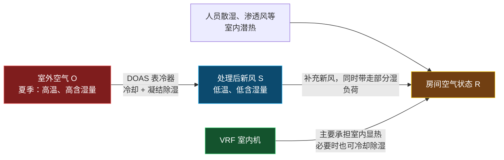

# VRF 与 DOAS 组合及节能机理（项目二面试速记 v0.1）

> 来源：用户项目二学习材料 + 已发表小论文（1-s2.0-S0378778825010564-main）事实底座。
> 数字口径：DOAS 节能 69.9%、VRF 节能 9.3%、总 HVAC 节能 X%，均来自 `项目2事实清单_v0.1.md`（EnergyPlus 仿真、单一阅览室案例）。
> 本文件解释"为什么 DOAS 节能远大于 VRF"的机理，是事实清单与 `project2_QA_v0.1.md` 未展开的面试弹药。

---

## 1. VRF vs 冷水机组（横向对照）

| 对比维度 | VRF / 多联机 | 冷水机组系统 |
|----------|--------------|--------------|
| 末端输送介质 | 制冷剂直接进入室内机盘管 | 冷冻水输送至 AHU/FCU |
| 核心设备 | 室外机、变频压缩机、制冷剂管、多个室内机 | 冷水机组、冷冻水泵、AHU/FCU；水冷式还包括冷却水泵、冷却塔 |
| 管路形式 | 铜制冷剂管路、分歧管 | 冷冻水供回水管；水冷式还包括冷却水供回水管 |
| 分区控制 | 每台室内机可独立调节，分区灵活 | 末端可通过两通阀、FCU/AHU 或 VAV 分区；系统级控制更集中 |
| 常见规模 | 中小型、改造项目、分区灵活需求强的建筑 | 大型公共建筑、医院、商业综合体、工厂或长时间大负荷项目 |
| 运维重点 | 制冷剂泄漏、冷媒充注量、室内外机与控制通信 | 机组、泵、冷却塔、水质、结垢、管网水力平衡和群控 |
| 初投资与空间 | 通常无需大型机房、冷却塔和水系统，安装灵活 | 机房、水泵、管网和可能的冷却塔需求更高，系统较复杂 |
| 工程优势 | 部分负荷和局部区域控制通常较灵活 | 大冷量集中供冷、系统级协同优化和长期运行管理能力强 |

> 不要说"VRF 一定只适合小建筑、冷水机组一定更节能"。准确表述：VRF 常在中小规模、分区灵活或改造受限场景有优势；冷水机组更常用于大型、集中、长期运行项目，但最终选择取决于建筑规模、负荷特征、空间、水资源、初投资和运维能力。

**面试口述版**：VRF 和冷水机组核心区别在于输送介质。VRF 是制冷剂直接通过铜管输送到各室内机，由室内机直接处理房间负荷；冷水机组则在机房内制取冷冻水，通过水泵送到 AHU 或 FCU 末端换热。VRF 分区控制更灵活，常用于中小型或改造项目；冷水机组设备和运维更复杂，但更适合大冷量、集中式、长期运行的建筑。实际选型要综合规模、负荷、分区需求、安装条件和全生命周期成本判断。

---

## 2. 为什么 DOAS 节能远大于 VRF

项目中：DOAS 节能 **69.9%**，VRF 节能 **9.3%**，总 HVAC 节能 **X%**。

### 负荷来源不同
- **DOAS 主要负荷**：室外新风量 × 室外空气处理需求
  - 显热：室外空气降温/加热
  - 潜热：室外空气除湿/加湿
  - 风机输送能耗
- **VRF 主要负荷**：围护结构传热 + 太阳辐射 + 照明设备 + 人员显热/潜热 + 部分新风耦合影响

### 为什么 DOAS 节能最显著
传统控制常按固定时间表或最大设计人数提供新风，实际人数较少时造成"过度通风"。项目用 **CNN 识别分区人数**并据此调整 DOAS 新风阀门开度。

尤其在夏季湿热地区，室外新风不仅要降温还要除湿；降低不必要新风量，DOAS 盘管负荷和送风机能耗明显下降。DOAS 的**直接受控对象就是新风量**，因此节能最显著。

### 为什么 VRF 节能空间较小
VRF 仍要处理许多与人数关系不强或不完全成比例的负荷：
- 围护结构传热
- 太阳辐射
- 照明与设备发热
- 建筑蓄热
- 部分人员负荷
- 室内设定温度维持需求

人员减少会降低一部分室内负荷，但围护结构、日射、设备负荷不会同步消失；所以 VRF 有节能空间，但通常远低于直接随新风量变化的 DOAS。

**面试口述版**：控制策略直接根据各区域实际人数调节 DOAS 新风阀门开度，首先减少不必要的室外新风量。室外空气进入系统后通常需冷却、除湿和风机输送，尤其在湿热气候下新风处理负荷较大，因此 DOAS 节能最明显，达 69.9%。VRF 虽因人员减少降低部分室内负荷，但仍需承担围护结构、太阳辐射、照明和设备等负荷，节能幅度相对较小，为 9.3%。两部分共同作用后，总 HVAC 节能 X%。

---

## 3. 为什么 VRF + DOAS 可以组合

```
室外空气 → DOAS：处理新风、承担通风和主要湿负荷 → 送至各区域
室内回风 / 房间负荷 → VRF 室内机：处理显热为主，按区域独立调温 → 维持各区域热舒适
```

### 各自负责什么
| 系统 | 主要职责 | 控制变量 |
|------|----------|----------|
| DOAS | 提供满足人员需求的新风，处理室外空气显热和潜热负荷，控制通风与空气品质 | 新风量、送风状态、阀门或风机 |
| VRF | 处理室内空间冷热负荷，尤其分区显热负荷，实现局部温度控制 | 室内机容量、制冷剂流量、室内机风量与设定温度 |

> 注意：不要绝对说"VRF 只处理显热，DOAS 只处理湿负荷"。更准确是职责侧重不同：DOAS 主责通风与新风温湿度，VRF 主责空间温度与分区显热。

### DOAS 的冷却除湿与焓湿图过程（机理补充）

**DOAS 是不是 AHU**：可看作 AHU 的一种专用应用形式，但职责更聚焦——普通 AHU 常处理"新风+回风"混合空气并同时承担室内负荷；DOAS 以 100% 室外空气为对象，独立承担过滤、热回收、冷却、深度除湿、必要时再热，只负责"处理好新风"。它不是所有 AHU 的同义词。

**夏季冷却除湿**：室外高温高湿新风经过低温冷却盘管，当盘管表面温度低于空气露点时，空气被冷却到露点以下，水蒸气凝结排走，温度与含湿量同时下降——这就是冷却除湿。DOAS 常以独立湿度控制为特征，并可借排风能量回收预处理新风。

**焓湿图对应**：夏季最典型为冷却除湿过程，状态点由 OA（高温高湿高焓）向左下方移动到 SA（低温低湿低焓）；各参数均降（干球、含湿量、焓、露点），相对湿度常接近饱和。这与"等湿冷却"（仅降温、含湿量不变）不同，DOAS 为处理新风潜热需越过露点发生凝结。

**可能再热**：深度除湿后空气过冷时，常增加等湿再热使送风温度适合送入室内，焓湿图上为 `OA→冷却除湿→盘管出风→等湿再热→DOAS送风` 两段连续过程；是否再热取决于室内设定、末端分工与控制策略，非必然。

> 衔接：本机理对应 `项目2事实清单_v0.1.md` 三-B（焓差计算边界 `h_OA−h_SA`）与三-C（DOAS 本质与冷却除湿完整过程）；与空气侧文件"等湿冷却 vs 冷却除湿盘管判据"自洽。

### 组合优势
- 新风量可依据人员、CO₂ 或 IAQ 需求独立控制；
- 室内温度可依据各区域负荷独立调节；
- 避免仅靠 VRF 室内机处理新风带来的湿度与通风问题；
- 便于将 CNN 人数识别结果直接接入 DOAS 新风控制；
- 便于在节能、热舒适和 IAQ 之间做明确权衡。

这正是项目关键：**CNN 识别人数不是目的，而是作为 DOAS 新风控制输入；VRF 则继续承担空间负荷调节。**

```
CNN 分区人数 → 计算各区需求新风量 → 调节 DOAS 新风阀门开度 → 减少过度通风和新风处理能耗 → VRF 持续按空间负荷维持室内设定温度
```

**面试口述版**：VRF 和 DOAS 组合因任务互补。DOAS 专门负责室外新风处理、通风量和主要湿负荷控制，VRF 更适合处理各区域室内冷热负荷和独立温度调节。把通风和热舒适控制解耦后，新风量可根据人员数量或 CO₂ 需求调节，各房间温度仍由 VRF 灵活维持。对项目而言，CNN 人数识别结果直接用于调整 DOAS 新风量，减少过度通风；VRF 则继续承担围护结构、照明和室内区域负荷，系统能效和控制逻辑都更清晰。

---

## 4. 占用驱动控制闭环：CNN 人数如何分配 DOAS 与 VRF 的节能

> 本节把项目讲成一个"占用感知—新风控制—能耗与环境响应"闭环，明确 CNN 人数识别结果**首先、也最直接**作用于 DOAS 新风量；VRF 主要仍按各分区温度负荷运行，间接受益。是事实清单三-B/三-C 与 QA 任务六的"控制逻辑总装"。

### 4.1 系统闭环图（两条并行的控制链）

```
摄像头 / 图像
     ↓
CNN 识别各区域实际人数
     ↓
控制器计算所需新风量
     ↓
DOAS 风量或新风阀开度调整
     ↓
室外新风 → 冷却除湿 → 各阅览区送风
```

与此同时（独立链，主要受温度驱动）：

```
室内温度传感器
     ↓
VRF 室内机按分区温度偏差调节制冷剂流量
     ↓
处理照明、设备、围护结构、人员显热等空间负荷
```

**关键认知**：CNN 的人数识别结果**不直接决定 VRF 的制冷剂流量**，而是主要用于调整 DOAS 的需求新风量；VRF 则主要仍根据各区域温度负荷进行分区运行。两条链同时响应占用变化，但控制变量和主要目标不同——这正是项目"算法进入 HVAC 系统"的落地接口。

### 4.2 房间里有哪些负荷（夏季阅览室热湿分解）

夏季房间的热湿负荷分三侧来源：

| 来源侧 | 具体负荷 | 性质 |
|--------|----------|------|
| 室外侧 | 室外新风的高温 + 高湿 | 新风显热 + 新风潜热 |
| 室内侧 | 学生、照明、电脑设备、围护结构、太阳辐射 | 主要是显热 |
| 人员本身 | 显热 + 呼吸/出汗带来的少量潜热 | 显热 + 少量潜热 |

人数增加不只是"人多了更热"，还意味着四件事同步发生：
1. 所需新风量提高（控制 CO₂ 与 IAQ）；
2. 新风处理量提高，DOAS 的冷却与除湿负荷增加；
3. 人体显热和潜热增加；
4. VRF 需要承担更多区域显热。

DOAS 与 VRF 的组合，本质是把"室外空气处理"与"房间温度调节"分别交给更适合的设备——研究与工程资料也通常将该组合描述为：DOAS 主要处理室外空气负荷，VRF 主要处理房间负荷。

### 4.3 低占用时怎么运行（DOAS 节能最直接）

晚上或非高峰时，阅览室实际只有少数人，但传统系统若仍按设计满员人数送新风，会引入过多夏季高温高湿室外空气：

```
实际人数少
    ↓
所需新风量下降
    ↓
CNN 输出低占用信号
    ↓
DOAS 降低新风量 / 风机输出
    ↓
需处理的室外高焓空气变少
    ↓
DOAS 的冷却、除湿和送风机能耗下降
```

此时 VRF 也会因人员显热降低而减少制冷输出，但**它的负荷不只由人数决定**：照明、设备、太阳辐射和围护结构传热仍可能存在。因此在低占用条件下，DOAS 的节能通常更直接、更明显，VRF 的节能则相对受建筑负荷影响更大。

### 4.4 高占用时怎么运行（两套系统同时响应，目标不同）

当阅览室接近满员时：

```
人数增加 → CO₂ 产生量增加 → DOAS 提高新风量 → 更多高温高湿新风需要冷却除湿
```

同时：

```
人体显热增加 → 室内温度趋于升高 → VRF 室内机提高制冷剂流量 → 维持分区室温
```

注意：**DOAS 增加风量是为了满足通风和空气品质；VRF 增加能力主要是为了维持各区温度。** 两套系统会同时响应，但控制变量和主要目标不同。

### 4.5 焓湿图上怎么看（双系统视角）

定义三个空气状态：
- **OA**：室外新风，高温高湿
- **SA**：DOAS 送风，较低温、较低湿
- **RA**：室内回风，接近室内设定状态

**DOAS 处理室外新风**（冷却除湿，向左下）：

```
OA ──冷却除湿──→ SA
```

夏季 DOAS 典型过程：干球温度↓、含湿量↓、焓值显著↓、水蒸气在盘管凝结并经冷凝水管排走。DOAS 的重要价值不只是"把新风吹进来"，而是**避免高温高湿的室外空气直接破坏室内湿度和温度状态**（详见事实清单三-C）。

**VRF 处理室内回风**（以显热为主，但不绝对不除湿）：

```
RA ──室内机盘管──→ VRF 出风 ──→ 房间
```

- 若室内机盘管表面温度高于回风露点 → 主要是等湿冷却；
- 若盘管表面温度低于回风露点 → 冷却除湿，VRF 也会带走一部分潜热。

项目可概括为：**DOAS 承担新风的冷却除湿和主要新风潜热，VRF 根据分区温度负荷处理空间显热为主。** 这个"主、次分工"比说两者完全不重叠更准确（衔接事实清单三-B/三-C）。

### 4.6 为什么 DOAS 节能更大（热湿学解释）

论文结果：HVAC 总能耗下降 **X%**，且 DOAS 节能幅度明显高于 VRF。热湿学上：

$$Q_{DOAS\ coil} = \dot m_{OA}\,(h_{OA} - h_{SA})$$

低占用时，控制器降低新风质量流量 $\dot m_{OA}$。只要 $h_{OA} > h_{SA}$，DOAS 的盘管冷却除湿负荷就随新风量下降而直接下降。

而 VRF 的空间冷负荷更接近：

$$Q_{VRF} \approx Q_{围护结构} + Q_{日射} + Q_{照明设备} + Q_{人员显热} - Q_{DOAS\ 对房间的冷却贡献}$$

即使人数减少，围护结构、日射、灯光和设备等负荷不一定同步减少，因此 VRF 节能通常不随人数或新风量完全成比例。

### 4.7 项目核心一句话（面试背诵）

> 在本项目中，CNN 识别阅览室实际占用人数后，控制器据此调节 DOAS 所需新风量。DOAS 对室外高温高湿空气进行冷却除湿，重点承担通风需求及新风带来的潜热负荷；VRF 室内机则根据各区域温度偏差调节制冷剂流量，主要处理人员、照明、设备和围护结构引起的空间显热。低占用时，减少不必要的新风量会直接降低 DOAS 对高焓室外空气的冷却、除湿和送风能耗，因此其节能更显著；VRF 也会受益，但仍需应对与人数无关的建筑显热负荷。

### 4.8 面试追问：两者会冲突吗？（协调控制）

可能会，所以需要协调控制。例如：
- DOAS 若为了深度除湿送入过冷空气，会承担更多显冷；若 VRF 仍按原温控逻辑全力制冷，房间可能过冷；
- 反过来，DOAS 新风量过低虽节能，但 CO₂ 可能超标（印证事实清单中 CO₂ 最高近 1200 ppm 的权衡）。

因此控制目标不能只写"最低能耗"，而应是：

> **在满足最小新风量、CO₂ 限制、室内温度和湿度约束的前提下，降低 VRF + DOAS 总能耗。**

这正好把项目讲成一个**工程控制问题**，而不是单纯的 CNN 人数识别问题——也呼应 QA 任务五"岗位迁移"与事实清单第四节"局限与权衡"。

---

## 5. 显热/潜热分工的严谨表述（纠正"DOAS 只潜热、VRF 只显热"）

> 本节纠正一个常见简化说法：**新风机组不是天然"只处理潜热"，VRF 也不是天然"只处理显热"。** 典型分工里 DOAS 优先处理室外新风带来的湿负荷、同时处理相应显热；VRF 室内机主要处理房间显热，也可在盘管低于露点时参与除湿。是 QA 任务八与事实清单三-E 的"机理澄清"。

### 5.1 为什么新风必须除湿

室内潜热负荷主要来自三类：
- **室外新风携带的水蒸气**：夏季高温高湿地区往往是很大的湿负荷来源；
- **人员呼吸、出汗等室内散湿**；
- 渗透风、工艺散湿等。

而 FCU 或 VRF 室内机通常以满足房间温度为主；当室内显热负荷较低时，它们可能很快达到设定温度并降低容量或停机。此时即便室温已达标，室外新风持续进入带来的水分仍须被移除，否则室内相对湿度可能上升。

因此 DOAS 的核心价值是把"通风量与湿度控制"从区域末端中分离出来：它持续按规范或需求提供室外空气，并通过低温盘管冷却、凝结除湿后再送入室内。专业新风机组的处理对象就是室外空气，可对其制冷、除湿或加热；新风与排风之间还可通过全热回收回收显热和潜热，降低新风处理负荷。

> 注意：新风机组冷却除湿时同时减少温度和含湿量，所以它处理的是**新风显热 + 新风潜热**，只是设计上往往更强调湿度控制。

### 5.2 双系统热湿分工图



### 5.3 VRF 主要处理什么（稳妥分工 + 严谨补丁）

在项目语境中，先使用稳妥分工：

- **DOAS** 负责按需引入并处理室外新风，优先控制新风导致的湿负荷；
- **VRF 室内机** 根据各区域温度需求，主要处理室内显热负荷，并提供分区温度调节。

VRF 通过变频压缩机和室内机电子膨胀阀调节制冷剂循环量，从而匹配各房间的即时负荷。

但更严谨地说，VRF 盘管只要低于室内空气露点，就会发生凝结水析出，因此会同时：
- 降低空气温度：处理显热；
- 降低空气含湿量：处理潜热。

所以**不能绝对说"VRF 不除湿"**。真正区别是：VRF 的除湿能力跟着温度控制和运行时长变化，通常不如独立新风除湿那样稳定、可控。

例如阴雨天"温度不高、湿度很高"工况：室温 24°C 已接近设定值，室外 26°C 高湿——DOAS 仍应持续除湿并供应合格新风；VRF 因显热需求低而降低容量，除湿能力随之减弱。这正是 DOAS 与 VRF 协同的意义。

### 5.4 是否处理到等焓点（不是必须，但是经典方案）

"新风处理到室内等焓点"是 FCU+新风、VRF+DOAS 系统中一种经典处理方案。含义是处理后新风送入室内的焓值 $h_S$ 与室内空气状态点的焓值 $h_R$ 相同：

$$h_S = h_R$$

此时新风进入房间后从总热量（焓）角度不额外增加或减少室内负荷，通常说新风"不承担室内负荷"；它主要抵消或处理的是"室外新风本身带来的负荷"。

但"等焓"绝不代表"状态相同"。夏季处理后新风常是：室内空气 R 温度较高、含湿量相对较高；新风送风 S 温度较低、含湿量更低；两者焓值相等。即新风为了除湿，通常送到温度更低、相对湿度更高但含湿量更低的状态点；它与室内点位于同一条等焓线附近，而非与室内状态点重合。


### 5.5 三种常见送风策略对照

| 新风处理方式 | 焓湿关系 | 新风是否承担室内负荷 | 适用理解 |
|--------------|----------|----------------------|----------|
| 处理至室内等焓点 | $h_S = h_R$ | 通常不承担室内总负荷 | 经典"新风负荷与室内负荷分开"方案 |
| 处理到低于室内焓值 | $h_S < h_R$ | 承担一部分室内冷负荷 | 新风较低温较干，可减轻 VRF/FCU 负担 |
| 仅预处理或未充分除湿 | $h_S > h_R$（常见于夏季） | 新风给室内增加冷、湿负荷 | 区域末端必须额外承担该负荷 |

### 5.6 项目最合适表述（面试背诵加固）

> DOAS 对室外新风进行冷却除湿，优先满足通风和湿度控制需求；在一种经典设计中，可将新风处理至室内等焓点，使其不承担室内负荷。若将新风进一步处理到低于室内焓值，则 DOAS 还能承担部分室内显热或总冷负荷，从而减少 VRF 的负担。VRF 则依据各区域温度负荷调节制冷剂流量，主要承担室内显热，但实际运行中也可能发生除湿。

> 衔接：等焓点理论对应 `空气侧处理与焓湿图面试速记_v0.1.md` 新增"等焓点专节"；与事实清单三-E、QA 任务八自洽；焓湿图三对照（分流 vs 合流）见空气侧文件三对照章节。

---

## 边界提示（面试口径）
- 69.9% / 9.3% / X% 是 **EnergyPlus 仿真、单一阅览室案例**，口头须说明，不夸大至"已部署实测"。
- CO₂ 最高接近 **1200 ppm**（高于传统控制）必须主动承认，体现节能与 IAQ 的权衡判断。
- 个人贡献须与论文作者贡献区分，详见 `project2_QA_v0.1.md` Q9。

---
**互链**：事实底座见 `项目2事实清单_v0.1.md`；项目二问答见 `project2_QA_v0.1.md`；VRF 与冷水机组系统级对照见 `水冷冷水机组系统图_v0.1.md`；VRF/DOAS/CRAC/CRAH 四概念分类与总对比见 `VRF_DOAS_CRAC_CRAH四概念对比面试速记_v0.1.md`。

