# 空气侧处理与焓湿图（面试速记 v0.1）

> 来源=用户学习笔记（秋招空调制冷/数据中心方向，"空气怎样被处理并送入空间"学习日），非本仓库代码。
> 定位：衔接昨日"冷量产生与输送"（制冷原理/冷水机组/水系统），补上空气侧。今天以"看懂过程方向"为目标，不陷入复杂查图计算。
> 互链：冷水机组与水系统见 `水冷冷水机组系统图_v0.1.md` / `水系统管路阀门水泵面试速记_v0.1.md`；VRF+DOAS 节能机理见 `VRF与DOAS组合及节能机理面试速记_v0.1.md`；VRF/DOAS/CRAC/CRAH 四概念分类与总对比见 `VRF_DOAS_CRAC_CRAH四概念对比面试速记_v0.1.md`；项目二完整问答见 `project2_QA_v0.1.md` / `项目2事实清单_v0.1.md`。

---

## 一、空气系统主线（图一：基础空气系统）

典型全空气系统核心目标：处理新风与回风的混合空气，使其达到合适温度、湿度和洁净度，再送至房间；房间空气部分排出、部分回到系统循环。

> 画图配色建议：蓝色=较冷/处理后空气，灰色=回风，绿色=新风，更直观。

```
                         室外空气
                            │
                         新风 OA
                            │
                     [新风阀 / 风阀]
                            │
                            ├─────────────┐
                            │             │
室内回风 RA ──→ [回风阀] ───┘          [混合段]
                                          │
                                          ▼
                                      [过滤段]
                                          │
                                          ▼
                                [冷却 / 除湿盘管]
                                          │
                                          ▼
                                      [送风机]
                                          │
                                          ▼
                                 送风 SA → 送风口
                                          │
                                          ▼
                                        室内空间
                                          │
                                          ▼
                                        回风口
                                          │
                         ┌────────────────┴───────────────┐
                         │                                │
                         ▼                                ▼
                    排风 EA 至室外                    回风 RA 至混合段
```

图旁五句话：
- **新风 OA**：从室外引入，用于通风、稀释 CO₂ 与污染物；
- **回风 RA**：从室内返回系统、可再次处理利用的空气；
- **混合风 MA**：新风和回风混合后的空气；
- **送风 SA**：经过过滤、冷却、除湿等处理后送入空间的空气；
- **排风 EA**：排至室外，用于排出污染物、湿气和部分室内空气。

> 最重要逻辑：全部回风会使污染物累积；全部新风会显著增加室外空气的冷却/除湿/加热/加湿负荷。故常规舒适性空调通常采用"新风 + 回风混合处理"。

---

## 二、六个基本名词

| 名词 | 英文缩写 | 含义 | 作用 |
|------|----------|------|------|
| 新风 | OA | 从室外引入的空气 | 提供通风，稀释污染物 |
| 回风 | RA | 从室内返回空调系统的空气 | 作为可再处理、再利用的空气来源 |
| 送风 | SA | 经处理后送入房间的空气 | 承担供冷、供热、除湿和通风任务 |
| 排风 | EA | 从系统或房间排到室外的空气 | 排出污染物、湿气和部分室内空气 |
| 混合风 | MA | 新风与回风混合后的空气 | 降低新风处理能耗，并满足通风需求 |
| 循环风 | — | 在室内—末端—室内间反复循环的空气 | 主要处理房间显热负荷 |

### 两个必答题
**为什么不能全部使用回风？** 仅靠回风会使 CO₂、人体代谢物、挥发性污染物逐步累积。建筑需引入满足最低卫生要求的新风，并通过相应排风维持空气品质和合理压力平衡。

**为什么不能全部使用新风？** 室外空气通常需被冷却、加热、除湿、加湿和过滤。尤其夏季高温高湿时，处理全部新风需同时承担显热和潜热负荷，能耗明显升高；故常采用"部分新风 + 部分回风"混合方式。

---

## 三、四类设备（空气侧）

| 设备 | 核心介质与位置 | 主要任务 | 是否完整新风方案 |
|------|----------------|----------|------------------|
| AHU | 空气侧集中设备，常配冷冻水/热水/DX 盘管 | 混风、过滤、冷却、除湿、加热、加湿、集中送风 | 可承担，取决于设计 |
| FCU | 房间或小区域末端，常配冷冻水/热水盘管 | 循环室内空气，局部温控，处理显热为主 | 通常不是 |
| DOAS | 专门处理室外空气的空气侧系统 | 保证新风、IAQ，处理新风潜热和部分显热 | 是 |
| VRF | 制冷剂直接送至室内机的 DX 系统 | 分区制冷/制热，响应室内冷热负荷 | 不是 |

> FCU 往往只处理房间回风和局部热负荷，通常需另配新风系统；VRF 虽具灵活分区温控能力，其室内机通常也不等同于完整新风系统。

**最关键结论**：VRF 主要负责各区域室内负荷和温度调节；DOAS 独立满足通风需求并处理室外空气带来的湿负荷和部分显热。两者组合把"空间温控"与"新风、湿度和 IAQ"相对解耦，使控制更清楚、更灵活。

> 措辞边界：把"VRF 只管显热"改为"VRF 主要承担空间显热和区域温控"；把"DOAS 处理全部潜热"改为"DOAS 处理新风带来的主要潜热"。实际比例取决于盘管选型、送风状态、室内湿负荷与控制方式。

### 图二：VRF + DOAS 分工（一定要突出"DOAS 管新风，VRF 管房间负荷"）

```
                 室外新风 OA
                      │
                      ▼
          ┌────────────────────────┐
          │          DOAS          │
          │ 过滤 / 冷却 / 除湿 /   │
          │ 加热（按工况需要）     │
          └────────────────────────┘
                      │
            处理后的新风 SA
                      │
            ┌─────────┼─────────┐
            ▼         ▼         ▼
          区域 A     区域 B     区域 C
            │         │         │
            │     满足通风、IAQ、新风湿负荷
            │
            ▼
  ┌─────────────────────────────┐
  │         VRF 室内机           │
  │ 区域温度调节、主要空间负荷   │
  │ 制冷 / 制热、局部独立控制    │
  └─────────────────────────────┘
            │
            ▼
        房间空气状态
```

图旁三标签：
| 系统 | 主要任务 | 在项目2中的作用 |
|------|----------|----------------|
| DOAS | 新风、通风、空气品质、新风潜热和部分显热 | 根据 CNN 识别的区域人数调节新风量 |
| VRF | 分区制冷制热、室内主要热负荷、温度控制 | 继续维持房间基本热舒适 |
| CNN 占用识别 | 输出各区域实际人数 | 给 DOAS 的需求新风量计算提供输入 |

> 项目表达固定为：**人数识别不是最终目的，它是控制输入；控制对象是 DOAS 新风量；评价结果是能耗、舒适性和 CO₂ 之间的权衡。**

---

## 四、焓湿图（以"看懂过程方向"为目标）

焓湿图是在固定大气压力下，把干球温度、含湿量、相对湿度和焓等空气状态参数及处理过程图形化，用于分析空调处理过程。

> 先分清两张图：**焓湿图管空气，压焓图管制冷剂**，二者不同。你之前学蒸汽压缩制冷循环看的是**制冷剂压焓图（p−h 图）**；焓湿图是研究空气侧系统的工具。两者会在空调盘管处相遇——制冷剂或冷冻水把盘管冷却，盘管再改变空气的温度和含湿量。

| 图表 | 研究对象 | 主要解决什么问题 | 典型应用 |
|------|----------|------------------|----------|
| 焓湿图 | 湿空气（干空气+水蒸气） | 空气如何加热、冷却、除湿、加湿、混合 | AHU、DOAS、新风、数据中心送回风、除湿 |
| 制冷剂压焓图 p−h | 制冷剂 | 压缩、冷凝、节流、蒸发循环如何运行 | 压缩机、冷水机组、热泵、VRF、CRAC |

### 六个参数
| 参数 | 简单理解 | 面试正确说法 |
|------|----------|--------------|
| 干球温度 | 普通温度计测得的空气温度 | 描述空气显热状态 |
| 湿球温度 | 湿纱布包裹温包、蒸发冷却后反映的温度 | 反映空气湿润程度和蒸发潜力 |
| 相对湿度 RH | 当前水汽含量相对该温度下饱和水汽含量的比例 | 表示空气"离饱和还有多远" |
| 含湿量 d | 单位干空气携带的水蒸气质量 | 判断空气中水分绝对多少 |
| 焓值 h | 空气包含的总能量，含显热与潜热 | 分析空气处理总负荷 |
| 露点温度 | 空气冷却到开始凝结水滴时的温度 | 冷却到露点以下会发生除湿 |

### 三个温度的关系
- **干球温度**：就是平时说的空气温度，普通温度计测得，反映"有多热"，但不直接说明空气里有多少水分。
- **湿球温度**：温度计包湿纱布、水分蒸发带走热量后测得的温度。空气越干、蒸发越强、湿球越低；空气越湿、蒸发越弱、湿球越接近干球。
- **露点温度**：含湿量不变时，把空气冷却到刚好开始结露的温度；再降温水蒸气就凝结成水。

对未饱和空气，一般有关系：
```
露点温度 < 湿球温度 < 干球温度
```
对饱和空气，三者相等。

### 五个过程
```
1. 等湿加热：      温度 ↑，含湿量不变，RH ↓
2. 等湿冷却：      温度 ↓，未到露点，含湿量不变，RH ↑
3. 冷却除湿：      温度 ↓，含湿量 ↓，出现凝结水
4. 加湿：          含湿量 ↑，可伴随温度变化
5. 两股空气混合：  混合状态位于两股空气状态连线上
```
**最关键的是冷却除湿**：潮湿空气经过低于其露点温度的冷盘管时，不仅因温差降温，水蒸气还在盘管表面凝结成水排走，故干球温度和含湿量同时下降。

### 显热与潜热
- **显热**：只改变温度、不改变含湿量的热量（如等湿冷却/加热）。对空调而言，显热决定"有多热"。
- **潜热**：与水蒸气含量变化有关的热量（如冷却除湿凝结水带走的能量、加湿时水蒸气增加所需能量）。对空调而言，潜热决定"有多潮湿"。
- 核心区别：显热是只让温度变化、不改变物质状态的热量；潜热是发生相变时吸收或释放的热量，典型表现为空气中水蒸气的凝结或蒸发。

| 对比 | 显热 | 潜热 |
|------|------|------|
| 本质 | 改变温度 | 改变物态或空气水分状态 |
| 温度计能否直接体现 | 能，干球温度变化 | 不一定，可能温度几乎不变 |
| 空气侧表现 | 空气变热或变冷 | 空气含湿量增加或减少 |
| 空调对应任务 | 降温或升温 | 除湿或加湿 |
| 常见来源 | 太阳辐射、照明、设备散热、人员显热 | 人员呼吸与出汗、渗透湿气、室外高湿新风 |
| 焓湿图变化 | 主要沿等含湿量方向 | 含湿量发生改变 |

空调总冷负荷通常由显热负荷和潜热负荷组成：
```
Q_total = Q_sensible + Q_latent
显热比 SHR = Q_sensible / Q_total
```
显热比越高，说明负荷越以"降温"为主；显热比越低，说明除湿任务占比越大。

**在制冷剂循环中**：制冷循环同时含显热与潜热变化，但最关键换热能力通常来自相变潜热。蒸发器内低压液/两相制冷剂吸热蒸发（吸收汽化潜热）；冷凝器内高压蒸气放热冷凝（放出冷凝潜热）。制冷剂从液体变蒸气需吸收大量汽化潜热，正是从室内/冷冻水/被冷却对象吸走的热量，也是蒸汽压缩循环高效搬热的关键。压缩机、过热段、过冷段也存在显热变化（如压缩后蒸气升温、冷凝液过冷），但蒸发/冷凝的相变潜热通常更核心。

**在空调空气侧**：
- 显热负荷：室内空气温度升高→空调需"降温"。例如照明、电脑、日射、设备使空气 24℃→27℃但水分未明显增加，盘管带走这部分热量使温度回设定值，主要在处理显热。
- 潜热负荷：空气中水蒸气增加→空调需"除湿"。例如人员呼吸出汗、烹饪、渗透湿气或夏季高湿新风向室内加水分，即使温度未显著上升，相对湿度仍可能升高、人体闷热；空调须让空气经过低于露点的冷盘管，使水蒸气凝结排走，才真正去除潜热。

```
高温高湿空气
      ↓
低于露点温度的盘管
      ↓
温度下降：去除显热
水蒸气凝结：去除潜热
      ↓
低温、低含湿量空气
```

**易错点**："空调开得很冷"≠"除湿一定充分"。盘管表面温度高于露点→只等湿冷却（温度降、含湿量不变）；低于露点→才冷却除湿（温度与含湿量同降）。真正判断是否除湿，要看含湿量是否下降，不能只看干球温度或相对湿度。

**与 DOAS 项目的关系**：VRF 主要处理室内区域显热负荷（围护传热、日射、设备、人员热量）；DOAS 处理室外新风的潜热负荷和部分显热负荷，尤其夏季高温高湿新风。控制实际人数后降低 DOAS 新风量=减少需被冷却除湿的室外空气，故 DOAS 节能幅度可能显著大于 VRF。这正是项目中"DOAS 节能高于 VRF"的热湿学解释：控制策略直接削减了高温高湿新风对应的显热与潜热处理量（数字口径：DOAS 69.9%、VRF 9.3%、总 X%，来自 `项目2事实清单_v0.1.md` 的 EnergyPlus 仿真单一阅览室案例）。

**数据中心视角**：数据中心通常以服务器/存储/网络设备发热形成的显热负荷为主——服务器使空气升温，但一般不明显向空气释放水分。故 CRAC/CRAH 主要任务是把热通道空气冷却后送回冷通道；不过机房仍需控制湿度与露点，防止过干致静电、过湿致结露或腐蚀。

**面试版回答**：显热是只引起温度变化、不发生相变的热量，例如设备和太阳辐射使室内空气升温；潜热与水分状态变化有关，例如人员散湿或高湿新风使空气含湿量增加。空调总冷负荷由显热和潜热组成：处理显热主要是降温，处理潜热主要是除湿。制冷剂在蒸发器中通过汽化吸收大量潜热，是制冷循环搬热核心；而在空气侧，只有当冷盘管温度低于空气露点时，水蒸气才会凝结排出，实现冷却除湿。

### 负荷与风量概念群（描述"搬多少热、送多少风"）
这一组概念可一起记：三个温度描述空气状态；冷负荷/新风负荷/系统冷负荷描述空调要搬走多少热；送风量/新风量描述系统送多少空气、引多少室外空气。

**冷负荷**：为把房间或系统维持在设定温湿度范围内，空调必须从空间带走的热量。它不是"房间一共产生多少热"，而是"空调最终需要搬走多少热"。通常分显热负荷（太阳辐射、照明、设备、人员散热使温度升高）和潜热负荷（人员散湿、渗透湿气、新风带水蒸气使含湿量变化）。总冷负荷：
```
Q_total = Q_sensible + Q_latent
```
（显热比 SHR 见上节。）

**新风负荷**：处理室外空气到室内所需状态时产生的负荷。室外空气常与室内状态不同，进来前往往要冷却、除湿、加热或加湿。夏季室外又热又湿，新风不仅要降温（显热）还要除湿（潜热），故新风负荷常偏大。工程思路常用焓差法：
```
Q_新 ≈ ρ · G_新 · (h_室外 − h_送风)
```
也可拆成显热和潜热两部分。一句话：**新风负荷 = 把室外空气处理到送风状态所需的冷量。**

**系统冷负荷**：整个空调系统最终需要由冷源提供的总冷量，不仅含房间内部负荷，还含新风负荷、风管与设备散热、输配过程附加负荷等：
```
Q_系统 = Q_房间 + Q_新风 + Q_输配 + Q_损失
```
常见组成：围护结构传热、人员/照明/设备、新风负荷、风机水泵管道风管附加负荷、机房管井吊顶漏冷。
> 易混点：**房间冷负荷**=房间本身需被带走的热量；**系统冷负荷**=整个 HVAC 最终由冷源提供的总冷量，通常 = 房间负荷 + 送风与新风处理负荷 + 输配附加负荷，故一般大于房间冷负荷。

**送风量**：送到房间的总空气量（常单位 m³/h）。风量大能搬的热多；送风温差大、同样风量下搬的热也更多。工程上送风量须满足：室内冷负荷需求、气流组织、噪声与风速限制、室内温差限制。

**新风量**：从室外引入、用于通风与 IAQ 的空气量。核心作用不是直接"制冷"，而是稀释 CO₂ 和污染物、保证卫生通风、维持 IAQ、在某些系统承担部分湿负荷。

| 项目 | 送风量 | 新风量 |
|------|--------|--------|
| 定义 | 送进房间的全部空气量 | 其中来自室外的那部分空气量 |
| 作用 | 主要承担供冷/供热 | 主要承担通风和 IAQ |
| 大小关系 | 通常较大 | 通常小于送风量 |
| 可能关系 | 送风量 = 新风量 + 回风量（混合风送入部分） | 是送风量的一部分 |

> 简单说：送风量是"总送进来多少风"，新风量是"其中有多少来自室外"。

**放到 VRF + DOAS 项目里**：VRF 主要跟房间冷负荷有关，负责处理室内显热和部分湿负荷；DOAS 主要跟新风负荷有关，负责处理室外空气的冷却和除湿。占用人数变化时，真正被直接调整的是**新风量**，所以节能效果主要体现在 DOAS（数字口径：DOAS 69.9%、VRF 9.3%、总 X%，来自 `项目2事实清单_v0.1.md` 的 EnergyPlus 仿真单一阅览室案例）。

**面试版回答（概念群整合）**：干球温度是空气的实际温度，湿球温度反映空气蒸发冷却后的状态，露点温度是空气在含湿量不变时冷却到开始结露的温度。冷负荷是空调需要从空间中带走的总热量，包括显热和潜热；新风负荷是把室外空气处理到室内送风状态所需的冷量。系统冷负荷则是整个空调系统最终需要由冷源提供的总冷量，通常比房间冷负荷更大。送风量是送到房间的总空气量，新风量是其中来自室外、用于通风和空气品质控制的那部分空气量。

### 焓湿图看什么（方向速记）
你当前不必记所有图线，只抓住两个方向：
```
向左：温度降低
向右：温度升高

向下：含湿量减少，空气变干
向上：含湿量增加，空气变湿
```

### 等湿冷却 vs 冷却除湿（盘管温度判据）
两者都"降温"，关键区别在**盘管表面温度是否低于空气露点**：

```
等湿冷却（干式冷却）
30°C、湿空气
    ↓ 盘管表面温度仍高于露点
24°C、湿空气
    ↓
温度降低，但水分没被去掉（含湿量不变）

冷却除湿
30°C，高温高湿空气
        ↓
  低于露点温度的冷盘管
        ↓
空气降温 + 水蒸气凝结成水
        ↓
较低温、较干的送风
```

- **等湿冷却**：盘管温度低于空气温度、但**高于空气露点** → 只降温，水蒸气不凝结，含湿量基本不变。
- **冷却除湿**：盘管温度**低于空气露点** → 空气被冷却到露点后，多余水蒸气在盘管表面凝结成液态水排出，温度与含湿量同时下降。

### 除湿是什么（三个易混点，重要面试点）
**除湿 = 从空气中移除水蒸气，使含湿量下降。** 空调最常见方法是冷却除湿（让空气经过低于露点的冷盘管，水蒸气凝结排出）。

必须区分：
1. **降温不一定除湿**：盘管温度高于露点，只发生等湿冷却；
2. **除湿通常伴随降温**：冷盘管低于露点，发生冷却除湿；
3. **相对湿度下降不一定代表除湿**：等湿加热时含湿量没变，但相对湿度会降低。

> 反例：冬季把室内空气加热后，人体会觉得"干"，但系统未必真的去除了水分；它只是让空气相对湿度变低（含湿量不变）。这是高频面试点。

**为什么夏季新风要除湿？** 夏季室外空气通常既热又湿，DOAS 或 AHU 处理新风时需同时：①降低温度（处理显热）；②去除水蒸气（处理潜热）。若只降温、不充分除湿，送入空气仍可能带来较多水分，使室内湿度偏高、人体闷热，并增加结露与霉菌风险。

### 对制冷与空调岗位的重要性
焓湿图很重要，因为空调并非只要"降温"，还需要处理空气中的水分。它能直观显示空气的温度、含湿量、相对湿度、露点和焓值，并表示冷却、加热、加湿、除湿及混合等过程。它能帮你回答这些工程问题：
- 室外新风为什么需要大量冷量？
- 空气经过冷盘管后，到底是"只降温"还是"降温并除湿"？
- 为什么送风温度不能只看干球温度？
- 新风和回风混合后，空气状态变成什么？
- 需要多少冷量、加热量或除湿量？
- DOAS 为什么要重点处理湿负荷？

> 夏季室外空气高温高湿，送进 DOAS 或 AHU 通常要同时降温、除湿（显热+潜热），这正是焓湿图最常用的分析场景。

### 对数据中心的重要性（使用重点不同）
数据中心通常以服务器产生的**显热负荷**为主，空气经过服务器后温度升高、含湿量通常变化不大；CRAC/CRAH 再把热空气冷却后送回冷通道。

```
CRAC / CRAH 送入冷空气
          ↓
       冷通道
          ↓
服务器吸入冷空气、产生显热
          ↓
热通道
          ↓
CRAC / CRAH 回风冷却
```

在焓湿图上，若只考虑服务器显热，空气状态近似沿**等含湿量线**变化（前：较低温、同含湿量；后：较高温、含湿量基本不变）。数据中心仍须关注湿度：
- 湿度过低：静电风险可能增加；
- 湿度过高：结露、腐蚀风险可能增加；
- 送风温度过低：表面温度低于空气露点时可能结露；
- 新风/自然冷却：室外空气引入后温湿度控制更复杂；
- 节能控制：评估空气侧自然冷却、间接蒸发冷却时，需比较室内外空气状态与焓值。

> 数据中心岗位最低目标：能讲清"主要处理 IT 显热、服务器前后含湿量通常变化不大，但仍要控制温湿度和露点避免静电/结露/热点；若采用新风、蒸发或自然冷却，焓湿图是判断室外空气是否适合利用及如何处理的工具"。不要求立刻会做复杂焓湿计算。

### 焓湿图怎么"运作"（状态地图）
严格说焓湿图本身不运作，它是一张空气状态地图。空气经过某设备前后各有一个状态点，把两点连起来就得到处理过程线；每个点代表一定压力下的一种空气状态，每条线表示温度/含湿量/焓值等参数变化关系。

```
已知空气进入设备前的状态 A
            ↓
知道设备做了什么：冷却 / 除湿 / 加热 / 加湿 / 混合
            ↓
在图上沿相应方向移动
            ↓
得到处理后的状态 B
            ↓
读出温度、湿度、焓值、露点与冷量变化
```

在固定大气压力下，通常只要知道湿空气的两个独立参数即可确定状态点并读出其他参数，例如：干球温度+相对湿度、干球温度+湿球温度、干球温度+含湿量。

### 与项目二的关系（高焓高含湿新风→节能链条）
VRF+DOAS 项目中，焓湿图是理解"为什么减少新风量能显著节能"的关键：

```
夏季室外新风：高温 + 高湿
          ↓
DOAS 必须冷却 + 除湿
          ↓
处理到适合送入室内的状态
          ↓
占用人数变少
          ↓
所需新风量下降
          ↓
需要处理的高温高湿室外空气减少
          ↓
DOAS 冷却、除湿和风机能耗明显下降
```

可表述为：**DOAS 节能显著，不只是少送一点风，而是少处理了一部分高焓、高含湿量的新风**；VRF 仍须处理围护结构、照明、日射和设备等空间负荷，故节能幅度通常低于直接受新风量控制的 DOAS。（数字口径：DOAS 69.9%、VRF 9.3%、总 X%，均来自 `项目2事实清单_v0.1.md` 的 EnergyPlus 仿真单一阅览室案例。）

### 焓湿图上的三种对照：VRF+DOAS / FCU+新风 / CAV 全空气

> 焓湿图横轴是干球温度 t（向右升高），纵轴是含湿量 d（向上升高）。方向速记：水平向左=显冷（温降、含湿量不变）；向左下方=冷却除湿（温、湿同降）；水平向右=显热加热/再热（温升、含湿量基本不变）；两状态点连线上的混合点=两股空气按干空气质量流量比例混合。下面三图适合面试白板讲解（非严格按比例）。

**① VRF+DOAS（你的项目）**——新风与室内负荷分流处理：

```
O 室外空气（高温高湿）
   ↓ 新风机组/DOAS 盘管：冷却除湿（t↓, d↓, h↓）
S 处理后新风（低温低湿）→ 补入房间

R 室内/回风（约 26°C、50%RH）
   ↓ VRF 室内机盘管：以显冷为主，必要时兼有除湿
F VRF 出风（低温、较低含湿量）→ 循环送风 → 房间 → 回到 R
```

**② FCU+新风（冷水末端）**——与 VRF+DOAS 空气侧分工相似，仅末端冷量介质为冷冻水：

```
O 室外空气（高温高湿） → 新风盘管：冷却除湿（t↓, d↓, h↓） → S 送入房间的新风（低温低湿）
R 室内/回风 → FCU 冷水盘管：以显冷为主，可能除湿 → F FCU 出风（低温低焓）→ 循环送风 → 房间
```

两种实际运行情况都要注意：**若新风机组已把送风露点压得足够低，新风可承担大部分甚至全部室内潜热，FCU 偏显冷；当 FCU 盘管表面温度低于空气露点、或室内潜湿负荷大时，FCU 也会冷却除湿（状态点向左下方移动），不能绝对说 FCU"只处理显热"。** 冷却盘管在很多系统中同时完成降温和除湿；若为了控湿过度降温，后续可能需再热满足送风温度。

**③ CAV 全空气（定风量）**——新风与回风先混合，最易遗漏的是混合点 M：

```
O 室外空气 ─┐
            ├→ 混合段 M（M 位于 O-R 连线上，由风量比例定）
R 室内回风 ─┘
            ↓ AHU 冷水盘管：冷却除湿
C 盘管出风（低温低湿）
            ↓ 若需要：再热（t↑, d 基本不变）
S 定风量送风（风量基本恒定）→ 进入房间，承担显热+潜热 → 回到 R
```

口述顺序：夏季 CAV 全空气中，室外新风 O 与室内回风 R 先按风量比例混合，混合状态 M 位于 O-R 连线；混合空气经 AHU 冷水盘管沿冷却除湿到达低温低湿的盘管出风 C；为在恒定送风量下同时满足温湿度，部分工况先深度冷却除湿、再经再热到送风点 S；送风进房间吸收显热潜热后状态回到室内点 R。**混合、冷却除湿、再热是全空气系统焓湿图核心过程。**

**三者焓湿图对照一句话**：VRF+DOAS 与 FCU+新风都是"新风一路冷却除湿、室内负荷一路由末端显冷（必要时除湿）"的分流结构；CAV 全空气则是"新风+回风先混合、再统一冷却除湿、必要时再热"的合流结构。区别在空气路径与是否设混合点，不在于冷却除湿本身。

> 衔接：概念层级辨析（冷冻水/FCU+新风/CAV 三者不是并列替代）见 `VRF_DOAS_CRAC_CRAH四概念对比面试速记_v0.1.md` 第 5 章；与四-B（全空气 vs 水系统）、四-C（系统分类框架）及"等湿冷却 vs 冷却除湿盘管判据"自洽。

#### 等焓点专节：新风"处理到室内等焓点"到底什么意思

在 VRF+DOAS、FCU+新风这类"新风负荷与室内负荷分担"的系统里，一种经典送风方案是**把处理后新风送到与室内空气等焓的状态点**：

$$h_S = h_R$$

含义：新风送入房间后，从总热量（焓）角度不额外增加或减少室内负荷，通常说新风"不承担室内负荷"；它主要抵消或处理的是**室外新风本身带来的负荷**（降温 + 除湿）。

**关键纠偏**：等焓 ≠ 状态相同。夏季处理后新风常是：

- 室内空气 R：温度较高、含湿量相对较高；
- 新风送风 S：温度较低、含湿量更低；
- 两者：焓值相等（位于同一条等焓线附近）。

新风为了除湿，通常必须送到温度更低、相对湿度更高但含湿量更低的状态点；它不是与室内状态点重合。

**三种送风策略对照**（直接服务面试追问"新风处理到哪"）：

| 新风处理方式 | 焓湿关系 | 新风是否承担室内负荷 | 适用理解 |
|--------------|----------|----------------------|----------|
| 处理至室内等焓点 | $h_S = h_R$ | 通常不承担室内总负荷 | 经典"新风负荷与室内负荷分开"方案 |
| 处理到低于室内焓值 | $h_S < h_R$ | 承担一部分室内冷负荷 | 新风较低温较干，可减轻 VRF/FCU 负担 |
| 仅预处理或未充分除湿 | $h_S > h_R$（常见于夏季） | 新风给室内增加冷、湿负荷 | 区域末端必须额外承担该负荷 |

**概念示意**（Mermaid 不计精确刻度，只看状态点与过程方向）：

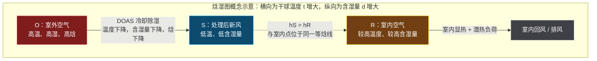

> 衔接：等焓点理论在 `VRF与DOAS组合及节能机理面试速记_v0.1.md` 第 5 节有完整展开（含 DOAS/VRF 显热潜热严谨分工）；与 `项目2事实清单_v0.1.md` 三-E、`project2_QA_v0.1.md` 任务八自洽。

### 你该学到什么程度（秋招目标）
以秋招目标，焓湿图应掌握到"能解释工程过程"，暂不需达到完整设计计算水平。

**必须会**：
- 读懂干球温度、相对湿度、含湿量、焓值、露点；
- 解释显热、潜热；
- 区分等湿冷却与冷却除湿；
- 解释新风与回风混合；
- 说明夏季新风为什么既要降温又要除湿；
- 将 DOAS 与新风潜热负荷联系起来；
- 解释数据中心显热主导、露点与结露风险。

**暂时不用深挖**：
- 手工复杂焓湿图计算；
- 完整送风状态点计算；
- 热湿比线的精确作图；
- 复杂一次/二次回风设计计算；
- 复杂机房自然冷却选型计算。

**面试版回答（整合两张图 + 岗位视角）**：焓湿图是描述湿空气温度、含湿量、相对湿度、露点和焓值关系的工具，用于分析空气加热、冷却、除湿、加湿和混合等过程；它不同于压缩机循环使用的制冷剂压焓图（p−h 图）——焓湿图管空气，压焓图管制冷剂，两者在空调盘管处相遇。它对空调制冷很重要，因为空调不仅要降温，还常要处理空气中的水分，例如夏季新风进入 DOAS 或 AHU 时需同时处理显热和潜热。对数据中心，焓湿图可用于分析服务器前后空气的显热升温过程、机房湿度与露点控制、结露风险，以及自然冷却或蒸发冷却条件。它不是设备本身，而是一张空气状态地图：确定空气处理前后的状态点，就能判断热湿变化并估算相应冷量和除湿需求。

---

## 四-B、全空气系统 vs 水系统（系统级区分）

> 本节衔接第三节"四类设备"与 `水系统管路阀门水泵面试速记_v0.1.md`（组件级）。这里从"房间负荷由谁输送"的视角做系统级区分。

### 全空气系统
空气在集中式 AHU 中完成混风、过滤、冷却、除湿、加热或加湿，再通过风管送进房间；房间的冷、热、湿负荷主要都由送风承担。

```
室外新风 + 室内回风
          ↓
     AHU 空气处理机组
  混合 / 过滤 / 冷却除湿
       加热 / 加湿
          ↓
        送风机
          ↓
        风管
          ↓
        房间
          ↓
      回风 / 排风
```

- 典型设备：AHU、送/回风机、风管风阀风口、过滤器、冷却/加热盘管、加湿器、新/回/排风阀。
- 优点：新风、过滤、温湿度可集中处理，空气品质与湿度控制能力较强。
- 缺点：空气输送冷量能力较低，大冷量常需较大风量与风管，占用吊顶与竖井空间。
- 常见场景：商场、剧院、会展中心、体育馆、大型办公、医院手术区、洁净室等大风量或高新风需求建筑。
- 注意：全空气系统≠"100% 新风系统"，它可采用新风+回风混合处理后再送入房间。

### 水系统
暖通语境中"水系统"通常指标空调冷热水系统：冷水机组或热源先制取冷冻水/热水，由水泵经管路送到 AHU、FCU、辐射末端等，末端利用水盘管或辐射面与室内空气换热。

```
冷水机组 / 热源
       ↓
   冷冻水泵 / 热水泵
       ↓
     水管网络
       ↓
AHU / FCU 水盘管
       ↓
空气被冷却、加热或除湿
       ↓
   水回到冷水机组 / 热源
```

若是水冷冷水机组，还有独立冷却水系统（冷凝器→冷却水泵→冷却塔→冷凝器）；冷冻水把室内热量带回蒸发器，冷却水把冷凝器热量带去冷却塔排向室外，两者不能混淆（详见 `水冷冷水机组系统图_v0.1.md`）。

- 典型设备：冷水机组、锅炉、热泵等冷热源；冷冻/热水泵；供回水管；AHU、FCU、辐射地板、冷梁等末端；阀门、过滤器、平衡阀、膨胀水箱等附件。

### 两者根本区别
| 对比项 | 全空气系统 | 水系统 |
|--------|------------|--------|
| 房间负荷主要由谁输送 | 空气 | 冷冻水或热水 |
| 主要输配网络 | 风管 | 水管 |
| 常见集中设备 | AHU | 冷水机组、泵、AHU/FCU |
| 室内末端形式 | 风口、风管送风 | FCU、AHU 水盘管、辐射末端等 |
| 新风处理能力 | 系统本身通常可集中处理 | 取决于末端；FCU 水系统通常需另配新风 |
| 湿度控制 | 通常较强、较集中 | 若只用 FCU，湿度控制与新风处理能力相对有限 |
| 管路/空间特点 | 风管体积大 | 水管较小，但需泵和水力平衡 |
| 常见应用 | 大空间、洁净和高新风需求场景 | 酒店、办公、医院、商业建筑等多分区项目 |

### 容易混淆的点
- **AHU 属于哪种系统？** AHU 可出现在两类系统中：全空气系统中 AHU 处理空气、风管直接送风，空气承担房间负荷；水系统中 AHU 的冷却盘管用冷冻水（冷源来自水系统），但仍通过空气和风管向房间送风。更准确：AHU 是空气侧设备，其盘管冷源可来自冷冻水，也可来自 DX 制冷剂。
- **FCU 属于全空气系统吗？** 通常不属于。FCU 是水系统常见末端，在房间内让回风经过冷冻水/热水盘管实现局部制冷、制热和一定除湿；风量较小、以处理室内回风为主，一般要配合 DOAS、新风机组或 AHU 满足新风需求。
- **VRF 属于水系统吗？** 不属于。VRF 是制冷剂直接膨胀系统，靠制冷剂铜管连接室外机与室内机，既非全空气系统，也非冷冻水系统。

```
全空气：AHU 处理空气 → 风管送风
水系统：冷水机组 → 冷冻水管 → FCU / AHU 盘管 → 空气
VRF 系统：室外机 → 制冷剂管 → VRF 室内机 → 空气
```

> 实际工程二者常结合：例如冷水机组供冷冻水给 AHU 盘管，AHU 再通过风管向房间送风。简单说——全空气系统主要靠空气输送冷热量，水系统主要靠水输送冷热量。AHU 冷水盘管与 FCU 虽同为冷冻水末端换热设备，但 AHU 是集中式大风量带风管机组、FCU 是房间级就地循环末端，层级不同不可混为一谈；完整辨析见 `冷冻水冷却水系统与水泵控制面试速记_v0.1.md` 六-C 节（含 AHU/FCU 对照表与"冷量道路+卸货点"比喻）。

### 一次回风与二次回风（全空气系统的回风组织方式）
回风在空气处理设备前后怎样参与混合，有两种组织方式：

**一次回风**：室外新风和室内回风在冷却除湿盘管（或喷水室）**之前混合一次**，混合风统一被处理，之后直接送入房间。
```
新风 OA ─┐
          ├→ 混合 ─→ 冷却/除湿盘管 ─→ 必要时再热 ─→ 送风 SA → 房间
回风 RA ─┘                                      │
                                                └→ 回风再循环
```
工作逻辑：新风与回风先混合→混合风统一冷却除湿→若出风太冷需再热到合适送风温度→一部分排风、一部分回风参与下一轮混合。
优点：流程简单、控制较易。缺点：某些夏季工况需"先深度冷却除湿、再加热"，产生再热能耗。

**二次回风**：回风分成两部分。第一部分在盘管前与新风混合、经深度冷却除湿；第二部分**不经过盘管**，在盘管后与低温低湿空气再次混合，一起送入房间。
```
新风 OA ──────────┐
                   ├→ 第一次混合 → 冷却/除湿盘管 ──┐
一次回风 RA1 ──────┘                                │
                                                     ├→ 第二次混合 → 送风 SA → 房间
二次回风 RA2 ───────────────────────────────────────┘
```
为什么这样做：盘管出口为除湿往往处理得很冷很干；直接送风温度过低，一次回风常用再热解决，二次回风则用未经盘管的部分回风与之混合把送风温度"拉高"，减少或避免再热。
一句话：**一次回风=先混合再统一处理；二次回风=部分回风先混合处理、另一部分在盘管后再次混合调高送风温度、减少再热。** 二次回风不是"多回收一次空气"，而是把回风在不同位置分两批利用。

| 项目 | 一次回风 | 二次回风 |
|------|----------|----------|
| 回风混合次数 | 一次，在盘管前 | 两次，盘管前一次、盘管后一次 |
| 盘管后空气状态 | 可能需再热后送风 | 通常先处理得较冷较干，再与二次回风混合 |
| 调节送风温度方式 | 常通过再热 | 通过二次回风混合，通常可减少再热 |
| 系统复杂度 | 较低 | 较高，风阀与控制更复杂 |
| 能耗特点 | 可能有再热能耗 | 可节省再热，但机器露点较低、控制更复杂 |
| 常见理解 | 简单、常规 | 用回风混合替代部分再热 |

**面试版回答（全空气 vs 水系统）**：全空气系统指房间冷热湿负荷主要由集中处理后的送风承担，新风和回风在 AHU 中完成混合、过滤、冷却除湿或加热加湿后通过风管送入房间。水系统则由冷水机组或热源制取冷冻水、热水，由水泵经管路输送到 FCU、AHU 或辐射末端，通过水和空气换热调节室内环境。简单说，全空气系统主要靠空气输送冷热量，水系统主要靠水输送冷热量；实际工程二者常结合，例如冷水机组供冷冻水给 AHU 盘管，AHU 再通过风管向房间送风。

### 四-C、空调系统分类总框架（按"输送冷量介质 + 冷量产生方式"）

> 本节把四-B 的"全空气 vs 水系统"扩成完整分类树。核心记忆锚点：**系统按"向房间输送冷量的介质"和"冷量怎么产生"来分**——空气、水、制冷剂、空气+水、水蒸发，共五类。

**最易记的总框架**：
```
空气系统：      靠空气送冷量
水系统：        靠冷冻水送冷量
冷剂式 / DX：   靠制冷剂直接送冷量
空气-水系统：   空气和水共同送冷量
蒸发冷却：      靠水蒸发吸热来降温
多联机 VRF：    冷剂式 / DX 系统的一种
```

#### 1. 定风量全空气系统（CAV 全空气）
属于全空气系统：房间冷热湿负荷主要由处理后的空气承担，AHU 处理空气后通过风管送到房间。"定风量"指正常运行时送风量基本不变，负荷变化时主要通过改变送风温度、盘管阀门开度或再热等方式适应。

```
新风 + 回风
     ↓
AHU：混合、过滤、冷却除湿
     ↓
送风机
     ↓
风管，以基本固定的风量送风
     ↓
房间
```
- 优点：系统逻辑较简单、风量稳定、便于集中处理新风和湿度；
- 缺点：部分负荷时若风量仍较大，风机能耗和再热能耗可能偏高；
- 典型场景：大开间办公区、商场、剧院、会议室、洁净区域等较适合集中送风的场所。

#### 2. 空气—水空调系统（半集中式）
空气和水共同承担房间冷热负荷。通常处理后的新风由 AHU 或新风机送入房间；同时冷冻水或热水送到房间内 FCU、诱导器或辐射板等末端，处理室内主要冷热负荷。

```
冷水机组 → 冷冻水管 → FCU / 辐射板 → 处理房间负荷
                         ↑
室外新风 → AHU / 新风机 ─┘ → 满足通风、除湿与 IAQ
```
- 最常见形式：冷水机组 + 冷冻水泵 + FCU + 独立新风系统；
- 核心优点：水的输送冷热能力比空气强，水管通常比大风管更省空间；新风由独立系统集中处理，FCU 实现房间分区温控；
- 典型场景：酒店、办公楼、医院病房、宿舍和多房间商业建筑。

#### 3. 蒸发冷却空调系统
利用水蒸发时吸收热量的原理冷却空气，核心不一定依赖压缩机和制冷剂循环，而是利用水的汽化潜热降温。

**直接蒸发冷却**：空气直接接触水或湿填料，水蒸发吸热，空气温度下降、含湿量增加。
```
高温干燥室外空气
       ↓
湿帘 / 喷水填料
       ↓ 水蒸发吸热
低温、但湿度更高的空气
```
极限接近室外空气湿球温度，特别适合高温干燥地区；湿热地区因空气已很湿，蒸发能力有限，效果明显受限。

**间接蒸发冷却**：被处理的送风与蒸发冷却侧空气通过换热器换热，两股空气不直接混合，送风可降温而含湿量基本不增加。
```
一次空气：需送入房间的空气 → 换热器 → 降温，含湿量基本不变
二次空气：与水接触蒸发冷却 → 吸热 → 排出
```
- 优点：压缩机能耗低，适合干燥地区，也常用于数据中心自然冷却或预冷环节；
- 限制：受室外湿球温度和气候影响大，还需关注水耗、水质、卫生与维护。

#### 4. 冷剂式空调系统（DX，Direct Expansion）
制冷剂直接膨胀式：不经过冷冻水中间介质，制冷剂直接流到室内盘管，在室内机蒸发吸热、冷却空气。

```
压缩机 / 室外机
      ↓ 制冷剂管
室内机蒸发器盘管
      ↓
室内空气被冷却、必要时除湿
```
- 常见例子：家用分体空调、窗式空调、柜机、屋顶式空调机组、精密空调中的 CRAC、多联机 VRF；
- 特点：制冷剂直接输送，设备链路较短、响应较快；但制冷剂管路设计、冷媒充注量、泄漏风险、系统高度与配管长度限制需重点关注。

#### 5. 多联机式空调系统（VRF / VRV）
本质属于冷剂式 DX 系统。"多联"=一台或多台室外机通过制冷剂管路连接多台室内机；"变制冷剂流量"=根据各房间实际负荷，调节压缩机转速和流向各室内机的制冷剂流量。

```
VRF 室外机
    ├──制冷剂管──→ 室内机 A：办公室
    ├──制冷剂管──→ 室内机 B：会议室
    └──制冷剂管──→ 室内机 C：房间
```
- 核心优势：每个房间可独立设定温度；部分房间无人时可降低对应室内机输出；不需要冷冻水泵、冷却塔和大规模水系统；适合多房间、负荷差异较大、改造条件受限的建筑；
- 注意：VRF 本身通常不承担完整新风任务，常与 DOAS 搭配——VRF 管房间温度和主要空间负荷，DOAS 管室外新风、空气品质和新风湿负荷（详见第三节图二与 `VRF与DOAS组合及节能机理面试速记_v0.1.md`）。

#### 五类系统对比表
| 系统 | 向房间输送冷量的主要介质 | 核心设备 | 新风处理能力 | 典型特点 |
|------|--------------------------|----------|--------------|----------|
| 定风量全空气 | 空气 | AHU、风机、风管 | 强，可集中完成 | 风量基本固定，适合集中处理和大空间 |
| 空气—水系统 | 空气 + 冷冻水/热水 | AHU、新风机、FCU、冷水机组、水泵 | 通常由新风系统承担 | 新风与室内负荷分工，分区能力较好 |
| 蒸发冷却 | 经蒸发冷却后的空气或冷水 | 湿帘、喷淋、填料、换热器、风机、水泵 | 多数为全新风或高新风运行 | 干热地区节能明显，受湿球温度限制 |
| 冷剂式 DX | 制冷剂 | 压缩机、冷凝器、蒸发器、制冷剂管 | 通常较弱，常需另配新风 | 制冷剂直接在室内盘管蒸发吸热 |
| 多联机 VRF | 制冷剂 | VRF 室外机、多台室内机、分歧管 | 不等于完整新风系统 | DX 的多区域、变流量形式，分区灵活 |

#### 它们之间的关系（分类树）
```
空调系统
│
├─ 全空气系统
│  └─ 定风量 CAV、变风量 VAV
│
├─ 空气—水系统
│  └─ FCU + 新风 / AHU + 辐射末端等
│
├─ 全水系统
│  └─ 冷冻水 / 热水末端，不单独解决新风
│
├─ 冷剂式 DX 系统
│  ├─ 分体机
│  ├─ 屋顶机
│  ├─ CRAC
│  └─ 多联机 VRF
│
└─ 蒸发冷却系统
   ├─ 直接蒸发冷却
   └─ 间接蒸发冷却
```

> 衔接：四-B 节已讲"全空气 vs 水系统"；本节的"空气—水系统""全水系统"是更细的系统级分支。VRF 已在 `VRF_DOAS_CRAC_CRAH四概念对比面试速记_v0.1.md` 单列，这里只放它在分类树中的位置。

**面试版回答（你当前最该记的版本）**：定风量全空气系统通过 AHU 和风管，以基本固定的送风量承担房间全部冷热湿负荷；空气—水系统则由新风空气和冷冻水末端共同承担负荷，典型形式是 FCU 加独立新风。蒸发冷却利用水蒸发吸热降温，适合干燥气候，也可作为数据中心自然冷却或预冷手段。冷剂式系统让制冷剂直接在室内盘管蒸发吸热；多联机 VRF 就是冷剂式系统的一种，可通过多台室内机实现灵活分区控制。蒸发冷却的冷却能力受室外湿球温度影响，而直接蒸发冷却会使空气含湿量升高。

---

## 五、回到项目二（空气侧视角，精炼）

> 完整问答见 `project2_QA_v0.1.md`（Q5 VRF/DOAS 分工、Q7 DOAS 69.9% 机理、Q8 CO₂ 权衡）。此处只给空气侧链条与四问要点。

工程链条（不要讲成"CNN 识别人，然后调了风阀"）：
```
室内图像 → CNN 输出各区域占用人数 → 按人数计算需求新风量 → 调节 DOAS 新风阀门/新风量
        → 减少不必要的室外空气冷却、除湿和输送 → 降低 DOAS 能耗 → VRF 继续处理主要空间冷热负荷
```

- **Q1 为什么采用 VRF + DOAS？** 项目采用 VRF 与 DOAS 组合，主要是为了将区域温度调节与新风处理相对解耦。VRF 通过室内机对不同区域的主要空间冷热负荷进行灵活调节，DOAS 则专门处理室外新风，满足通风与空气品质需求，并承担新风带来的潜热和部分显热负荷。因此，可以根据区域实际人数独立调节新风量，同时不明显影响 VRF 对室内温度的基本控制。
- **Q2 为什么控制 DOAS 新风量能节能？** 新风从室外进入室内前，通常需要被处理到合适的送风状态。夏季室外空气温度高、湿度也高，DOAS 不仅需要降低空气温度，还需要除去部分水分，因此包含显热和潜热处理负荷。固定按最大人数供应新风会在低占用时期产生过度通风；根据实际人数调节 DOAS 风量，可直接减少冷却、除湿和送风所需的能耗。
- **Q3 为什么不能无限减少新风量？** 新风量不能只按节能目标确定，还必须满足卫生通风和室内空气品质要求。若新风量过低，CO₂、人体代谢物及其他污染物的稀释能力会下降，室内空气品质可能恶化。因此，占用驱动控制需要设置最低新风量边界；更合理的进一步方案是结合人数前馈信息和 CO₂ 反馈信号，而不是只根据人数不断降低风量。
- **Q4 CO₂ 上升说明什么？** CO₂ 上升说明系统存在节能与室内空气品质之间的权衡。占用驱动控制减少了低占用时的过度通风，因此能够显著降低 DOAS 的新风处理能耗；但新风减少也会削弱对 CO₂ 的稀释，使其浓度上升。这个结果提示后续控制策略应将人数、CO₂、最低卫生新风量和热舒适指标同时纳入，而不是只追求最高节能率。

---

## 六、数据中心连接（空气侧）

### CRAC 与 CRAH
| 设备 | 全称 | 主要冷却方式 | 与普通空调关系 |
|------|------|--------------|----------------|
| CRAC | Computer Room Air Conditioner | 通常为 DX 直膨式，制冷剂在机组内直接蒸发吸热 | 更像数据中心专用直膨式精密空调 |
| CRAH | Computer Room Air Handler | 冷冻水盘管，由外部冷水机组提供冷量 | 更像数据中心专用 AHU |

> CRAH 用冷冻水盘管，CRAC 多为直膨式；具体产品/架构随项目变化，面试说"通常"最稳妥。

### 冷热通道
```
冷通道 → 服务器前侧吸入冷空气 → 内部吸收显热 → 后侧排出热空气 → 热通道
       → CRAC/CRAH 回风口 → 处理后冷空气重新送回冷通道
```
隔离目的：减少冷风热风过早混合，避免热风回流到进风口，提升送风有效利用率、减少局部热点。

### 与舒适性空调区别
| 维度 | 普通舒适性空调 | 数据中心空气冷却 |
|------|----------------|------------------|
| 主要负荷 | 人员、照明、日射、围护，显热+潜热 | IT 设备显热为主 |
| 湿度影响 | 常是舒适性和除湿重要因素 | 潜热相对小，但仍需维持设备允许范围 |
| 运行特征 | 随人员与气候，可能有停机时段 | 高负荷、全年连续运行 |
| 核心目标 | 人员舒适与 IAQ | 设备进风温度、可靠性、连续性和热点控制 |
| 气流组织 | 满足舒适送回风与新风需求 | 高度关注送风到机柜、热回风路径、旁通风与短路风 |
| 可靠性 | 按建筑服务要求设计 | 更强调冗余、监控、故障切换和维护连续性 |

> 数据中心往往以再循环空气承担主要显热冷却，仅为人员提供必要新风；核心不是把房间"吹得舒服"，而是让服务器进风条件稳定、避免热点并保持持续可靠运行。

### 四-D、数据中心空气冷却（学习日专题）

> 先建立总体画面：**数据中心不是以"人舒不舒服"为第一目标，而是持续、可靠地把服务器产生的大量显热送走，并让每台服务器进风都处于安全范围。** CRAC、CRAH 是冷却设备；冷热通道是让冷量真正送到服务器的气流组织方法。

#### 总体气流循环（先记这张图）
```
CRAC / CRAH
   ↓ 送出冷空气
冷通道
   ↓
服务器前侧进风口
   ↓ 服务器内部吸收设备热量（CPU/GPU/电源等使空气升温）
服务器后侧排风口
   ↓
热通道
   ↓
CRAC / CRAH 回风口
   ↓
冷却后重新送至冷通道
```
服务器通常是"**前进后出**"：前侧吸入冷空气，内部部件使空气升温，再从后侧排出热空气。数据中心的空气系统就是不断把热通道的热空气送回冷却设备，冷却后再供应到冷通道。

#### CRAC 是什么
CRAC = Computer Room Air Conditioner（计算机房空调器）。通常采用**直接膨胀（DX）制冷**，设备内具有压缩机和制冷剂循环；热空气经过制冷剂盘管后被冷却，再送回机房。可理解成服务机房、强调连续稳定运行的专用精密空调。

```
机房热空气
   ↓
CRAC：风机 + 制冷剂盘管 + 压缩机
   ↓
冷空气送到冷通道
```
- 适用：小型数据中心、边缘机房或不具备集中冷冻水条件的场景；
- 特点：安装和独立部署方便，但压缩机在设备端运行，整体能效通常不如大型集中冷冻水方案。

#### CRAH 是什么
CRAH = Computer Room Air Handler（计算机房空气处理机组）。本身通常**没有压缩机**，依靠外部冷水机组提供的冷冻水；机房热空气经过 CRAH 的冷冻水盘管，热量传给冷冻水，之后冷冻水回到冷水机组排热。

```
冷水机组
   ↓ 冷冻水
CRAH：风机 + 冷冻水盘管
   ↓
冷空气送到冷通道
```
- 可近似理解为"**数据中心专用 AHU**"：以空气为末端送风介质，但盘管冷量来自冷冻水系统；
- 适用：中大型、集中式数据中心，便于与冷水机组、冷却塔、水侧自然冷却等系统协同。

#### 两者怎么区分（一句话记忆）
**CRAC 自己"制冷"；CRAH 自己不制冷，而是"用冷冻水处理空气"。**

| 对比项 | CRAC | CRAH |
|--------|------|------|
| 中文理解 | 计算机房精密空调 | 计算机房空气处理机组 |
| 冷却盘管介质 | 制冷剂 | 冷冻水 |
| 压缩机 | 通常设备内置 | 通常不在 CRAH 内，由外部冷站供冷 |
| 系统性质 | 相对独立的 DX 冷却系统 | 集中冷冻水系统的空气侧末端 |
| 类比 | 专用直膨式精密空调 | 数据中心专用 AHU |
| 常见场景 | 小型机房、边缘节点、局部冷却 | 中大型、集中式数据中心 |

#### 冷热通道为何重要
冷热通道隔离不是为了"排得整齐"，而是为了避免冷空气和热空气过早混合。若服务器后侧排出的热空气绕回前侧，服务器会吸入偏热空气，出现局部热点；系统为压住热点，只能把 CRAC/CRAH 送风温度调更低、风机开更大，能耗上升。

```
不隔离：
冷风 →→→ 与热风混合 →→→ 服务器吸入混合热风
                   ↑
             热风回流 / 短路

隔离后：
冷风 → 冷通道 → 服务器 → 热通道 → 回风
```

冷热通道隔离的直接作用：
1. 减少冷热空气混合和旁通风；
2. 减少服务器进风口的热空气回流；
3. 提高每单位送风的有效利用率；
4. 减少热点，提升温度均匀性；
5. 允许在满足服务器进风要求前提下提高送风温度，从而降低冷却能耗。

#### 与舒适空调不同（复习表，六节已列，这里补完整九维）
| 维度 | 普通舒适性空调 | 数据中心空气冷却 |
|------|----------------|------------------|
| 核心对象 | 人员与室内环境 | 服务器及 IT 设备 |
| 首要目标 | 人员热舒适、通风与 IAQ | 设备进风边界、稳定运行与可靠性 |
| 主要负荷 | 人员、照明、日射、围护结构和新风负荷 | 服务器、存储、网络设备等持续设备显热 |
| 显热与潜热 | 潜热常不可忽略，尤其夏季新风 | 以显热为主，潜热相对较小 |
| 运行时间 | 多随人员使用时间变化 | 通常全年 24/7 连续运行 |
| 热密度 | 相对较低且较分散 | 高且集中，机柜可能形成热点 |
| 气流组织 | 关注舒适风速、送回风均匀性 | 极重视冷热通道、封闭、旁通和热回流 |
| 可靠性 | 短时故障通常影响舒适度 | 故障可能导致 IT 降频、宕机或设备风险 |
| 冗余要求 | 常规项目视需求配置 | 常要求 N+1、2N 等冗余与故障切换 |

普通舒适性空调需同时处理人员舒适、新风、CO₂、湿度等；数据中心主要面对高密度、连续的 IT 显热，并对温度稳定性、冗余及热点控制提出更严格要求。

#### 90 秒面试回答（学习日验收稿）
数据中心空气冷却与普通舒适性空调在基本原理上都包括送风、回风和盘管换热，但控制目标不同。舒适性空调主要服务人员，需要兼顾温度、湿度、新风和空气品质；数据中心主要处理服务器等 IT 设备持续产生的高密度显热，潜热负荷相对较小。

数据中心通常采用 CRAC 或 CRAH。CRAC 是采用制冷剂直接膨胀的专用精密空调，设备通常带有压缩机；CRAH 则使用外部冷水机组提供的冷冻水，通过水盘管冷却机房空气，可以理解为数据中心专用 AHU。

数据中心全年连续运行，对供冷可靠性、冗余、温度稳定性和故障切换要求更高。气流组织上，服务器前侧从冷通道吸入冷空气，后侧向热通道排出热空气；通过冷热通道隔离减少冷热空气混合和热风回流，可以减少热点并提高冷却效率。

#### 四-D-2、数据中心冷却系统观：热量从 IT 设备到室外的完整链路

> 本子节把四-D 的"设备与气流基础"进一步拉成**完整系统观**：核心不是"机房平均温度多低"，而是建立"热量从 IT 设备出发，跨越空气侧、水侧或制冷剂侧，最终排至室外"的全链路认知。数据中心的冷却对象不是人的舒适感，而是服务器等 IT 设备的进风温度、持续运行能力与热点风险。

##### 先看系统边界（五层面，今天只连冷却与 IT 热量）

| 层面 | 典型内容 | 与冷却的关系 |
|------|----------|--------------|
| IT 设备 | 服务器、存储、交换机、路由器 | 电能大部分最终转化为热量，是冷却负荷来源 |
| 供配电 | 变压器、UPS、配电柜、柴油发电机 | 自身也有损耗发热，且保障冷却设备不断电 |
| 冷却系统 | CRAC、CRAH、冷机、泵、冷却塔、液冷设备 | 将 IT 热量逐级搬运并排向室外 |
| 监控与控制 | 温湿度、机柜进风温度、流量、压差、功率、告警 | 发现热点、控制设备、判断能效与故障 |
| 消防与安全 | 火灾探测、灭火、门禁等 | 保障机房运行安全，但不是本节重点 |

**重要认识**：服务器消耗的电能几乎都会以热的形式出现在机房中。GPU、CPU、内存、硬盘、电源模块和网络设备都在持续放热，因此数据中心冷却本质上是一个**持续排热问题**。

##### 空气冷却主路径（传统空气冷却数据中心）

服务器通常"前进风、后排风"：机柜前侧形成冷通道、后侧形成热通道；冷空气进入服务器前部，吸收元件热量后以热空气从后部排出。最关键的不是"机房平均温度"，而是：每台服务器进风口是否得到足够冷空气、排出的热空气能否被顺利收集、冷空气是否真正穿过服务器吸热、是否存在局部热点/热回流/冷风旁通。


##### CRAH 如何接水系统

若用 CRAH，通常采冷冻水盘管：机房热空气经 CRAH 盘管把热量传给盘管内冷冻水，CRAH 再把处理后的冷空气送往冷通道。一句话概括：**服务器先把热量交给机房空气，CRAH 再把空气中的热量交给冷冻水，冷冻水最后把热量带回冷水机组**。CRAH 是空气侧末端，不直接"制造冷量"，而是使用集中冷水系统提供的冷冻水与机房回风换热。

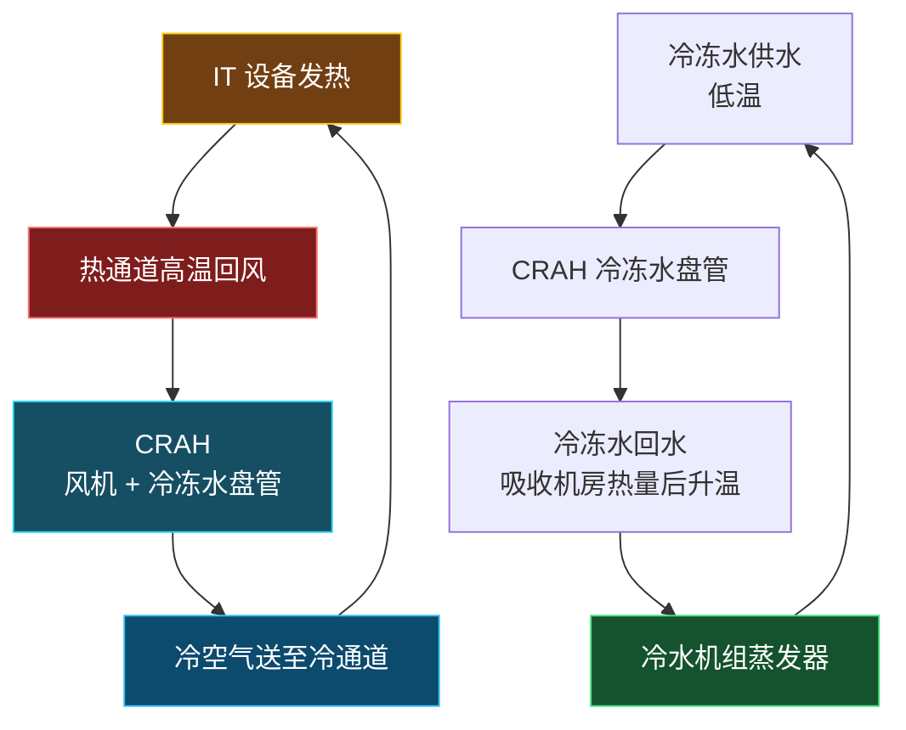

##### 冷机如何排热（完整热量链）

冷水机组蒸发器从冷冻水吸热，制冷剂经压缩机升压升温后在冷凝器向冷却水放热；高温冷却水再被送往冷却塔，借助空气和水蒸发把热量排到室外。

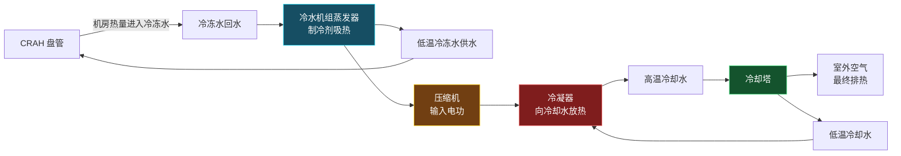

大型水冷数据中心一条完整热量链：

```
IT 芯片 → 服务器内部空气 → 服务器排风/热通道 → CRAH 回风 → CRAH 冷冻水盘管
       → 冷冻水回水 → 冷水机组蒸发器 → 制冷剂 → 冷凝器冷却水 → 冷却塔 → 室外空气
```

> 注意：冷却塔排出的热量不仅包括服务器产生的热量，也包括冷水机组压缩机等设备消耗电能后转化的热量（呼应冷冻水文件六、冷却塔基础的热量链 `Q_tower ≈ Q_cond = Q_evap + W_comp`）。

##### CRAC 的路径不同（DX 直膨）

若末端是 CRAC，常见架构为直接膨胀式 DX：制冷剂直接在 CRAC 内蒸发器盘管吸收机房空气热量，通常不需要 CRAH 冷冻水盘管这一环节。

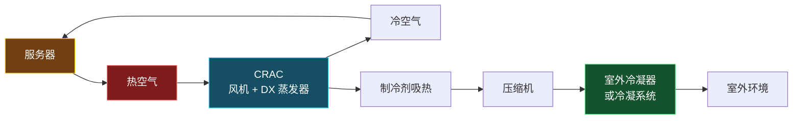

三类机房末端吸热与下一步去向对照：

| 设备 | 机房内如何吸热 | 热量下一步去哪里 |
|------|----------------|------------------|
| CRAC | 制冷剂在 DX 盘管中直接吸热 | 制冷剂回路、压缩机、室外冷凝器或冷凝系统 |
| CRAH | 冷冻水在水盘管中吸热 | 冷冻水回到集中冷水机组 |
| 液冷换热设备 | 冷却液直接或间接从芯片附近吸热 | CDU、设施水或其他外部排热回路 |

CRAC 与 CRAH 都负责机房空气侧循环和换热，但前者更接近"机房专用直膨空调"，后者更接近"接入集中冷冻水系统的机房空气处理设备"（即"数据中心专用 AHU"）。

##### 为什么不只是降室温（冷风旁通 vs 热空气回流）

普通建筑空调主要感受房间平均温度/湿度/风速/空气品质；数据中心首先关心服务器进风温度和局部热环境。即使机房平均温度正常，若热空气绕流到机柜前部，局部服务器进风温度仍可能过高。

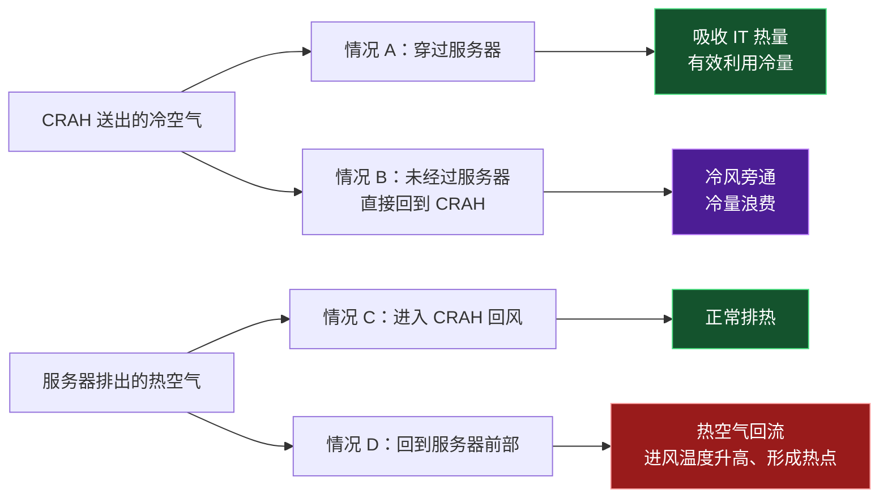

冷热通道和通道封闭的目的，就是尽量减少冷风旁通和热空气回流。ASHRAE 数据中心能效建议也强调，冷热通道布局及封闭可防止送风与回风短路，并帮助稳定服务器进风温度。

##### 面试表达（40—60 秒可直接用）

数据中心冷却的核心不是简单降低机房平均温度，而是持续、可靠地把高密度 IT 热负荷排至室外，并保证服务器进风温度不超限。以 CRAH 加冷冻水系统为例，服务器从前部冷通道吸入冷空气，空气流经 CPU、GPU 等部件后吸热，从后部排入热通道；CRAH 回收热空气，通过冷冻水盘管将热量传给冷冻水。冷冻水回到冷水机组蒸发器，热量再经制冷剂、冷却水和冷却塔排至室外。系统还要通过冷热通道封闭、风量和温度控制，减少冷风旁通与热空气回流，并通过冗余设计保障故障或检修期间的连续冷却能力。

> 衔接：本子节完整链路与 `冷冻水冷却水系统与水泵控制面试速记_v0.1.md` 六、六-C（冷却塔排热、冷冻水末端）自洽；与 `VRF_DOAS_CRAC_CRAH四概念对比面试速记_v0.1.md` 6.6（数据中心 CRAH 高可靠版本）、6.7（风冷 vs 水冷先问哪一侧）呼应；CRAC/CRAH 设备级区分见四-D 主节，选型方法论见四-E。

### 四-E、数据中心冷却方案选型（方法论专题）

> 四-D 讲"设备与气流基础"；本节讲"如何根据条件选方案"。**先记住最稳的结论：数据中心没有一种"任何项目都最节能"的固定冷却方案。正确做法是先保证服务器进风条件、可靠性和可维护性，再根据 IT 负荷密度、当地气候、水资源、电价、规模、冗余等级和改造条件，选择空气冷却、自然冷却、蒸发冷却、冷冻水或液冷的组合。**

#### 先纠正一个误区：不能只看单机 COP
"最节能"不能只看某台 CRAC、CRAH 或冷水机组的 COP，也不能只看是否采用液冷。数据中心总能耗应从整条链路看：

```
IT 设备
  + CRAC / CRAH 风机
  + 压缩机或冷水机组
  + 冷却塔、冷却水泵、冷冻水泵
  + 加湿、除湿、控制与照明等
  ↓
数据中心总能耗
```

常用总体指标是 PUE：

PUE = 数据中心总能耗 / IT设备能耗

PUE 越接近 1，说明非 IT 基础设施的附加能耗越低；但高能效不能以牺牲设备可靠性、结露控制和冗余能力为代价。ASHRAE 数据中心热指南也将设备环境条件、温湿度测量、气流组织、设备布局及高密度设备作为设计和运行的核心问题。

#### 第一步：先减"无效冷却"（最便宜、最稳的节能）
在选择冷源前，往往最便宜、最稳的节能措施是改善空气组织。如果冷风没有真正进入服务器进风口，而是和热风提前混合，再高效的冷机也会被浪费掉。

```
不良组织：
冷风 →→ 与热风混合 →→ 服务器吸入偏热空气
                  ↑
              热风回流

优化后：
CRAC / CRAH → 冷通道 → 服务器前侧 → 服务器后侧 → 热通道 → 回风
```

优先措施：
- 采用冷热通道布置，服务器前侧面对冷通道、后侧面对热通道；
- 使用冷/热通道封闭，减少旁通风和热风回流；
- 封堵机柜空位、地板开孔和电缆孔，避免冷风短路；
- 依据机柜负荷布置送风口或回风口，而不是平均送风；
- 用机柜进风温度、回风温度和热点情况控制风机，而不是长期满速运行。

设备布局和气流模式本身就是 ASHRAE 数据中心热环境指南重点覆盖的内容，它通常也是空气冷却系统最先该优化的部分。

#### 第二步：按热密度选路线
| IT 热负荷密度 | 更合适的冷却主线 | 原因 |
|---------------|------------------|------|
| 低至中等密度、传统通用服务器 | CRAH/CRAC 空气冷却 + 冷热通道隔离 | 技术成熟、维护简单，空气仍可有效承担主要显热 |
| 中等密度、规模较大 | 冷冻水 CRAH + 水侧自然冷却 | 适合集中冷站；可利用低室外湿球温度减少冷机运行 |
| 气候干燥或凉爽 | 间接蒸发冷却、直接/间接自然冷却 | 可显著减少压缩机制冷时间，但要评估气候、水耗和空气品质 |
| 高密度 AI/HPC 机柜 | 风液混合、冷板直接液冷 + 少量空气冷却 | 空气难以经济地带走全部高热流密度，液体可在热源附近高效取热 |
| 极高热密度、专用部署 | 浸没式液冷或其他高比例液冷 | 热容量和传热能力高，但改造、运维与设备兼容要求更高 |

这不是绝对的容量分界表：实际选择需以机柜功率密度、芯片热流密度、服务器厂商要求、供回水温度和冗余等级为准。ASHRAE 已专门增加高密度空气冷却设备类别和液冷设备环境指南，说明高密度负荷不能简单沿用传统机房空调思路。

#### 第三步：让冷源"少开压缩机"
压缩机制冷通常是空气冷却中较高能耗的环节。最有效的策略之一是根据当地全年气象条件，让系统尽可能多地运行在"少用或不用压缩机"的模式。

自然冷却并非一定把室外风直接吹进机房。常见方式：

| 方式 | 工作逻辑 | 优点 | 主要限制 |
|------|----------|------|----------|
| 空气侧自然冷却 | 过滤后的室外空气直接或部分进入机房 | 节电潜力大，系统链路短 | 室外污染物、湿度、温度波动和过滤要求 |
| 水侧自然冷却 | 利用低温室外空气、冷却塔或干冷器冷却水，再经换热器供冷 | 不让室外空气直接进入机房，环境可控性较好 | 需要合适气候和水系统设计 |
| 间接空气自然冷却 | 室外空气通过换热器冷却室内循环空气，两股空气不混合 | 可兼顾节能与室内洁净控制 | 换热器压损、初投资和控制复杂度 |
| 直接蒸发冷却 | 水蒸发冷却送风 | 能耗较低 | 送风含湿量上升，对干燥气候更合适 |
| 间接蒸发冷却 | 通过蒸发冷却侧和换热器冷却送风 | 送风可降温而不明显增湿 | 仍需考虑水耗、水质和气候 |

ASHRAE 将空气侧自然冷却描述为：把过滤后的室外空气直接引入数据中心、无需传统空调或湿度处理来实现冷却；但是否能采用取决于当地室外条件、污染物和设备环境边界。

#### 第四步：提高供风温度
如果 IT 设备允许，不要习惯性把机房送风温度设得过低。在满足服务器进风温度、露点、湿度及热点控制要求的前提下，提高供风/回风温度设定，通常可以提高冷机效率、扩大自然冷却可用时段，并减少过度除湿或再热。

但必须注意：控制目标应是服务器进风口温度，而不是只看 CRAC/CRAH 出风温度。若气流组织差，即使设备出风很冷，远端机柜仍可能出现热点；反之，在隔离良好的冷热通道中，系统可以在更高、更节能的送风温度下稳定运行。

#### 第五步：空气与液冷协同
液冷并不意味着机房不再需要空气系统。即使采用冷板液冷，服务器的内存、硬盘、网卡、电源和机柜环境等部件仍可能需要一定空气冷却；液冷系统也需要 CDU、泵、换热器、管路、泄漏检测和控制逻辑。

更常见、也更稳妥的路线：

```
CPU / GPU 等高热流部件
        ↓
冷板直接液冷
        ↓
CDU / 二次侧液路
        ↓
设施水系统 / 冷却系统

其余部件和机柜环境
        ↓
CRAH / 风机墙 / 空气侧系统
```

面对 AI 负荷，关键不是简单问"要不要液冷"，而是问：多少热量必须由液体带走，剩余热量如何由空气侧可靠地带走，以及两侧如何协同控制。

#### 选择决策框架（工程筛选顺序）
```
1. 确认 IT 设备需求
   └─ 机柜功率、服务器进风温湿度、是否支持液冷、未来扩容

2. 确认可靠性目标
   └─ 是否要求 N、N+1 或 2N，故障时允许何种降载

3. 看当地全年气象
   └─ 干球温度、湿球温度、焓值、湿度、空气污染物

4. 看资源与约束
   └─ 电价、水价/水资源、场地、噪声、机房层高、改造条件

5. 先优化空气组织
   └─ 冷热通道封闭、减少旁通与回流、按机柜负荷送风

6. 再确定冷却路线
   └─ 风冷、自然冷却、蒸发冷却、冷冻水、风液混合或液冷

7. 用全年能耗模拟和生命周期成本验证
   └─ 不只看初投资，也看 PUE、WUE、维护、水耗和可靠性
```

美国能源部的数据中心节能设计指南将设计、运行和能源效率作为系统性问题处理；因此实际项目应以全年运行策略和全生命周期成本验证方案，而不是以单一设备效率判断。

#### 面试回答（最稳版本）
数据中心最节能的冷却方案不能脱离机柜热密度、气候、水资源、可靠性和扩容需求单独判断。对于中低热密度机房，应先通过冷热通道隔离、封堵旁通风和按需风机控制，减少无效空气混合；在气候适宜地区，再优先采用空气侧或水侧自然冷却、间接蒸发冷却，尽量减少压缩机运行。对于高密度 AI 或 HPC 负荷，空气冷却可能难以经济地承担全部热量，更合理的路线通常是冷板液冷与 CRAH 空气系统协同：液冷带走 CPU/GPU 等高热流部件的热量，空气侧处理其余部件和机房环境。最终应以服务器进风环境、全年 PUE/WUE、可靠性冗余和全生命周期成本共同评价，而不是只追求某一种设备或单项能效。

---

#### 四-F、数据中心 IT 负荷与冷却容量匹配（通用基础专题，不进液冷）

> 本子节属于普通数据中心与 AI 数据中心的**共同基础**：根据 IT 功率理解机柜热负荷，解释冷却容量如何匹配，并判断"冷量不足"与"气流组织不足"是两个不同问题。
>
> **今日总目标（一句话）**：数据中心冷却要同时满足**总量热平衡**和**局部气流/容量匹配**；总冷量足够，不代表每个高负荷机柜都能获得足够冷空气。
>
> **渐进学习路径**（秋招优先、面试表达优先：先把 CRAH 空气冷却和水系统讲稳，液冷作为高密度 AI 场景的"进一步解决方案"而非孤立热门名词）：


今日不进入 CDU、冷板、浸没等液冷细节。

##### 一、电功率—热负荷基本概念

服务器、存储、网络设备消耗电能后，绝大部分最终以热量形式释放到机房或冷却液。

**入门/单个 IT 设备热平衡**可先按：**1 kW IT 实际用电 ≈ 1 kW IT 散热**估算。更严谨的面试表达为：

> 在稳态近似下，服务器消耗的电能绝大部分最终会转化为机房内需要移除的热量，因此可将 IT 实际功率近似视为 IT 热负荷。但数据中心冷却容量设计还应叠加 UPS、配电、照明等附加热源，并考虑峰值、冗余、扩容和实际工况。

注意：**不要说"所有数据中心总冷负荷等于 IT 功率"**——否则忽略了辅助设备的热量与系统边界。数据中心总热负荷应考虑 IT 设备之外的系统部件热量（UPS/配电损耗、照明、人员、围护结构、未来增长、冗余与实际运行工况）。

**四种功率必须分清**（面试勿把铭牌功率当长期实际负荷）：

| 概念 | 含义 |
|------|------|
| 设备铭牌功率 | 厂商标注的最大或额定输入功率 |
| 实际运行功率 | 服务器当前真实消耗的功率 |
| 峰值功率 | 特定任务或负载下可能出现的最大值 |
| 设计功率 | 冷却和供电系统容量规划采用的值 |

##### 二、机柜功率密度（kW/柜）与三层汇总

机柜功率密度用 `kW/柜` 表示机柜内 IT 设备的功率与发热水平。三层汇总关系：

```
服务器功率 → 机柜功率 → 机房/数据中心 IT 负荷
```

**关键结论：总量匹配不代表局部匹配**。机房平均功率密度不能完全代表局部状态——部分机柜低负荷、部分高负荷时，全机房均值可能正常，但高负荷机柜附近仍可能进风温度偏高或风量不足。除总 IT 负荷和总制冷量外，还必须看：每个机柜功率、机柜位置、服务器进风温度、送风量分配、回风路径、冷风旁通、热空气回流。

##### 三、空气冷却热平衡 `Q = ṁ c_p ΔT`

空气带走热量的基本关系：

$$Q = \dot m\, c_p\, \Delta T = \rho\, \dot V\, c_p\, \Delta T$$

- `Q`：空气带走的热量；`ṁ`：空气质量流量；`ρ`：空气密度；`V̇`：体积流量；`c_p`：空气比热容；`ΔT`：空气经过服务器前后温升。

理解要点：机柜热负荷增加时，要维持相同温升通常需增加风量；风量不足时，排进风温差增大或进风温度升高。**风量并非越大越好**——过大会增 CRAH/CRAC 风机能耗、造成冷风旁通、机房压差异常、气流组织恶化、部分区域过剩而部分仍不足。正确目标是冷却能力与每个机柜实际热负荷匹配。

**今日计算练习**：10 kW 机柜、温升 12 K、ρ≈1.2 kg/m³、c_p≈1.0 kJ/(kg·K)。注意单位统一：以 kW、kg/s、kJ/(kg·K) 和 K 表示时，由 `Q = ρ V̇ c_p ΔT` 反算得到的 `V̇` 单位就是 m³/s，数值即 kW：

$$\dot V = \frac{Q}{\rho\, c_p\, \Delta T} = \frac{10}{1.2\times1.0\times12} = 0.694\ \text{m}^3/\text{s}$$

换算：

$$0.694 \times 3{,}600 \approx 2{,}500\ \text{m}^3/\text{h} \quad (\text{约 } 1{,}470\ \text{CFM})$$

即理想条件下，10 kW 机柜、进排风温升 12 K 时约需 **0.69 m³/s 或 2,500 m³/h**（典型温升常取 10–12°C）。

**但必须补限制条件**：这只是"空气真正均匀穿过服务器、没有旁通或回流"的热平衡理论值。现场还需考虑机柜内部阻力、服务器风扇曲线、地板开孔或送风口能力、漏风、冷热气流混合、气流不均与安全余量，所以**不应把 2,500 m³/h 当作可直接选型的最终送风量**。会解释公式意义即可，不必死记结果。

##### 四、冷却容量如何匹配（四类容量概念）

容量链：**IT 总负荷 → 机柜负荷分布 → 所需空气流量和冷量 → CRAC/CRAH 末端能力 → 冷冻水或制冷剂系统 → 冷水机组和室外排热设备**。

四个容量概念：

1. **额定冷量**：规定工况下标称的冷却能力；
2. **实际可用冷量**：受冷冻水供水温度、进风温度、水流量、风量、盘管状态、部分负荷性能影响，额定 ≠ 现场实际可用；
3. **显冷量**：数据中心主要负荷是服务器显热，需重点关注高显热比运行（区别于舒适性空调还需处理人员/新风潜热与湿度负荷）；
4. **冗余后的可用容量**：如负荷需 3 台 CRAH、配 4 台（N+1），不能把 4 台全视为长期可扩容容量，其中一台承担冗余。

**判断**：安装容量、运行容量、冗余容量、可扩展容量必须分开。

##### 五、关键监测参数（为什么进风温度 > 平均温度）

| 参数 | 工程意义 |
|------|----------|
| 服务器进风温度 | 判断服务器获得的冷空气是否合格 |
| 服务器排风温度 | 反映服务器排热状态 |
| CRAH/CRAC 送风温度 | 冷却设备输出空气状态 |
| CRAH/CRAC 回风温度 | 反映回收热空气状态 |
| 送回风温差 | 反映空气带走热量的情况 |
| 机柜功率 | 直接反映局部热负荷 |
| 机房压差 | 判断气流方向和送风组织 |
| 湿度/露点 | 判断静电、结露和环境风险 |
| 风机转速 | 反映空气输送能力及能耗 |
| 阀门开度 | 反映冷冻水或制冷剂调节状态 |

**为什么进风温度比机房平均温度更重要**：服务器真正"感受到"的是其进风口空气状态；平均温度正常时，某高负荷机柜仍可能因热空气回流出现过高进风温度。

**送回风温差不能单独诊断**：较大的服务器进排风温差可能表示该机柜有效吸收了较多热量，也可能表示局部风量不足或进风受热回流影响；必须与机柜功率、进风温度、风量、CRAH 运行状态一起判断。温差是非常有价值的诊断信号，不是单独的故障结论。

> 边界：18–27°C 常被作为典型 IT 设备推荐进风温度范围，但实际可接受范围必须以所用 IT 设备的 ASHRAE 热等级与厂商规范为准；不能把单一范围当成所有服务器的强制限值。ASHRAE 的 AI 数据中心能效建议也明确强调：应避免过量送风、根据实际 IT 负荷调节 CRAH/CRAC 风机，并在机柜进风侧部署细粒度传感器，而不能只用房间级温度判断。

**监测参数优先级**（面试官问"最重要的监测量"时按优先级而非背表回答）：

| 优先级 | 关键参数 | 为什么看它 |
|--------|----------|------------|
| 1 | 机柜/服务器进风温度 | 直接反映 IT 设备真实热环境，是热点预警核心 |
| 2 | 单柜 IT 功率、机柜功率密度 | 决定局部热负荷和所需冷却能力 |
| 3 | CRAH/CRAC 送回风温度、风机转速 | 判断末端换热和空气输送状态 |
| 4 | 冷冻水供回水温度、流量、压差、阀位 | 判断 CRAH 冷水盘管是否得到足够冷量 |
| 5 | 冷机负荷、冷却水温度、泵/塔状态 | 判断集中冷源与室外排热能力 |
| 6 | 湿度/露点、机房压差、漏水与告警 | 防止结露、静电、气流反向和水系统风险 |

##### 六、容量不足的三种表现（系统诊断思维）

1. **冷量不足**：CRAH/CRAC 接近满负荷、送风温度无法降低、冷冻水阀门长期全开、多区域温度整体升高；
2. **风量或气流组织不足**：总制冷量仍有余量，但部分机柜温度偏高、热空气回流明显、局部冷风不足、高负荷机柜热点突出；
3. **冷源或水系统受限**：CRAH 阀门已开大但盘管供冷不足、冷冻水供水温度升高、水流量不足、压差不够、冷机或泵达能力上限。

**容量不足诊断树**（今天最值得练成口头表达的系统性框架——先从最靠近 IT 设备的局部负荷与气流开始，逐层向冷源回溯；它不是绝对固定的维修 SOP，但作为面试系统诊断框架非常好）：

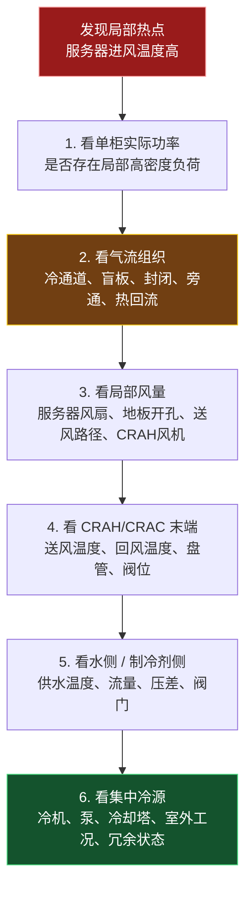

> 面试关键句：出现热点时不能直接判断是冷机容量不足，应沿"服务器进风 → 空气流量 → CRAH → 冷冻水流量 → 冷源能力"逐级排查。

##### 七、与 AI/HPC 的有限联系（边界克制，今日不深入液冷）

今天只需形成以下关系（**正确且克制**，无需讨论 CDU、冷板和浸没式）：

```
单柜功率越高
→ 需要的风量或允许的温升管理要求越高
→ 机柜级气流分配与热点风险更突出
→ 纯空气冷却的风机能耗、噪声、风阻和空间压力增加
→ 才引出后续的液冷、后门换热器或混合冷却
```

AI 机柜功率密度上升确实是推动冷却技术变化的核心因素，但不同数据中心和机柜设计条件差异很大，**不能用一个固定 kW/柜 阈值宣称"超过即必须液冷"**。

##### 八、连接项目 1（缺失鲁棒性迁移，定稿表达）

> 我的主课题研究了传感器数据缺失条件下的热舒适预测鲁棒性和关键变量筛选。数据中心容量管理与热点控制同样依赖机柜功率、服务器进风温度、排风温度、风量、压差、冷冻水供回水温度及设备状态等数据；若传感器出现缺失、漂移或异常，局部负荷识别和冷却控制可能失真。因此，我在缺失处理、特征重要性分析和轻量化输入方面的方法思路，未来可以迁移到数据中心运行数据的质量诊断、热点风险预测或软测量中。不过，我当前研究对象仍是热舒适数据，实际迁移必须基于数据中心真实运行数据重新建模和验证。

##### 今日输出与验收

- **"总量"与"局部"图**（比单纯"服务器—CRAH—冷机"更贴合本日主题，含五类瓶颈）：

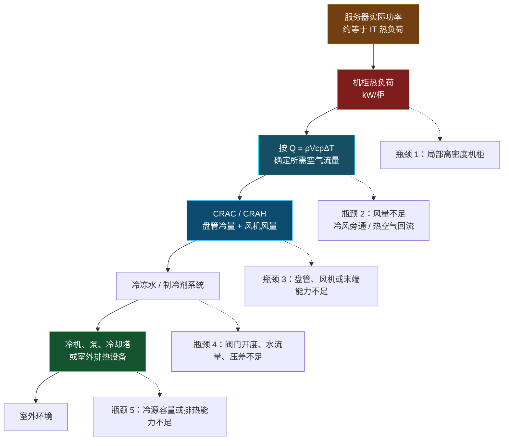

- **机柜风量估算题**：10 kW、ΔT=12 K，公式 `V̇≈Q/(ρ c_p ΔT)`、单位统一（数值即 kW、结果 m³/s）、0.694 m³/s≈2,500 m³/h≈1,470 CFM、为何需额外余量；
- **《数据中心负荷与容量面试 10 问》**（每题 80–150 字）：IT 功率与热负荷关系 / 机柜功率密度 / 平均负荷不代表局部风险 / 总冷量足够仍热点 / 风量-温差-热负荷关系 / 风量非越大越好 / 额定 vs 实际可用冷量 / 进风温度 > 平均温度 / 局部热点排查 / AI 更易面临空气冷却压力；
- **项目 1 迁移回答**一段（见第八节定稿）；
- **3 分钟录音**（题目：介绍 IT 负荷、机柜功率密度与冷却容量之间的关系；顺序见原文复述顺序）。

> 核心目标：能根据 IT 功率理解机柜热负荷、解释冷却容量如何匹配，并判断"冷量不足"与"气流组织不足"是两个不同问题。衔接：本专题与四-D-2（热量链路）、四-E（选型方法论）、六-C/冷冻水六（冷冻水末端与排热）自洽；液冷细节留待后续专题。

---

#### 四-G、冷热通道与气流组织（通用基础专题，不进液冷）

**本质先说清**：冷热通道的本质不是"把机柜摆整齐"，而是强制建立一条**可控的空气热量路径**——冷空气只进入服务器前部，热空气只回到空调设备回风侧，尽量避免两股空气在机房内混合。

##### 一、先把气流看懂

服务器通常是**前进风、后出风**。因此两排机柜应以前面相对形成**冷通道**、背面相对形成**热通道**的方式布置：冷空气进入冷通道，穿过服务器吸热后进入热通道，再返回 CRAH/CRAC。

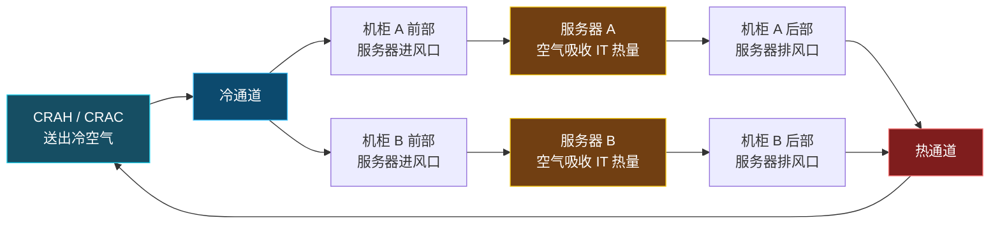

> 注意：冷通道和热通道本身**不是某台空调设备**，而是由机柜排列、送回风方式、架空地板或顶部送风、回风口和隔断共同形成的**机房空气组织方案**。

##### 二、为什么要分冷热通道

若没有冷热通道，服务器排出的热空气会在机房内扩散、与冷空气混合。为保证最不利机柜不超温，CRAH/CRAC 往往不得不降低送风温度或增加风量，结果制冷和风机能耗增加。

冷、热气流分离带来的核心收益：

1. 降低服务器进风温度的不均匀性，减少局部热点；
2. 让更多冷空气真正穿过服务器，而非直接返回空调；
3. 让更热、更集中的回风回到 CRAH/CRAC，提高末端换热的有效性；
4. 在满足最热点机柜进风温度的前提下，为提高送风温度、降低风机转速创造条件。

##### 三、两种典型问题

**1. 热空气回流**

热空气回流是服务器后部排出的高温空气，没有顺利被热通道和回风口收集，而是绕到机柜前部、又被服务器吸入。

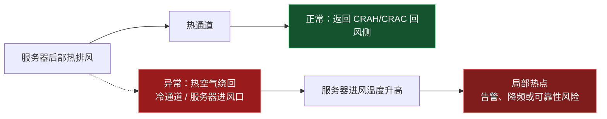

它的直接后果**不是"总冷量消失"**，而是高温空气掺入进风，局部服务器入口温度超限。即使房间平均温度和 CRAC/CRAH 总冷量看起来正常，高负荷机柜仍可能形成热点。

常见诱因：通道未封闭、机柜顶部或侧面漏风、空机位没有盲板、回风路径不畅、机柜摆放方向混乱、局部高密度负荷或局部送风量不足。

**2. 冷风旁通**

冷风旁通是 CRAH/CRAC 送出的冷空气没有穿过服务器吸热，便直接进入热通道或回到回风侧。

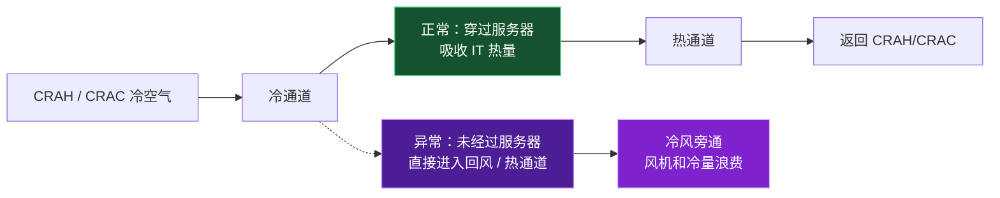

冷风旁通本质是"冷空气走捷径"。它使 CRAH/CRAC 回风温度偏低、盘管换热利用不足；为满足局部机柜，系统可能错误地继续加大风量或降低送风温度，增加能耗。

常见诱因：地板送风口开孔过多或位置不匹配、机柜空位或线缆孔未封堵、送风量明显超过服务器需求、冷通道端部未封闭、回风口位置不合理。

##### 四、风量不足与过量（口诀：不足看热点，过量看旁通）

| 问题 | 直接机理 | 主要表现 | 常见后果 |
|------|----------|----------|----------|
| 风量不足 | 通过高热负荷机柜的空气质量流量不够 | 机柜进排风温差增大、进风温度升高、局部热点 | 设备降频、温度告警、可靠性风险 |
| 风量过大 | 送风量超过 IT 实际吸热所需 | 冷风绕过机柜、回风温度偏低、部分冷通道静压过高 | 风机能耗增大、冷风旁通、局部气流短路 |
| 热空气回流 | 热排风混入服务器进风 | 单柜进风温度高，热点位置可能稳定或随负荷变化 | 即使总冷量够也可能超温 |
| 冷风旁通 | 冷风未穿过服务器就回到回风侧 | 回风偏冷、有效温差小、冷量利用率差 | 空调"看似在工作"，实际冷量浪费 |

不要把"风量越大"理解成"散热一定更好"。对于固定热负荷，空气侧满足：

```
Q = ρ·V̇·c_p·ΔT
```

风量 `V̇` 增大确实会降低空气穿过服务器后的温升 `ΔT`，但如果气流路径未被约束，多余空气可能旁通；同时风机功率通常会快速增加。因此目标是**按机柜负荷定向供风**，而不是把整个机房风量开到最大。

##### 五、什么是通道封闭（containment）

通道封闭是在冷通道或热通道上方、两端及必要侧面增加门、顶板、隔断等，使供风和回风路径更明确。它**不是把机柜"密封起来"**，而是把通道空间进行隔离。

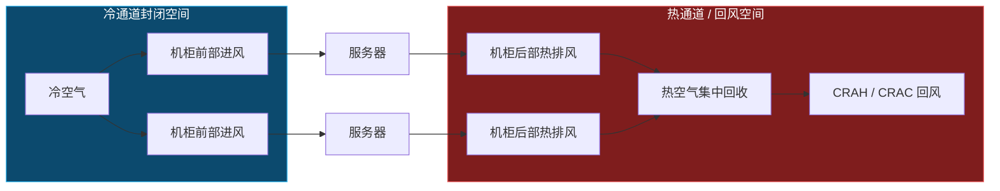

封闭可以是：

- **冷通道封闭 CAC**：把冷空气限制在机柜前方区域，适用于架空地板下送风等布置；
- **热通道封闭 HAC**：把热排风收集在机柜后方区域并导向回风侧，常有利于提高回风温度；
- **局部封堵措施**：空机位盲板、机柜侧板、线缆孔封堵、地板开孔管理；这些往往成本低，却能显著减少短路和漏风。

封闭不是万能方案，需同时考虑消防排烟、维护通道、照明、门禁、回风路径、局部压差和机柜扩容方式；工程上应结合机房布局、负荷密度和现有送回风形式进行设计。

##### 六、面试用 40 秒回答

数据中心采用冷热通道，是为了匹配服务器前进风、后出风的气流特征，使冷空气集中供应到机柜前部，服务器排出的热空气集中进入热通道并返回 CRAH 或 CRAC，从而减少冷热空气混合。热空气回流是热排风重新被服务器吸入，会造成局部进风温度升高和热点；冷风旁通则是冷空气没有经过服务器就直接回到回风侧，导致冷量和风机能耗浪费。通过冷通道或热通道封闭、盲板和线缆孔封堵、合理的送回风口布置以及风机变频控制，可以让冷量和风量更准确匹配机柜负荷。

---

## 七、3 分钟口述提纲（录音用）

典型空调空气系统由新风、回风、混合、过滤、冷却除湿和送风组成。新风用于通风和稀释污染物，回风循环利用可降低能耗。AHU 是集中式空气处理设备，可完成混风、过滤、冷却、除湿和送风；FCU 是房间末端，主要循环室内空气并进行局部温控，通常需要配合新风系统。VRF 通过制冷剂直接输送实现分区温控，但不是完整新风系统；DOAS 则专门处理室外新风及其湿负荷。项目中，CNN 根据区域人数调节 DOAS 新风量，减少过度通风及其冷却除湿能耗，而 VRF 持续承担房间主要冷热负荷。数据中心中，CRAC 通常采用直膨制冷，CRAH 通常采用冷冻水盘管；其空气系统更关注冷热通道隔离、热点和可靠性。

---

## 八、产出与验收（学习日执行模板）

> 今日优先级建议：先画图（≈30 分）→ 写 10 问（≈80–100 分）→ 补项目二四问（≈35 分）→ 录 3 分钟（≈30–40 分）→ 留 15 分检查精简。总时长 ≈3–3.5 小时。不扩展到风管计算、复杂焓湿图或液冷细节。

### 两张图（已在本文件一、三节）
- 图一：基础空气系统（OA/RA/MA/SA/EA + 配色 + 五句话标注）；
- 图二：VRF + DOAS 分工（DOAS 管新风、VRF 管房间负荷，三标签）。

### 10 个面试问答（写作规则 + 得分点）
统一四段结构：**定义/结论 → 为什么重要 → 系统中如何实现 → 一个工程边界或注意点**。

| 题目 | 必须说出的关键点 |
|------|------------------|
| 新风、回风、排风分别是什么？ | 新风用于 IAQ；回风回到系统再处理；排风排出污染物并维持空气平衡 |
| 为什么不能全部采用新风？ | 室外空气需冷却/加热/除湿/加湿；全新风能耗高；某些洁净/特殊场景可采用较高新风比例 |
| AHU 和 FCU 有何区别？ | AHU 集中、大风量、功能完整、可处理新风；FCU 分散、小区域、以回风循环和局部温控为主 |
| FCU 为什么需配新风？ | FCU 通常不保证室外新风量，单独使用可能无法满足通风和 IAQ |
| DOAS 的主要功能？ | 专门处理室外空气，保证最小新风，处理新风湿负荷和部分显热 |
| VRF 与 DOAS 为什么适合组合？ | VRF 做区域温控，DOAS 管通风/湿度；实现功能解耦和更灵活控制 |
| 显热和潜热的区别？ | 显热改变温度；潜热改变水蒸气含量/相态；冷却除湿同时处理两者 |
| 什么是冷却除湿？ | 空气经过低于露点的盘管，温度下降且水蒸气凝结，干球温度和含湿量同时下降 |
| 夏季新风为什么耗能高？ | 室外空气高温高湿，既需降温又需除湿，风机输送也耗能 |
| CRAC 和 CRAH 的区别？ | CRAC 常为 DX 直膨；CRAH 通常用冷冻水盘管；二者都面向机房空气冷却与可靠运行 |

### 3 分钟录音验收（只查五件事）
1. 是否在 3 分钟左右结束；
2. 是否把新风、回风、送风、排风说清；
3. 是否明确 AHU、FCU、VRF、DOAS 的不同职责；
4. 是否将项目二讲成"**感知—控制—能耗/IAQ 评价**"闭环；
5. 是否提到数据中心与普通舒适性空调的边界，而没有夸大已有经验。

### 今日完成标准（一句话）
能不看笔记讲出：**"空气从室外进入，经处理后送进房间，再以回风或排风离开；VRF 管空间温度，DOAS 管新风与湿负荷。"** 这直接增强你在 HVAC、楼宇智能化和数据中心冷却岗位中的基础表达能力。

