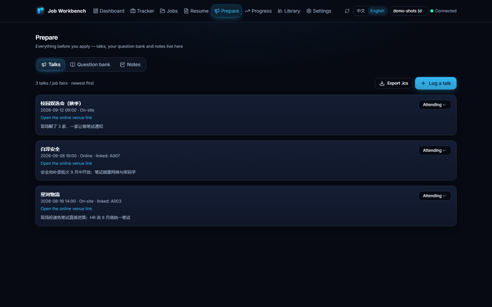
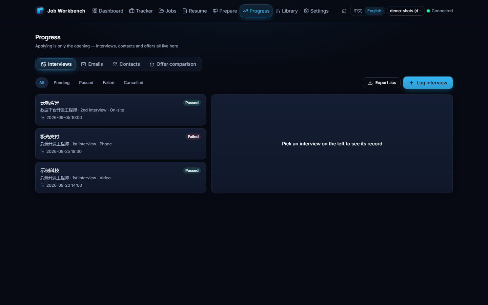
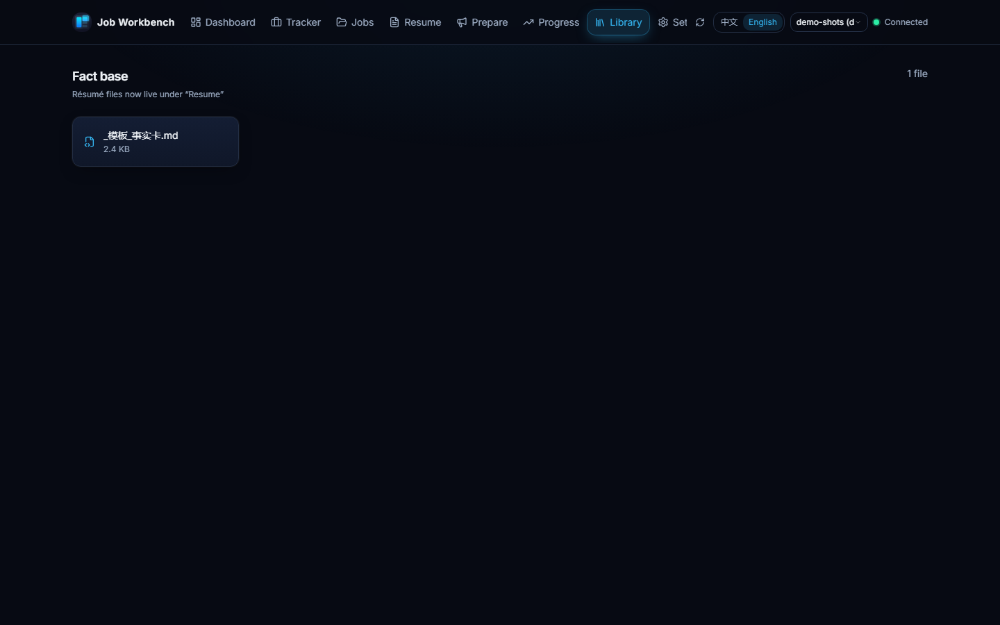
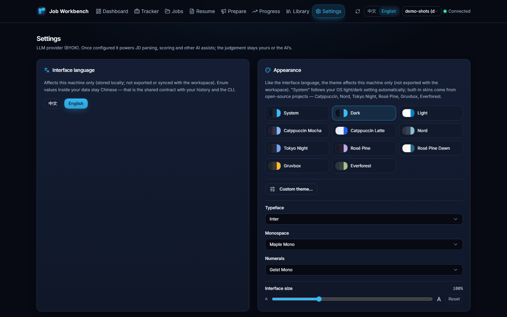

# job-workbench

[](https://github.com/chenxiang6663635/job-workbench/actions/workflows/ci.yml)
[](LICENSE)


A **local-first, auditable AI-assisted job-search workbench**: run the whole pipeline — from JD analysis to offer decision — in plain Markdown & CSV on your own disk, driven by your own AI CLI.

English | [简体中文](README.zh-CN.md)


## Why job-workbench

Job hunting means sensitive personal data (resumes, phone numbers, employer history) — and AI outputs that can quietly fabricate facts. This project is built around three answers:

- **Local-first privacy.** Everything lives on your disk as plain text — git-diffable, Excel-friendly, no telemetry, no server. Real personal data stays in `personal/`, which is fully git-ignored: a fresh clone gives you an empty workspace, and you can fork this repo without leaking a thing.
- **Auditable AI, not black-box automation.** Your own AI CLI (BYOK models) does the semantic judgment — reading the JD, scoring fit. Python scripts do everything deterministic: eligibility gates, score validation, PDF generation, tracker I/O — and every automated verdict (application health, CSV import diffs, failure clustering) comes with explicit, human-checkable **reasons**, never a bare score.
- **Anti-fabrication safeguards.** Resume import is *extraction, not generation*: every persisted value must trace back to source text, and unextracted fields are flagged. AI rewrite suggestions must pass five local anti-fabrication checks before they can be accepted.

## What it solves

The real difficulty of job hunting is not "not knowing what to do" — it is **scattered information that blocks decisions**:

- Is this company worth applying to? What did I conclude about a similar one last week?
- Which resume version did I send them three months ago, and what did the JD ask for?
- How many applications are in flight, and which deadline is tomorrow?

The workbench turns all of that into queryable, traceable files.

## Core design

- **AI judges, scripts verify.** Scores come from your AI CLI reading the JD against your profile; Python only validates totals, applies thresholds, generates PDFs, reads/writes the tracker — and makes explainable deterministic calls (application health in four states, CSV import diffs, failure clustering — all with reasons). Changing scoring rules means editing Markdown profiles, not code.
- **Four-layer one-way dependency**: skills (domain knowledge) → scripts (IO & validation) → data (Markdown + CSV) → git (versions). The `tools/` tree is a layered package — one CLI entry point (`jobws`) plus domain modules and gate scripts; module dependencies stay acyclic (domain code never imports the web/protocol layer), so each module stays independently testable.
- **Three-layer separation**: tooling (`tools/` + `skills/`, domain-agnostic) · domain profiles (`template/profiles/`, pluggable) · user workspace (`personal/`, your real data). A three-tier lexicon judges skills by *"can you survive follow-up questions"*, not *"have you heard of it"* — see [`template/AGENTS.example.md`](template/AGENTS.example.md).

## Features at a glance

- **Four CLI workflows**: `jwb-jd` (JD parsing & scoring), `jwb-apply` (application package), `jwb-track` (tracker & funnel), `jwb-resume` (PDF rebuild & validation) — full command reference in the [usage guide](docs/usage-guide.md)
- **Web UI** (`web/`): eight pages sharing the very same data files — dashboard, tracker, job pool, resume workshop (one-click import that *extracts rather than generates* + guarded AI rewrite + Word export), prepare (talks & your question bank), progress (interviews, emails, contacts), library (notes & material), settings; see [`web/README.md`](web/README.md)
- **Post-application loop**: interview records (one-click `.ics` export), recruiter contact follow-ups, offer comparison (**side-by-side facts, never a recommendation**), resume version lineage, stage-conversion retros, failure clustering, application health in four states — each with concrete reasons instead of a black-box score
- **Read-only email fetch (optional)**: with your own IMAP authorization code, pull recent recruiting emails and turn them into per-record status suggestions; read-only, connected only when you click, credentials kept local, dry-run until you confirm — details in the [usage guide](docs/usage-guide.md)
- **Email ledger & honest deep links** (`mails.csv` + `jobws track mail`): interview invites, test notices and rejections become first-class records that link back to an application — pulled emails carry their Message-ID and can be filed with one click. "Open original" is graded honestly: your own pasted link wins; Gmail gets a real `rfc822msgid` search deep link; other providers (Outlook / QQ / 163 / …) get a "copy the subject and search" fallback instead of a fake link. **Emails never change stages by themselves** — you always confirm.
- **Resume layouts & accent colors**: three built-in layouts (Classic / Compact / Accent) share a single placeholder skeleton, all single-column and ATS-checked; four accent colors combine freely with any layout, and the generated PDF matches the preview. Drop your own compliant HTML into the templates directory and it appears in the picker.
- **Interface typography**: a continuous size slider (80%–150%, 5% steps — root-font scaling, decoupled from desktop zoom and available in a plain browser); **12 UI typefaces** (Inter by default, plus Geist, IBM Plex Sans, Manrope, Plus Jakarta Sans, DM Sans, Figtree, Outfit, Public Sans, Source Sans 3, Work Sans, Atkinson Hyperlegible Next, and system/serif) and an independent **6-family monospace slot** (Maple Mono by default; JetBrains Mono, Fira Code, Geist Mono, IBM Plex Mono, Source Code Pro) plus a dedicated **numerals slot** (Geist Mono by default, or JetBrains Mono / IBM Plex Mono / follow the UI typeface) — all bundled locally under OFL-1.1, Latin subsets only (CJK falls back to the system stack).
- **Scoring framework**: an eligibility gate first (degree → major → cohort → language → city; any fail means no scoring), then four weighted dimensions → five-tier verdict; the full standard lives in [`skills/jwb-recruit-coach/SKILL.md`](skills/jwb-recruit-coach/SKILL.md)

## UI Preview

> **Note**: the interface is bilingual (简体中文 / English) — switch it with the `中文 / English` control in the header; the first run follows your system language and your choice is remembered. Read the note under [Download](#download) for what stays Chinese by design. The screenshots below are the real interface **in English**, taken with generated demo data — the [Chinese README](README.zh-CN.md) carries the same pages in 简体中文 (both sets come from the same demo workspace).

All pages below run on generated demo data (`jobws init --demo`); companies, roles and names are placeholders (`示例科技`, `示例同学`, …) — no real personal information. The two sets are produced by `npm.cmd run capture` in `web/frontend` — rerun it after any page change instead of retaking shots by hand.







## Quick start

```bash
# 0. Just want to look around first? One command gives you a filled demo workspace
#    (8 applications / 3 interviews / 2 contacts / 1 offer / 3 talks & job fairs
#     / 6 question-bank items, all placeholder data)
python tools/jobws.py init --target demo --demo

# 1. Initialize a workspace (six modules + profile templates + a domain plugin)
python tools/jobws.py init --target my_job_hunt --domain software-backend

# 2. Distribute skills / commands / subagents to your AI CLI
#    (CodeBuddy / Claude Code / cross-runtime ~/.agents/skills/)
python tools/jobws.py skills install --target user

# 3. Fill in my_job_hunt/AGENTS.md
#    Section 3 (hard eligibility facts) is required — the JD gate deliberately
#    refuses to guess. The file also carries two honesty red lines:
#    every resume verb must survive questioning; never fabricate experience.
```

**Rather not clone the repo?** Two channels:

- **Plugin marketplace (recommended — skills, commands and subagents together)** — with CodeBuddy or Claude Code, add this repo as a marketplace and install it (the plugin reads `skills/`, `commands/` and `agents/` straight from the repo; there is no second copy):

```
/plugin marketplace add https://github.com/chenxiang6663635/job-workbench
/plugin install job-workbench
```

- **Skills only**: `npx skills add chenxiang6663635/job-workbench` (installs into the current directory; `-g` for the user level — `.agents/skills/` is the cross-host convention, Claude Code reads `.claude/skills/`).

The local script covers custom layouts and acts as the fallback: `python tools/jobws.py skills install` distributes all three asset types by each host's directory convention (skills → skills dirs; commands and subagents → `.codebuddy/`, `.claude/`), copying by default. `--link` is experimental and symlinks the host copies to the single source instead (no stale copies; on Windows it needs developer mode or admin). **In-repo project-level copies** are kept honest by `python tools/jobws.py lint four-ends` — stale or diverged copies are named, and skills additionally report extra directories (your own files under `.claude/` are not counted). User-level `~/.agents/skills/` and plugin-marketplace caches are outside the checker's view: they do not travel with the repo.

Then just talk to your AI CLI: "parse this JD", "apply to this role", "what needs attention this week".

Requirements — CLI: Python 3.12+ (standard library only); `pypdf` for PDF validation; `certifi` ships the fallback CA bundle used when your system certificate store is unusable (outbound HTTPS / IMAP). PDF generation: Chrome or Edge. Web UI (optional): see [`web/README.md`](web/README.md).

## Referral

The optional AI features (resume import, AI rewrite) are BYOK — bring a key from any OpenAI-compatible provider. If you do not have one yet, the Settings page offers [OrcaRouter](https://www.orcarouter.ai/ref/ref_f34ad879f774bce8bc82) as a preset optional provider. Full disclosure: this is a **referral link** — signing up through it earns the project author a commission; your pricing and benefits are unaffected, and clicking it only opens a web page (nothing is sent from the app by clicking).

## Privacy

This repository contains **no real personal data**. `personal/` is a workspace you fill with your own data (name, photo, contacts, applications, fact cards); it is entirely excluded from version control — after cloning, it is empty; generate your own with the init command above. In short: **fork it publicly with confidence, but never paste `personal/` content into issues, PRs or discussions.**

## Repository layout

| Path | Purpose |
|---|---|
| `template/` | Generic skeleton: profile templates, empty workspace, domain plugins |
| `skills/` | The four job-hunting workflows + the coach scoring standard, and three maintainer-facing skills (CLI contract / API review / MCP) — single source across AI runtimes |
| `tools/` | Python domain layer — one CLI entry point plus domain modules and gate scripts |
| `web/` | Web UI: FastAPI backend + React frontend (eight pages), same data files as the CLI |
| `tests/` | pytest suite — privacy guards, anti-fabrication checks, tracker semantics; the CI gate |
| `personal/` | Your real workspace (**fully git-ignored; the repo ships zero real data**) |
| `docs/` | Usage guide, doc index, design documents (`docs/specs/`) |
| `.github/` | CI workflow, issue / PR templates, code of conduct, Copilot instructions |
| `.codebuddy-plugin/` | CodeBuddy plugin manifest — delivers the same `skills/` plus the commands and subagents; no second copy |
| `docs/four-ends.md` | **Four-entry capability matrix** (CLI / AI host / editor plugin / desktop UI), generated from `tools/four_ends_matrix.json` and checked by `jobws lint four-ends`. See `docs/mcp-integration.md` to plug the workbench into an AI host — the config key differs per host |

## Download

> **Note**: the interface is **bilingual** — every page ships in 简体中文 and English, with a `中文 / English` switch in the header (first run follows your system language, and the choice is remembered). The code, this README and the [usage guide](docs/usage-guide.md) are in English — with one deliberate exception: **code comments are Chinese by convention** (see CONTRIBUTING §文案与 i18n). What stays Chinese **by design**: the values stored in your CSV / Markdown files (stage names, column headers) — they are the shared data contract with the CLI and with your own history, so translating them would desync the UI from your data — plus the CLI's built-in help. The screenshots above show the English UI; the same pages in 简体中文 are in the [Chinese README](README.zh-CN.md).

A packaged Windows desktop app (no Python/Node needed) is attached to the
latest release — grab `job-workbench-setup-*.exe` from
[Releases](https://github.com/chenxiang6663635/job-workbench/releases/latest),
install, launch, done. The installer is a wizard: pick the install folder and
whether to install for all users or just you (when upgrading, keep the
defaults). Data lives in `%APPDATA%\job-workbench\` and never leaves
your machine. Prefer source? Skip to [Quick start](#quick-start).

## Docs

- [Roadmap](ROADMAP.md) — Now / Later plus a shipped-batch log; items link to a tracking issue when one exists
- [Doc index](docs/README.md) — status of every document (current / deprecated)
- [Usage guide](docs/usage-guide.md) — startup, the eight pages, AI workflows, CLI reference, FAQ
- [Support & compatibility](docs/support-and-compatibility.md) — when this counts as a stable release, what is supported, and why upgrades never require converting your data
- [Design documents](docs/specs/) — architecture, Web contract, productization, open-source release
- [Changelog](CHANGELOG.md)
- [Glossary](docs/glossary.md) — the internal terms used across these docs and the changelog, defined once

## Contributing

Issues and PRs are welcome — bug fixes, documentation, new domain profiles, privacy safeguards, tests and interoperability improvements are particularly useful. Please read [CONTRIBUTING.md](CONTRIBUTING.md) first (the four-gate process for new features, branching strategy, release flow) and the [code of conduct](.github/CODE_OF_CONDUCT.md). **Found a security problem? Use the private channel described in [SECURITY.md](SECURITY.md) — please do not open a public issue.** Code changes go through a PR with green CI (pytest + frontend lint/build + PR-title check + UI smoke); doc fixes can go straight to `main`. **Pace expectation**: a single-maintainer project — work arrives in bursts: some days land a focused batch of small PRs, other weeks land none (no development during interview/exam weeks — see CONTRIBUTING §可持续性约定). First response to issues targets 48 hours, with slips disclosed in a pinned issue (see [docs/maintenance.md](docs/maintenance.md)); a few days without a reply can still happen.

## License

[MIT](LICENSE) © job-workbench contributors — third-party notices in [THIRD-PARTY-NOTICES.md](THIRD-PARTY-NOTICES.md).
