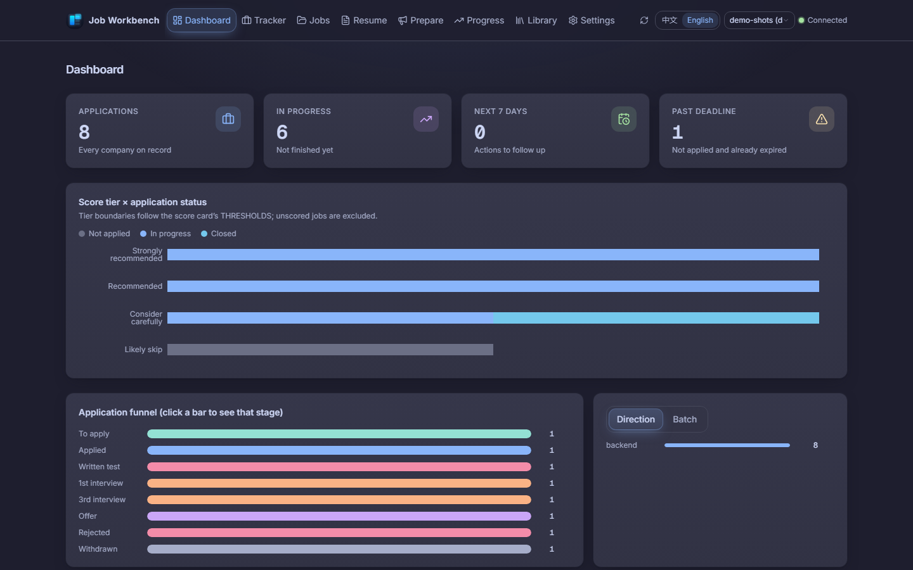
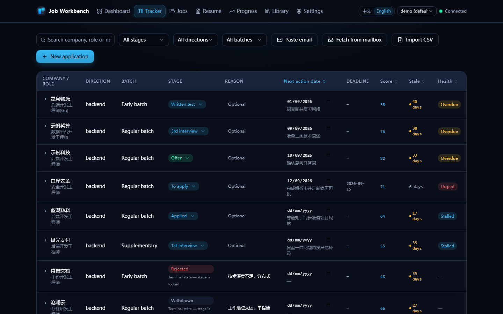
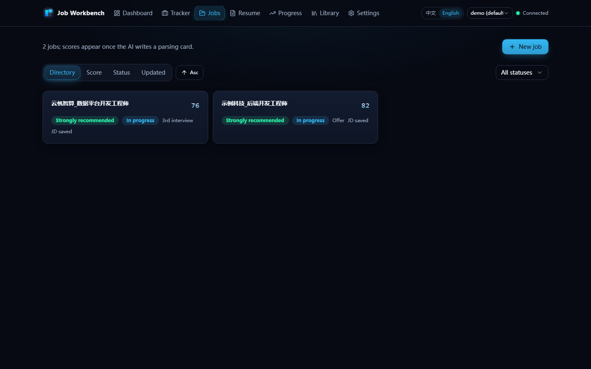
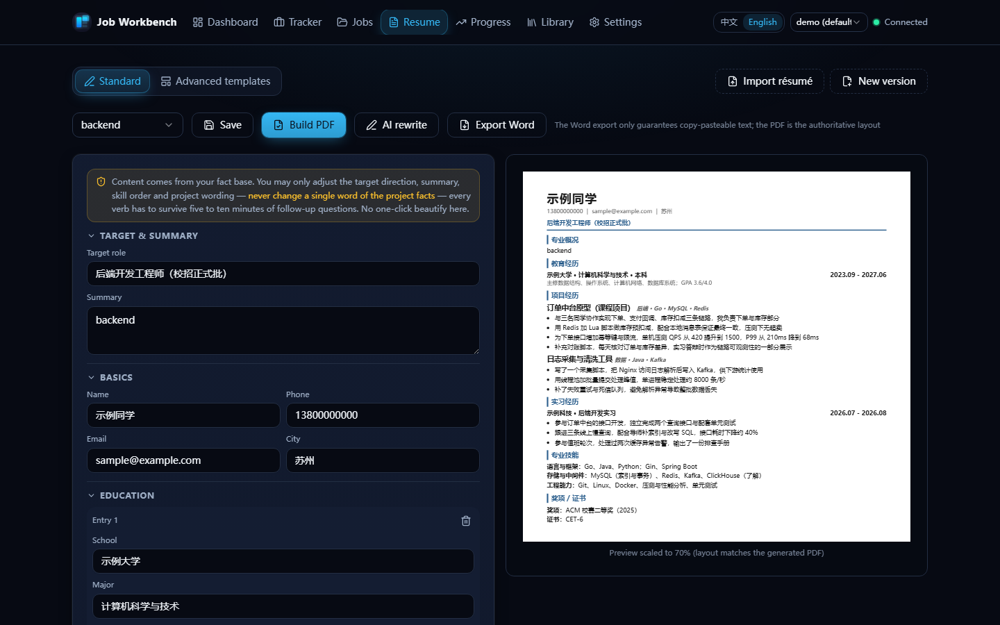
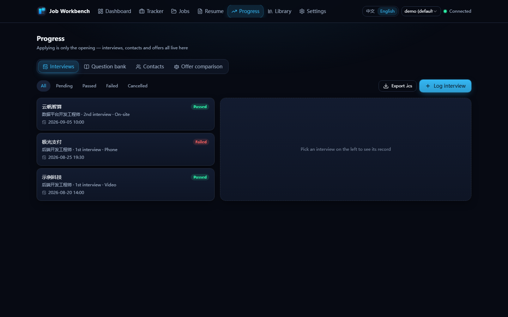
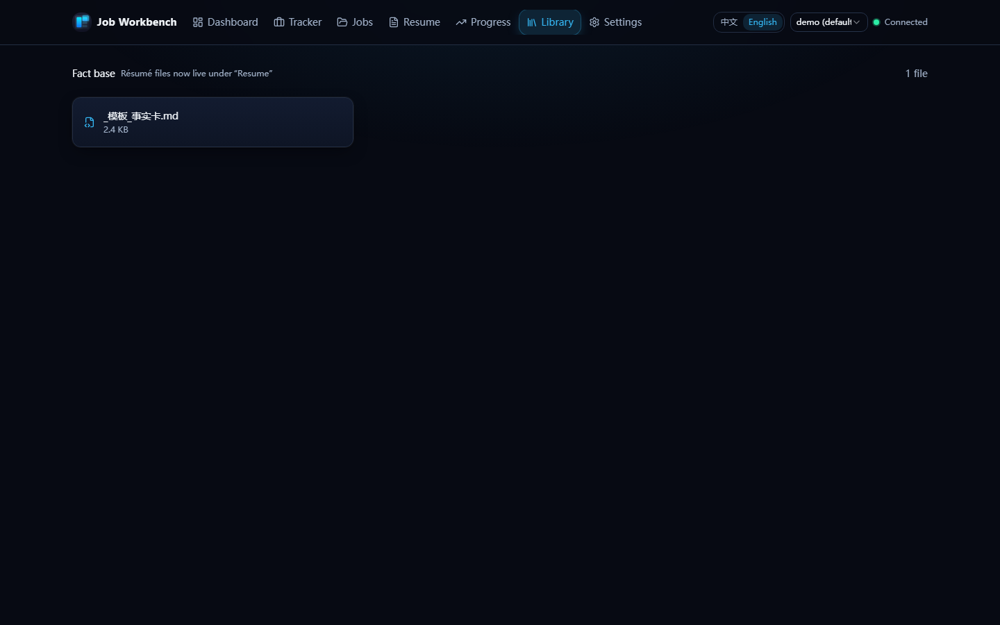
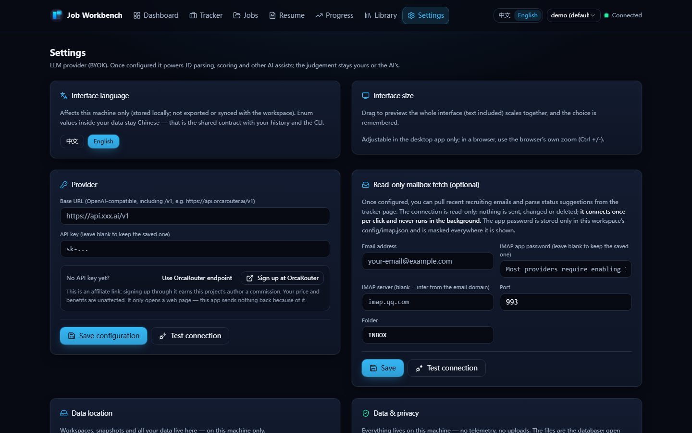

# job-workbench

[](https://github.com/chenxiang6663635/job-workbench/actions/workflows/ci.yml)
[](LICENSE)


A **local-first, auditable AI-assisted job-search workbench**: run the whole pipeline — from JD analysis to offer decision — in plain Markdown & CSV on your own disk, driven by your own AI CLI.

English | [简体中文](README.zh-CN.md)



## Why job-workbench

Job hunting means sensitive personal data (resumes, phone numbers, employer history) — and AI outputs that can quietly fabricate facts. This project is built around three answers:

- **Local-first privacy.** Everything lives on your disk as plain text — git-diffable, Excel-friendly, no telemetry, no server. Real personal data stays in `personal/`, which is fully git-ignored: a fresh clone gives you an empty workspace, and you can fork this repo without leaking a thing.
- **Auditable AI, not black-box automation.** Your own AI CLI (BYOK models) does the semantic judgment — reading the JD, scoring fit. Python scripts do everything deterministic: eligibility gates, score validation, PDF generation, tracker I/O — and every automated verdict (application health, CSV import diffs, failure clustering) comes with explicit, human-checkable **reasons**, never a bare score.
- **Anti-fabrication safeguards.** Resume import is *extraction, not generation*: every persisted value must trace back to source text, and unextracted fields are flagged. AI rewrite suggestions must pass five local anti-fabrication checks before they can be accepted.

## What it solves

The real difficulty of job hunting is not "not knowing what to do" — it is **scattered information that blocks decisions**:

- Is this company worth applying to? What did I conclude about a similar one last week?
- Which resume version did I send them three months ago, and what did the JD ask for?
- How many applications are in flight, and which deadline is tomorrow?

The workbench turns all of that into queryable, traceable files.

## Core design

- **AI judges, scripts verify.** Scores come from your AI CLI reading the JD against your profile; Python only validates totals, applies thresholds, generates PDFs, reads/writes the tracker — and makes explainable deterministic calls (application health in four states, CSV import diffs, failure clustering — all with reasons). Changing scoring rules means editing Markdown profiles, not code.
- **Four-layer one-way dependency**: skills (domain knowledge) → scripts (IO & validation) → data (Markdown + CSV) → git (versions). Scripts don't call each other (one exception: `report.py` reuses `tracker.py`'s IO), so each is independently testable.
- **Three-layer separation**: tooling (`tools/` + `skills/`, domain-agnostic) · domain profiles (`template/profiles/`, pluggable) · user workspace (`personal/`, your real data). A three-tier lexicon judges skills by *"can you survive follow-up questions"*, not *"have you heard of it"* — see [`template/AGENTS.example.md`](template/AGENTS.example.md).

## Features at a glance

- **Four CLI workflows**: `jd` (JD parsing & scoring), `apply` (application package), `track` (tracker & funnel), `resume` (PDF rebuild & validation) — full command reference in the [usage guide](docs/usage-guide.md)
- **Web UI** (`web/`): seven pages sharing the very same data files — dashboard, tracker, resume workshop (one-click import that *extracts rather than generates* + guarded AI rewrite + Word export), progress (interview question bank), retrospectives; see [`web/README.md`](web/README.md)
- **Post-application loop**: interview records (one-click `.ics` export), recruiter contact follow-ups, offer comparison (**side-by-side facts, never a recommendation**), resume version lineage, stage-conversion retros, failure clustering, application health in four states — each with concrete reasons instead of a black-box score
- **Scoring framework**: an eligibility gate first (degree → major → cohort → language → city; any fail means no scoring), then four weighted dimensions → five-tier verdict; the full standard lives in [`skills/recruit-coach/SKILL.md`](skills/recruit-coach/SKILL.md)

## UI Preview

> **Note**: the UI is currently Chinese-first — our primary users are Chinese job seekers, and the workflows read naturally in Chinese. An English UI is on the [roadmap](ROADMAP.md); until then the screens below are the real interface.

All pages below run on generated demo data (`init_workspace.py --demo`); companies, roles and names are placeholders (`示例科技`, `示例同学`, …) — no real personal information.








## Quick start

```bash
# 0. Just want to look around first? One command gives you a filled demo workspace
#    (8 applications / 3 interviews / 2 contacts / 1 offer, all placeholder data)
python tools/init_workspace.py --target demo --demo

# 1. Initialize a workspace (six modules + profile templates + a domain plugin)
python tools/init_workspace.py --target my_job_hunt --domain software-backend

# 2. Distribute skills to your AI CLI (CodeBuddy / Claude Code / cross-runtime ~/.agents/skills/)
python tools/install_skills.py --target user

# 3. Fill in my_job_hunt/AGENTS.md
#    Section 3 (hard eligibility facts) is required — the JD gate deliberately
#    refuses to guess. The file also carries two honesty red lines:
#    every resume verb must survive questioning; never fabricate experience.
```

Then just talk to your AI CLI: "parse this JD", "apply to this role", "what needs attention this week".

Requirements: Python 3.8+ (stdlib only); `pypdf` only for PDF validation; Chrome or Edge only for PDF generation; optional Web UI — see [`web/README.md`](web/README.md).

## Privacy

This repository contains **no real personal data**. `personal/` is a workspace you fill with your own data (name, photo, contacts, applications, fact cards); it is entirely excluded from version control — after cloning, it is empty; generate your own with the init command above. In short: **fork it publicly with confidence, but never paste `personal/` content into issues, PRs or discussions.**

## Repository layout

| Path | Purpose |
|---|---|
| `template/` | Generic skeleton: profile templates, empty workspace, domain plugins |
| `skills/` | The four workflows + the recruit-coach scoring standard, single source across AI runtimes |
| `tools/` | Six Python scripts |
| `web/` | Web UI: FastAPI backend + React frontend (seven pages), same data files as the CLI |
| `tests/` | 33 tests (anti-fabrication guards + health semantics), the CI gate |
| `personal/` | Your real workspace (**fully git-ignored; the repo ships zero real data**) |
| `docs/` | Usage guide, doc index, design documents (`docs/specs/`) |
| `.github/` | CI workflow, issue / PR templates, code of conduct, Copilot instructions |

## Download

A packaged Windows desktop app (no Python/Node needed) is attached to the
latest release — grab `job-workbench-setup-*.exe` from
[Releases](https://github.com/chenxiang6663635/job-workbench/releases/latest),
install, launch, done. Data lives in `%APPDATA%\job-workbench\` and never leaves
your machine. Prefer source? Skip to [Quick start](#quick-start).

## Docs

- [Roadmap](ROADMAP.md) — Now / Next / Later, each item linked to a tracking issue
- [Doc index](docs/README.md) — status of every document (current / deprecated)
- [Usage guide](docs/usage-guide.md) — startup, the seven pages, AI workflows, CLI reference, FAQ
- [Design documents](docs/specs/) — architecture, Web contract, productization, open-source release
- [Changelog](CHANGELOG.md)

## Contributing

Issues and PRs are welcome — bug fixes, documentation, new domain profiles, privacy safeguards, tests and interoperability improvements are particularly useful. Please read [CONTRIBUTING.md](CONTRIBUTING.md) first (the four-gate process for new features, branching strategy, release flow) and the [code of conduct](.github/CODE_OF_CONDUCT.md). Code changes go through a PR with green CI (33-test baseline + frontend build); doc fixes can go straight to `main`.

## License

[MIT](LICENSE) © job-workbench contributors — third-party notices in [THIRD-PARTY-NOTICES.md](THIRD-PARTY-NOTICES.md).
