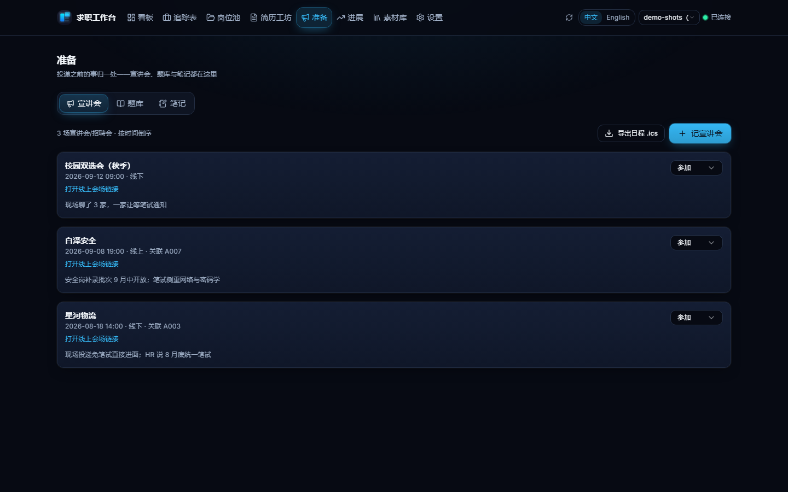
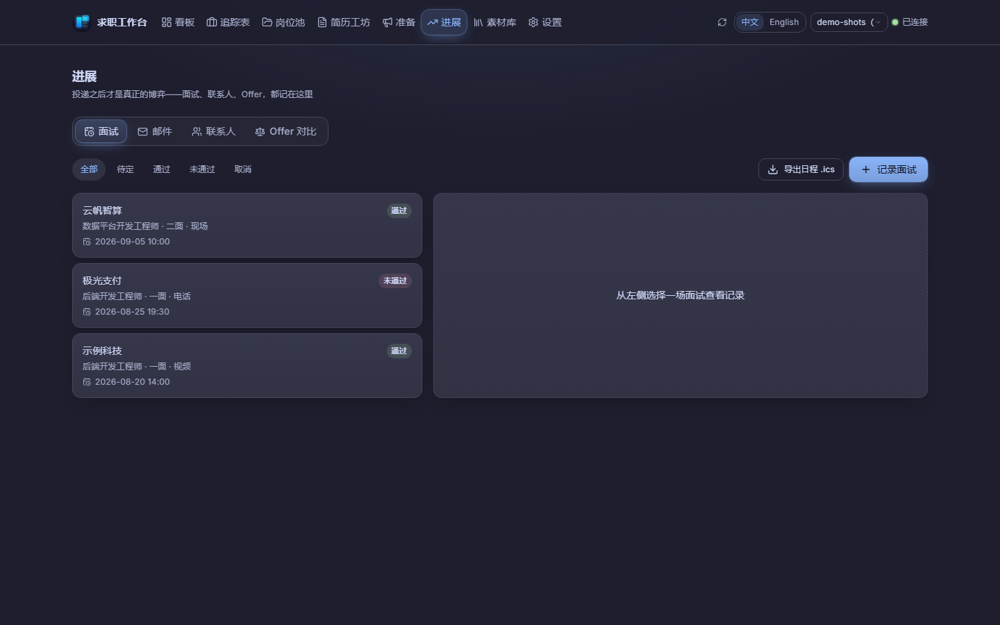
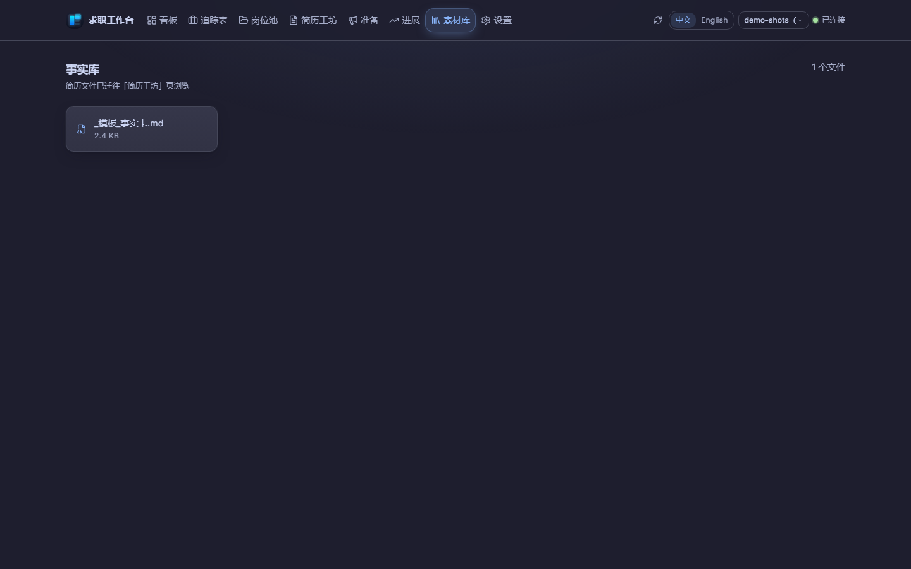
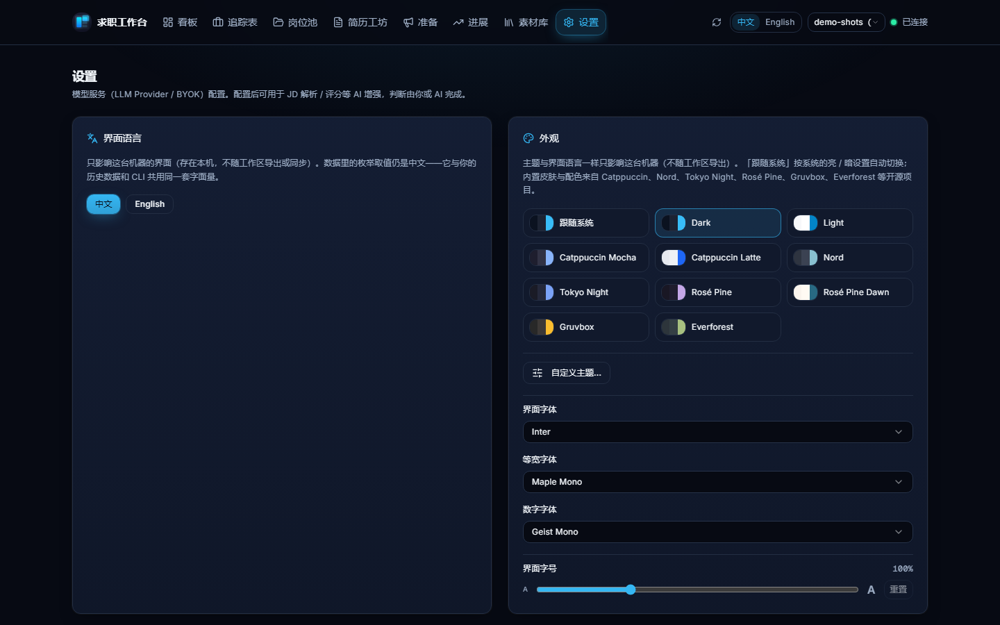

[English](README.md) | 简体中文

# 求职工作台

[](https://github.com/chenxiang6663635/job-workbench/actions/workflows/ci.yml)
[](LICENSE)


> 版本号是月粒度 CalVer `YY.MM.N`（`26.9.0` = 当月第一次发布，hotfix 只递增第三位）。安装包**未经代码签名**——首次运行 Windows 可能显示「Windows 已保护你的电脑」，见「下载」一节的处理方式。

一个**本地优先、AI 可审计**的求职工作台：从 JD 解析到 offer 决策的完整链路，用纯 Markdown 与 CSV 管理在你自己的磁盘上——可以从**桌面端、浏览器或你自己的 AI CLI** 三种入口驱动。

## 为什么做这个项目

求职意味着敏感的个人数据（简历、电话、投递历史）——以及可能悄悄编造事实的 AI 输出。这个项目围绕三个回答构建：

- **本地优先的隐私**。一切以纯文本存在你自己的磁盘上——git 能 diff、Excel 能打开、无遥测、**没有云端服务器**（桌面端启动的本地后端只监听 127.0.0.1）。真实个人数据留在 `personal/`（整体 gitignore）：克隆本仓库得到空工作区，你可以放心公开 fork 而不泄露任何东西。
- **可审计的 AI，而非黑箱自动化**。你自己的 AI CLI（BYOK 模型）做语义判断——读 JD、评匹配度；Python 脚本做一切确定性的事：资格门槛、评分校验、PDF 生成、追踪表读写——且每个自动判定（投递健康度、CSV 导入差异、失败聚类）都附带明确的、可人工核对的**理由**，绝不是一个裸分数。
- **反编造护栏**。简历导入是**抽取而非生成**：每个落盘的值都必须能在原文找到，未抽到的字段标黄。AI 改写建议必须通过五项本地反编造校验才能被采用。
- **一套引擎，任何专业**。评分规则与专业无关——领域知识装在**纯数据插件**里（内置两个示例：暖通制冷、软件后端），换专业只要照 [`docs/domain-contract.md`](docs/domain-contract.md) 写一份即可。

## 它解决什么问题

求职期的真实困难不是「不知道该怎么做」，而是**信息散落导致无法决策**：

- 这家公司值得投吗？上周看过类似的，当时怎么判断的？
- 三个月前投这家，用的是哪版简历？当时的 JD 怎么写的？
- 现在有几家在流程中？哪个明天截止？
- 邮件里写着「请在 25 日前完成测评」——这个截止会不会被悄悄忘掉？

工作台把这些变成可查询、可回溯的文件结构。

## 核心设计

- **AI 判断，脚本校验**。评分由 AI 读 JD 与你的档案后填进解析卡；Python 只校验加总自洽、套阈值出结论、生成 PDF、读写追踪表，并做可解释的确定性判定（健康度四态、CSV 导入差异、失败聚类——全部给理由）。改评分标准只改 Markdown 配置，不改代码。
- **四层单向依赖**：skills（领域知识）→ 脚本（IO 与校验）→ 数据（Markdown + CSV）→ git（版本）。`tools/` 是分层包——统一入口（`jobws`）+ 领域模块 + 门禁脚本；模块间依赖须无环（领域层不 import Web 层），各自独立可测。
- **三层分离**：工具层（`tools/` + `skills/`，领域无关）· 领域层（`template/profiles/`，可插拔）· 用户层（`personal/`，你的真实数据）。三级词典的判据是「能不能经得起追问」而非「会不会」，见 [`template/AGENTS.example.md`](template/AGENTS.example.md)。

## 功能一览

- **四个 CLI 工作流**：`jwb-jd`（JD 解析评分）、`jwb-apply`（投递包）、`jwb-track`（追踪看板）、`jwb-resume`（PDF 重建校验）——全部命令见[使用手册 CLI 命令速查](docs/usage-guide.zh-CN.md)
- **Web 界面**（`web/`）：八个页面与 CLI 共享同一份数据——看板、追踪表、岗位池、简历工坊（一键导入**抽取而非生成** + AI 改写反编造护栏 + 导出 Word）、准备（宣讲会 / 题库）、进展（面试 / 邮件 / 联系人 / Offer）、素材库、设置，详见 [`web/README.md`](web/README.md)
- **投递之后的闭环**：面试记录（一键导出 .ics）、招聘方联系人跟进提醒、Offer 并排对比（**只并排事实，绝不给建议**）、版本谱系、周期复盘、失败聚类、投递健康度四态——每条给具体理由而非黑箱分数
- **只读邮箱拉取（可选）**：用你自己的 IMAP 授权码拉取最近的招聘邮件，转成逐条状态建议；只读连接、只在点击时连接、凭证只存本地、确认前不改数据——详见[使用手册](docs/usage-guide.zh-CN.md)
- **邮件台账与诚实深链**（`mails.csv` + `jobws track mail`）：面试邀约、笔试通知、拒信都是一等记录，可指回投递记录；拉取的邮件带 Message-ID 且**一键记入台账**。「打开原邮件」分级诚实：自己粘的链接优先；Gmail 由 Message-ID 生成真实可用的 `rfc822msgid` 搜索深链；Outlook / QQ / 163 等没有可用深链——给「复制主题去邮箱搜索」，**不造假链接**。**邮件永不自动改阶段**，一律由你确认。
- **简历版式与强调色**：内置经典 / 紧凑 / 强调三套版式共享同一套占位符骨架，全部单栏、全部过 ATS 校验；强调色四档与版式自由组合，生成的 PDF 与预览同源；把自己的合规 HTML 放进模板目录即出现在选择器里。
- **界面字体与字号**：字号为连续滑块（80%–150%，步进 5%，即根字号缩放），与桌面端全局缩放解耦、浏览器里同样生效；界面字体 **12 款**可选（Inter 默认，另有 Geist、IBM Plex Sans、Manrope、Plus Jakarta Sans、DM Sans、Figtree、Outfit、Public Sans、Source Sans 3、Work Sans、Atkinson Hyperlegible Next 与系统栈 / 衬线），等宽字体**独立**可选 **6 款**（Maple Mono 默认、JetBrains Mono、Fira Code、Geist Mono、IBM Plex Mono、Source Code Pro），**数字字体**另设一槽（Geist Mono 默认、JetBrains Mono、IBM Plex Mono 或跟随界面字体）——全部本地打包（OFL-1.1、离线可用）、只发拉丁子集（中文走系统栈）。
- **评分框架**：资格门槛前置（学历 → 专业 → 届数 → 外语 → 城市；档案没填的岗位判「待补档案」——不打分也不终止，补齐即可评；城市偏好类只在「培养与稳定性」轻度扣分，硬性不可行才拦下），四维度加权五档位，完整标准见 [`skills/jwb-recruit-coach/SKILL.md`](skills/jwb-recruit-coach/SKILL.md)
- **领域插件是数据不是代码**：内置两个示例插件（暖通制冷——6 个方向；软件后端——最小参考实现）。你自己的专业按 [`docs/domain-contract.md`](docs/domain-contract.md) 写一份插件即可——纯数据、零代码改动，有两个完整范例可抄，`jobws lint domains` 自动校验结构。

## 界面预览

界面**中英双语**：每一页都有中文与英文，顶栏的 `中文 / English` 可随时切换（首次按系统语言，选择会被记住）。下面截图是中文界面（英文的那套在 [README.md](README.md) 同一节，两套取自同一个 demo 工作区）；英文界面是同样页面换了界面文字。仍然保留中文的只有四处：你自己录进工作区的内容、CSV / Markdown 里存的枚举取值（与 CLI 共享的数据契约）、**代码注释（本项目惯例，见 CONTRIBUTING）**、CLI 自带帮助——都有意为之。

以下页面全部由 demo 数据生成（`jobws init --target demo --demo`），公司、岗位、人名均为占位（`示例科技`、`示例同学` 等），不含任何真实信息。两套图由 `web/frontend` 下的 `npm.cmd run capture` 产出——页面改了就重跑它，不要手工重拍。







## 快速开始

不想配环境的话，[Releases](https://github.com/chenxiang6663635/job-workbench/releases/latest) 里有桌面版 `job-workbench-setup-*.exe`（免 Python / Node）：安装包是**向导式**——可自选安装位置，并选择「为所有用户 / 仅为我」（升级旧版时沿默认选项即可）。数据在 `%APPDATA%\job-workbench\`，不离开本机。

**安装包尚未做代码签名。** 首次运行 Windows 可能显示「Windows 已保护你的电脑」——未签名软件的正常提示：点「**更多信息**」→「**仍要运行**」。SmartScreen 信誉按版本重新积累，后续版本可能再次提示。每个 Release 同时附 `SHA256SUMS.txt`（安装包与 `latest.yml` 的哈希），可自行核对下载完整性；签名的缺位**不影响自动更新**（完整性以 `latest.yml` 里的哈希为准）。

```bash
# 0. 只想先看看界面？一条命令得到一份填满数据的 demo 工作区
#    （8 条投递 / 3 场面试 / 2 位联系人 / 1 个 Offer / 3 场宣讲会 / 6 道题 / 6 封邮件，全占位数据）
python tools/jobws.py init --target demo --demo

# 1. 初始化工作区（生成六个模块 + 档案模板 + 领域插件）
#    --domain 换成你专业的插件，可选值见 docs/README.md 的「领域插件」表
python tools/jobws.py init --target my_job_hunt --domain hvac-cooling

# 2. 分发技能 / 命令 / 子代理到你的 AI CLI（CodeBuddy / Claude Code / 跨运行时 ~/.agents/skills/）
python tools/jobws.py skills install --target user

# 3. 填写 my_job_hunt/AGENTS.md
#    第三节的硬门槛事实必填——不填的岗位会被判「待补档案」（不打分也不终止），
#    补齐即可评分；判定永不猜测。文件里还有两条通用诚实红线：
#    简历动词经得起追问、永不编造经历
```

**不想克隆仓库也能用？** 两条通道任选：

- **插件市场（推荐：技能 + 命令 + 子代理一起装）**——有 CodeBuddy / Claude Code 的话，把本仓库加为市场并安装（插件直接读仓库里的 `skills/`、`commands/`、`agents/`，没有第二份副本）：

```
/plugin marketplace add https://github.com/chenxiang6663635/job-workbench
/plugin install job-workbench
```

- **只装技能**：`npx skills add chenxiang6663635/job-workbench`（默认装到当前目录，`-g` 装用户级；`.agents/skills/` 是跨宿主约定，Claude Code 读 `.claude/skills/`）。

本地脚本是兜底与自定义落点用：`python tools/jobws.py skills install` 按宿主目录约定分发三类资产（技能 → skills 目录；命令与子代理 → `.codebuddy/`、`.claude/`），默认拷贝；`--link` 是实验选项，改用符号链接指向真源（不再有副本过期问题，Windows 需开发者模式或管理员权限）。**仓库内项目级副本**的一致性由 `python tools/jobws.py lint four-ends` 兜住：副本过期、内容不一致都会被指名，技能目录还额外报「多出」（`.claude/` 等目录里你自己的文件不算）——**用户级 `~/.agents/skills/` 与插件市场装的缓存在检查器视野之外**（它们不随仓库走）。

然后直接用自然语言跟你的 AI CLI 说："解析这份 JD"、"投递这个岗位"、"看最近七天要处理什么"。

环境要求——命令行：Python 3.12+（只用标准库）；pypdf 仅 PDF 校验需要；certifi 提供出网证书兜底（系统证书库不可用时回退到随包 CA 清单，HTTPS / IMAP 共用）。PDF 生成：Chrome 或 Edge。Web 界面（可选）见 [`web/README.md`](web/README.md)。

## 推广说明

AI 功能是 BYOK：自带任意 OpenAI 兼容服务商的 key 即可。还没有 key 的话，设置页把 [OrcaRouter](https://www.orcarouter.ai/ref/ref_f34ad879f774bce8bc82) 预置为可选 Provider。如实说明：这是一个**推广（返佣）链接**——通过它注册会给本项目作者返佣；你的价格与权益不受影响，点击也只是打开网页（本应用不会因点击发出任何数据）。

## 隐私

本仓库**不含任何真实个人数据**。`personal/` 是用你自己的真实数据（姓名、照片、联系方式、投递记录、事实卡）填充的工作区，已整体排除在版本管理之外——克隆本仓库后它是空的，用上面的初始化命令生成你自己的。也就是说：**可以放心公开 fork，但不要把 `personal/` 里的内容贴进 issue、PR 或讨论区。**

## 目录

| 目录 | 用途 |
|---|---|
| `template/` | 通用骨架：档案模板、空工作区、领域插件 |
| `skills/` | 四个求职向工作流 + 教练评分标准，另有三个开发向技能（CLI 契约 / API 审查 / MCP），跨运行时单一源 |
| `docs/four-ends.md` | **四端能力对照**（命令行 / AI 宿主 / 编辑器插件 / 桌面界面），由 `tools/four_ends_matrix.json` 生成、由 `jobws lint four-ends` 校验。接进 AI 宿主见 `docs/mcp-integration.md`——**配置键名按宿主不同，别照抄** |
| `tools/` | Python 领域层——统一入口 + 领域模块 + 门禁脚本 |
| `web/` | Web 界面：FastAPI 后端 + React 前端（八个页面），与 CLI 共享同一份数据 |
| `tests/` | pytest 测试套件（隐私护栏、反编造检查、追踪表语义），CI 质量门 |
| `personal/` | 使用者的真实工作区（**已整体 gitignore，仓库内不含任何真实数据**） |
| `docs/` | 使用手册、文档索引、设计文档（`docs/specs/`） |
| `.github/` | CI 工作流、issue / PR 模板、行为准则、Copilot 指引 |
| `.codebuddy-plugin/` | CodeBuddy 插件清单——把同一份 `skills/` 交给插件系统，不另存副本 |

## 文档

- [Roadmap](ROADMAP.md)——Now / Later 与已完成批次日志；有跟踪 issue 的项会挂链接
- [文档索引](docs/README.md)——每份文档的状态（现行 / 已废弃）
- [使用手册](docs/usage-guide.zh-CN.md)——启动、八页面详解、AI 工作流、CLI 命令速查、常见问题（英文主版：[usage-guide.md](docs/usage-guide.md)）
- [毕业条件与兼容承诺](docs/support-and-compatibility.md)——什么时候算正式版（四条判据）、支持哪些环境、升级为什么不需要转换数据
- [设计文档](docs/specs/)——架构、Web 契约、产品化路线、开源发布
- [变更记录](CHANGELOG.md)
- [术语表](docs/glossary.md)——文档与 CHANGELOG 里的内部术语集中定义一次

## 贡献

欢迎 issue 与 PR——bug 修复、文档、新领域插件、隐私护栏、测试与互操作性改进尤其有用。请先读 [CONTRIBUTING.md](CONTRIBUTING.md)（新需求四道门、分支策略、发布流程）与[行为准则](.github/CODE_OF_CONDUCT.md)；**安全漏洞请走私密通道，见 [SECURITY.md](SECURITY.md)**（不要开公开 issue）；所有改动走 PR（CI 绿：后端测试 + 前端 lint/build + PR 标题校验 + UI 冒烟；`main` 有分支保护，纯文档同样走 PR）。**投入节奏**：单维护者项目，投入是**分批**的——可能集中几天推进一批，也可能整周没有动作（面试周 / 笔试周停工，见 CONTRIBUTING「可持续性约定」）；对外部 issue 的首复目标是 48 小时内、滑期会在 pinned issue 说明（见 [docs/maintenance.md](docs/maintenance.md)），受求职节奏影响偶尔会有几天不回。

## License

[MIT](LICENSE) © job-workbench contributors，第三方依赖许可见 [THIRD-PARTY-NOTICES.md](THIRD-PARTY-NOTICES.md)。
